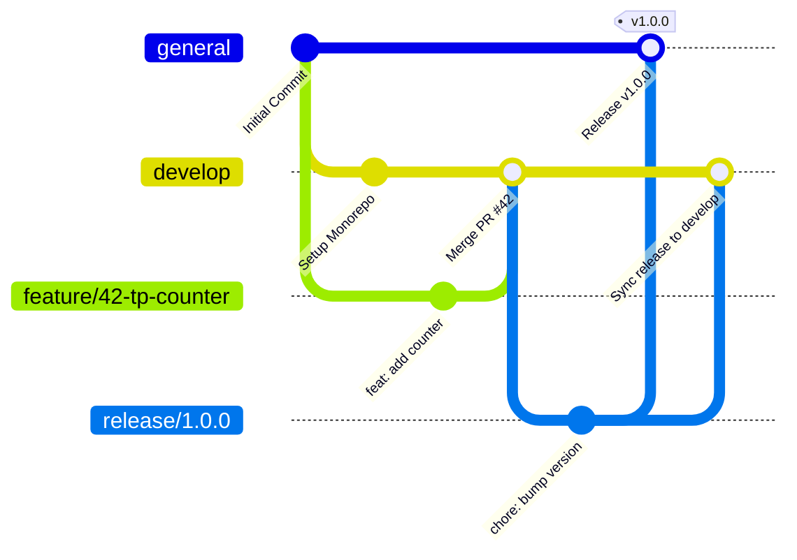

# Development Process and Configuration Management

This document is the main artifact describing the team's development, branching strategy, and configuration management process. It outlines how the team collaborates, manages code versions, and ensures quality across the monorepo.

## 1. Git Workflow Diagram

The team strictly follows the **Gitflow** branching model, adapted to meet specific course requirements. Below is a visual representation of our Git process:

## 2. Workflow Description & Practical Usage

### Branching Strategy

* **`general`**: Production-ready code. Protected. No direct commits.
* **`develop`**: Integration branch for features. Protected. No direct commits.
* **`feature/<issue-number>-<short-description>`**: Branches from `develop`. Merges back into `develop`.
  * *Examples:* `feature/42-tp-packet-counter`, `docs/15-update-readme`, `feature/8-websocket-timeout`
* **`release/<version>`**: Branches from `develop` when feature-complete. Merges into `general` and `develop`.
* **`hotfix/<issue-number>-<short-description>`**: Branches from `general` for critical production bugs. Merges into `general` and `develop`.

> **⚠️ CRITICAL COURSE REQUIREMENT:** Squash and Rebase merging are **disabled** in repository settings. All merges must use **Merge commits** to preserve full history and traceability.

### Team Roles and Task Instructions

#### @arinamnova (Technical Writer, Translator)

* **Responsibilities:** Documentation management, translation, and content coordination.
* **Task Instructions:** Maintain the `docs/` and `reports/` directory. Ensure all transcripts and reports are **sanitized** (no real names, no private recording links). Maintain root docs (`README.md`, `CHANGELOG.md`). Create branches named `docs/<issue-number>-<topic>`.

#### @jinseisieko (Backend Lead, DevOps Engineer, Project Manager)

* **Responsibilities:** CnSS development, CI/CD pipeline, repository administration, and project tracking.
* **Task Instructions:** Manage GitHub Project Board and CI/CD (including Lychee). Work inside `cnss/`. Create `release/` branches for MVP deployment. Review and merge PRs.

#### @Rena-ln (Core Systems Engineer)

* **Responsibilities:** Traffic Processor (TP), Communication Node (CN)
* **Task Instructions:** Work inside `traffic-processor/` and `communication-node/`. Implement transparent inline bridge and telemetry logic. Ensure all code passes CI checks before requesting a review.

#### @Minnezing (Frontend Lead, UI/UX Designer)

* **Responsibilities:** Management User Interface (MUI) development and UI/UX design.
* **Task Instructions:** Work inside `mui/`. Build web-based interface, implement binary visual cues and counters. Connect frontend to CnSS API/WebSocket.

### Development Guidelines

#### Commit Messages

Use Conventional Commits: `<type>: <description>`

* `feat`: A new feature
* `fix`: A bug fix
* `docs`: Documentation only changes
* `ci`: CI/CD configuration changes
* `chore`: Maintenance tasks

#### Pull Requests & Changelog

1. All PRs targeting `develop` or `general` require **at least one approving review**.
2. All PRs must pass required CI status checks (including **Lychee Link Check**).
3. **Changelog:** Every user-visible change must be added to `CHANGELOG.md` under `## [Unreleased]` with a link to the GitHub issue. Internal changes do not require a changelog entry.

---

## 3. Developer Working Script (Standard Operating Procedure)

> Follow this sequence for every new task.

### Step 1: Task Pickup and Branching

1. Move an issue to `In Progress` on the GitHub Project Board.
2. Sync local repository: `git checkout develop && git pull origin develop`
3. Create Feature Branch: `git checkout -b feature/42-tp-packet-counter`

### Step 2: Local Development

1. Navigate to your component directory (`cd traffic-processor/`, `mui/`, etc.).
2. Write code and commit using Conventional Commits.
3. Update `CHANGELOG.md` if the change is user-visible.

### Step 3: Pre-Push Verification & Sanitization

1. **Format and Lint:** Run `black .` / `flake8 .` (Python) or `npm run lint` (Node).
2. **Sanitization Check:** Ensure NO `.env` files, NO real names, and NO private links are committed.
3. **Local Build/Test:** Ensure the component compiles and tests pass.

### Step 4: Push and Pull Request

1. Push branch: `git push -u origin feature/42-tp-packet-counter`
2. Open PR targeting `develop`. Fill the PR template, link the issue (`Closes #42`), and verify the Changelog checkbox.
3. Move the issue to `In Review`.

### Step 5: Review and Merge

1. Wait for CI Checks (including Lychee) to turn green.
2. Request review from the appropriate component owner.
3. **Merge:** Reviewer clicks **Merge pull request** (Create a merge commit). **DO NOT SQUASH OR REBASE.**
4. **Cleanup:** Delete remote/local branches and move the issue to `Done`.

### Step 6: Integration Validation (Post-Merge)
Because this is a tightly coupled monorepo, verify adjacent components after merging into `develop` (e.g., if TP telemetry format changed, verify CN can still parse it).