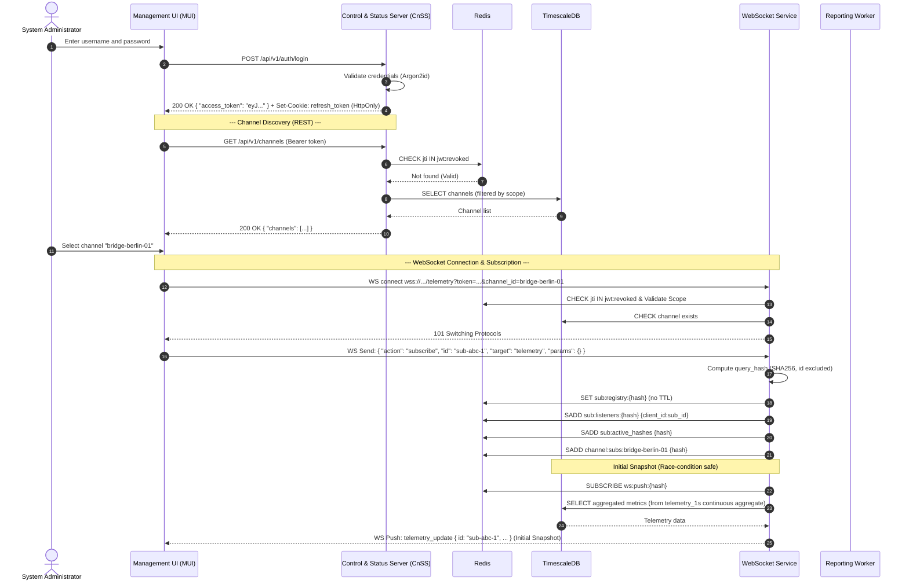
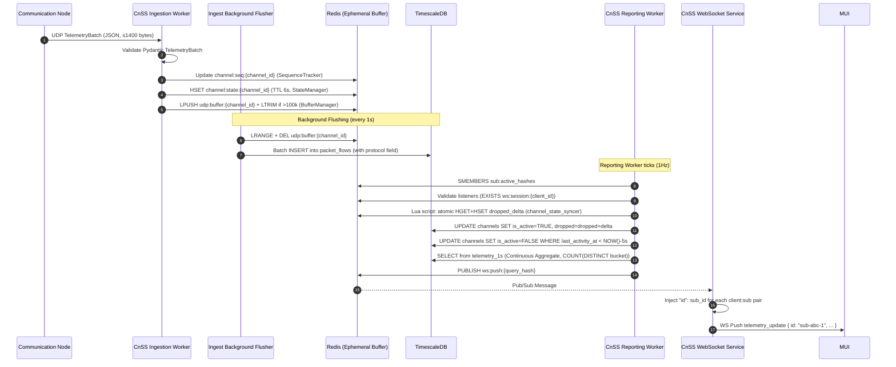
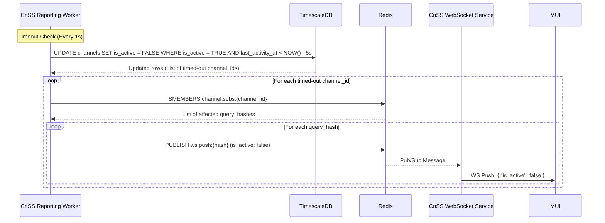
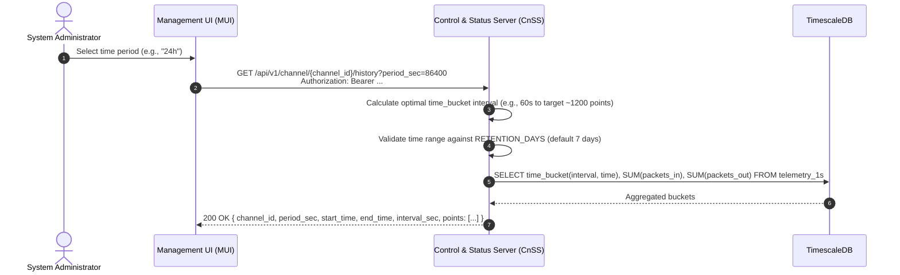
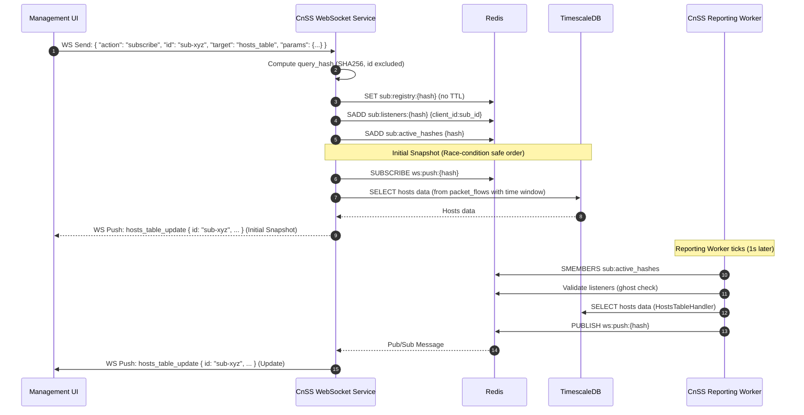

# System Architecture & Data Flow Specification (MVP v2)

## 1. Overview

The architecture is strictly decoupled into a hardware-accelerated data plane (for packet forwarding) and a software-defined telemetry side-channel (for monitoring). Failure in monitoring components must not impact the core packet forwarding (US-005, US-007, US-009).

The system supports multiple Communication Nodes (CNs) feeding a single Control and Status Server (CnSS), and multiple Management User Interfaces (MUIs) consuming data from the same CnSS.

The CnSS persists **raw packet metadata** (IPs, ports, directions, protocol) into a Time-Series Database (TimescaleDB). Real-time metrics for the MUI are aggregated via periodic SQL queries against a **TimescaleDB Continuous Aggregate** (`telemetry_1s`). This provides historical data, prevents memory leaks during traffic spikes, and allows for flexible future reporting.

To ensure horizontal scalability, fault isolation, and high-performance telemetry ingestion, the CnSS is strictly decoupled into isolated, containerized Docker microservices. **Redis** acts as the central nervous system for ephemeral buffering, state synchronization, and Pub/Sub messaging, operating without persistence (no RDB/AOF) to maximize IOPS. TimescaleDB remains the single source of truth for persistent data.

---

## 2. Component Architecture & Conceptual Responsibilities

### 2.1. Traffic Processor (TP)

**Role:** Core packet forwarding and telemetry extraction engine.

**Responsibilities:**

* **Data Plane (Passthrough):** Operates as a transparent inline bridge using Scapy packet sniffing on two network interfaces (`SNIFF_INTERFACE_IN`, `SNIFF_INTERFACE_OUT`), passing network packets in both directions at wire speed with negligible latency.
* **Telemetry Plane (Extraction):** Independently observes passing traffic, extracts per-packet metadata (direction, src/dst IP, src/dst port) using the `get_json_payload()` function in `tp_packet_counter.py`, and queues it for dispatch.
* **Local Dispatch:** Pushes per-packet JSON metadata directly to the local Communication Node (CN) via UDP on port 5140.

**Key implementation details:**
- Uses two separate `queue.Queue` instances (`packet_queue_in`, `packet_queue_out`) for IN and OUT traffic, fed by dedicated Scapy sniffing threads.
- A single `sending_data_to_cnss()` daemon thread dequeues and forwards individual packet metadata every 300ms.
- Configured via environment variables: `SNIFF_INTERFACE_IN`, `SNIFF_INTERFACE_OUT`, `OUT_INTERFACE`, `MY_MAC`, `MY_IP`, `CN_IP`.

### 2.2. Communication Node (CN)

**Role:** Local telemetry batching and forwarding node.

**Responsibilities:**

* **Ingestion:** Receives per-packet JSON telemetry from the local TP via Scapy sniffing (`SNIFF_INTERFACE`). Validates incoming payloads against a JSON schema (`json_from_tp_schema`).
* **Buffering & Batching:** Buffers incoming packet metadata in a `queue.Queue` and groups them into fixed time windows (`TIME_WINDOW` in milliseconds, enforced ≤ 60ms to prevent MTU fragmentation).
* **Remote Dispatch:** Every `TIME_WINDOW` ms, constructs a `TelemetryBatch` payload with `channel_id`, `timestamp`, `sequence`, `window_ms`, and `packets[]`, serializes to JSON, and forwards to the CnSS via UDP port 5140.
* **UDP MTU Constraint:** TIME_WINDOW is validated at startup to ensure payloads do not exceed the network MTU (`< 1400 bytes`). Batches exceeding 60ms may contain too many packets and cause IP fragmentation.
* **Channel Identity:** Each CN is configured with a unique `channel_id` (via `CHANNEL_ID` env var), which is included in every batch.
* **Sequence:** Uses an incrementing integer sequence counter (starting at 0, incrementing before each send).

**Note:** The current CN implementation (`cn_demo_1.py`) does not include the `protocol` field in packet metadata — the CnSS Ingestion Worker defaults this to `"UNKNOWN"` for backward compatibility.

### 2.3. Control and Status Server (CnSS)

The CnSS is deployed as a set of Docker containers (version `2.0.1`, Python ≥ 3.11). If any container crashes, Docker's `restart: always` policy ensures immediate recovery without affecting the core network forwarding plane.

The CnSS is composed of four independently deployable microservices:

| Service | Entrypoint | Default Port | Description |
|---|---|---|---|
| REST API & Auth | `services.api.main:app` (uvicorn) | 8000 (HTTP) | Authentication, channel discovery, health, historical data |
| WebSocket Service | `services.websocket.main` | 8001 (WS) | Real-time subscription routing and Pub/Sub forwarding |
| Ingestion Worker | `services.ingestion.main` | 5140 (UDP) | UDP reception, sequence tracking, Redis buffering, DB flushing |
| Reporting Worker | `services.reporting.main` | — | 1Hz polling, state sync, ghost cleanup |

#### 2.3.1. Ingestion Worker (UDP Listener & Buffer Manager)

**Role**: High-performance telemetry ingestion, sequence tracking, and database buffering.

**Source:** `cnss/services/ingestion/` — `udp_server.py`, `sequence_tracker.py`, `state_manager.py`, `buffer_manager.py`, `flusher.py`

**Responsibilities**:

1. **UDP Reception** (`udp_server.py`): Binds `asyncio.DatagramProtocol` to `0.0.0.0:{cnss_udp_port}` (default 5140). MTU constraint is enforced as **warn-only** to prevent data loss — oversized payloads are still processed. Validates JSON and Pydantic `TelemetryBatch` model before passing to the pipeline.

2. **Sequence Tracking** (`sequence_tracker.py`): Maintains `last_sequence` per `channel_id` in Redis (`channel:seq:{channel_id}`).
   - **Initial State**: If the key does not exist, the first `sequence` is stored as baseline with 0 drops (handles new channels and post-crash recovery).
   - If `incoming_sequence > last_sequence + 1`: Calculates `dropped = incoming_sequence - (last_sequence + 1)`.
   - If `incoming_sequence <= last_sequence`: Ignores (handles out-of-order delivery gracefully).
   - **Sequence Reset Detection**: If `last_sequence - incoming_sequence > SEQUENCE_RESET_THRESHOLD` (default 1,000,000), treats it as a CN reboot, resets baseline, and returns 0 drops.

3. **Redis State Buffering — Fast Path** (`state_manager.py`): Updates `HSET channel:state:{channel_id}` **ONLY IF** `len(packets) > 0` (empty keep-alive batches do not reset the timeout). Accumulates drops via `HINCRBY channel:state:{channel_id} dropped_delta`. Sets a **TTL of 6 seconds** on the key — if CN dies, key expires, indicating inactivity naturally.

4. **Redis Capped-List Buffering** (`buffer_manager.py`): Pushes raw packet metadata as JSON strings into `udp:buffer:{channel_id}` (Redis List). Uses `LLEN` + `LTRIM` to cap the list at `REDIS_UDP_BUFFER_MAX_LEN` (default 100,000 items) to prevent OOM crashes if the DB flusher lags. Empty batches are skipped.

5. **Background Flush** (`flusher.py`): A periodic background task (every `FLUSH_INTERVAL_SEC`, default 1.0s) pops all items from `udp:buffer:{channel_id}` using `LRANGE` + `DEL` and batch-inserts them into the `packet_flows` TimescaleDB hypertable.

#### 2.3.2. Reporting Worker (Background Aggregator)

**Role**: Periodic metric aggregation and real-time event publishing.

**Source:** `cnss/services/reporting/` — `poller.py`, `channel_state_syncer.py`, `ghost_cleaner.py`, `handlers/`

**Responsibilities**:

1. **Subscription Polling** (`poller.py`): Every `REPORTING_POLLER_INTERVAL_SEC` (default 1.0s), reads active subscription hashes from Redis Set (`SMEMBERS sub:active_hashes`).

2. **Ghost Subscription Prevention** (`ghost_cleaner.py`): Runs every `GHOST_CLEANUP_INTERVAL_SEC` (default 5.0s). Before executing SQL queries, validates listeners by checking `EXISTS ws:session:{client_id}`. Removes stale `client_id:sub_id` pairs from `sub:listeners:{hash}` via `SREM`. Deletes `sub:registry:{hash}` and removes from `sub:active_hashes` when all listeners are gone.

3. **Handler Dispatch**: For each active `query_hash`, retrieves the subscription JSON from `sub:registry:{hash}`, identifies the `target`, and invokes the registered handler from `HANDLER_REGISTRY`:

   | Target | Handler | Description |
   |---|---|---|
   | `telemetry` | `TelemetryHandler` | Real-time channel packet rates (packets in/out per sec) from `telemetry_1s` continuous aggregate |
   | `hosts_table` | `HostsTableHandler` | Aggregated host table with pagination, filtering (LAN/WAN, IP, subnet), and sorting |
   | `host_details` | `HostDetailsHandler` | Real-time Rx/Tx rate for a specific host IP |
   | `host_top_destinations` | `HostTopDestinationsHandler` | Top remote IPs for a specific host with pagination |
   | `host_top_ports` | `HostTopPortsHandler` | Top ports and protocols for a specific host |

4. **Continuous Aggregate Awareness**: The `telemetry_1s` aggregate is grouped by `(channel_id, bucket, protocol)`. Handlers MUST use `COUNT(DISTINCT bucket)` (not `COUNT(bucket)`) when calculating time windows for rate calculations, otherwise rates will be underestimated when multiple protocols are active.

5. **SQL Injection Prevention**: `sort_by` and `sort_order` parameters use strict whitelist mapping (never direct interpolation). `period_sec` is a Pydantic-validated numeric value, safely formatted into SQL `INTERVAL` literals.

6. **Pub/Sub Publishing**: Formats aggregated data per the API schema and publishes to Redis Pub/Sub (`ws:push:{query_hash}`).

7. **Atomic Drop Flushing — Slow Path** (`channel_state_syncer.py`): Every `REPORTING_CHANNEL_STATE_SYNCER_INTERVAL_SEC` (default 1.0s):
   - Uses a **Lua script** (`atomic_drop_flush.lua`) to atomically read and reset `dropped_delta` from `channel:state:{channel_id}` (prevents race conditions with the Ingestion Worker).
   - Executes batched `UPDATE channels SET is_active = TRUE, last_activity_at = NOW(), dropped = dropped + $delta` for channels that received new traffic.
   - Executes mass timeout: `UPDATE channels SET is_active = FALSE WHERE is_active = TRUE AND last_activity_at < NOW() - INTERVAL '5 seconds'`.

8. **Channel Reactivation**: `is_active` toggles from `FALSE` to `TRUE` immediately when the Reporting Worker's 1s flush detects new Redis state from the Ingestion Worker, ensuring sub-second reactivation on new traffic.

#### 2.3.3. WebSocket Service (Client Gateway)

**Role**: Persistent client connection management and subscription routing.

**Source:** `cnss/services/websocket/` — `server.py`, `auth.py`, `session.py`, `subscription.py`, `snapshot.py`, `pubsub_consumer.py`, `gc.py`

**Responsibilities**:

1. **Connection Lifecycle** (`server.py`, `auth.py`): Validates JWT (HS256 signature, expiration), checks `channel_id` presence, checks `jti` against Redis `jwt:revoked` set, verifies JWT `scope` against the channel, and confirms channel existence in the `channels` table. Returns specific close codes on failure.

2. **Subscription Management** (`subscription.py`): Receives JSON control messages (`subscribe`/`unsubscribe`). Computes a deterministic SHA-256 `query_hash` (truncated to 16 hex characters) from `channel_id`, `target`, and `params`. **The client-provided `id` field is strictly excluded from the hash** to ensure deduplication of identical queries from multiple clients.

3. **Redis State Sync**: Registers subscription in Redis (`sub:registry:{hash}` — no TTL, explicitly deleted when last listener leaves), adds composite `client_id:sub_id` to `sub:listeners:{hash}` Set, adds hash to `sub:active_hashes`, and adds hash to `channel:subs:{channel_id}`.

4. **Initial Snapshot** (`snapshot.py`) — Race-condition safe order:
   1. `SUBSCRIBE ws:push:{query_hash}` in Redis (subscribe **before** querying).
   2. Execute read-only query against TimescaleDB.
   3. Inject `"id": sub_id` into the snapshot payload.
   4. Push snapshot to the client WebSocket.

5. **Pub/Sub Consumption** (`pubsub_consumer.py`): Listens on `ws:push:{query_hash}` channels. Upon receiving a Pub/Sub message, iterates over `client_id:sub_id` pairs in `sub:listeners:{hash}`, injects `"id": sub_id` into the JSON payload for each, and forwards to the specific client's WebSocket connection.

6. **Garbage Collection** (`gc.py`): On client disconnect, reads `ws:session:{client_id}:subs` Set to find all `query_hash:sub_id` pairs. Removes `client_id:sub_id` from all listener sets. Deletes `sub:registry:{hash}` and removes from `sub:active_hashes` when the listener set becomes empty.

7. **Session Heartbeat** (`session.py`): Creates `ws:session:{ws_client_id}` hash with TTL 10s. Background heartbeat task refreshes TTL every 5s. If the WS container crashes, keys expire automatically — preventing orphaned subscriptions.

8. **Subscription Scope Validation**: The `channel_id` in the WebSocket subscription control message MUST match the `channel_id` in the initial connection URL. Mismatch closes the connection with code `4003`.

| Code | Reason | Meaning |
| --- | --- | --- |
| `4001` | `invalid_token` | Token is missing, malformed, expired, has invalid signature, or has been revoked (`jti` in `jwt:revoked`). |
| `4002` | `missing_channel` | The `channel_id` query parameter is entirely absent from the WebSocket request URL. |
| `4003` | `channel_forbidden` | Token is valid, but the user does not have access to the requested channel, OR the `channel_id` in a subscription control message differs from the connection URL. |
| `4004` | `channel_not_found` or `target_not_found` | The `channel_id` does not match any known channel in the registry, OR the `target` in a subscription message is invalid/unknown. |
| `1011` | `internal_error` | Unexpected server error. |

#### 2.3.4. REST API & Auth Service

**Role**: HTTP gateway, identity management, and historical data retrieval.

**Source:** `cnss/services/api/` — `routes/auth.py`, `routes/channels.py`, `routes/health.py`, `routes/history.py`

**Responsibilities**:

1. **Authentication** (`routes/auth.py`): Three endpoints:
   - `POST /api/v1/auth/login`: Validates credentials using **Argon2id** (via `passlib[argon2]`). Issues a short-lived JWT access token (HS256, default 24h) in the response body and a long-lived refresh token (default 7 days) as an `HttpOnly; Secure; SameSite=Strict` cookie restricted to `/api/v1/auth/refresh`.
   - `POST /api/v1/auth/refresh`: Issues a new access token using the `HttpOnly` refresh token cookie. Validates signature, expiration, type claim, and `jti` revocation status.
   - `POST /api/v1/auth/logout`: Revokes the refresh token's `jti` in Redis `jwt:revoked` and clears the cookie. Idempotent — succeeds even with missing or malformed cookies.

2. **JWT Middleware**: Every authenticated request extracts the Bearer token's `jti` and verifies it against `jwt:revoked` in Redis before route execution, enabling immediate session termination.

3. **Channel Discovery & Status** (`routes/channels.py`): Serves `GET /api/v1/channels` and `GET /api/v1/channel/{channel_id}/status` by reading directly from the persistent `channels` table — no heavy `MAX(time)` queries, zero-latency status checks.

4. **History API** (`routes/history.py`): Two endpoints:
   - `GET /api/v1/channel/{channel_id}/history?period_sec=N[&start_time=ISO]`: Channel line chart history. Calculates optimal `time_bucket` intervals (target ≈ 1200 points) snapping to logical steps (1s, 5s, 10s, 30s, 1m, 5m, 10m, 30m, 1h).
   - `GET /api/v1/channel/{channel_id}/hosts/{host_ip}/history?period_sec=N[&start_time=ISO]`: Per-host Rx/Tx history. Same bucket calculation. Validates time range against `RETENTION_DAYS` (default 7 days).

5. **Health Check** (`routes/health.py`): `GET /api/v1/health` verifies database connectivity and returns component status.

### 2.4. Infrastructure Layer (Edge Nginx)

**Role:** TLS termination, reverse proxy, and request routing.

**Source:** `infrastructure/nginx/`

**Responsibilities:**
- Serves as the single TLS termination point for the entire platform (centralized TLS).
- Proxies HTTPS requests to the CnSS REST API (port 8000) and WebSocket upgrades to the WebSocket service (port 8001).
- Uses `$uri` (not `$request_uri`) in `log_format` to prevent token leakage in Nginx access logs.
- Development: Self-signed certificates via `make certs`; Production: CA-signed certificates required.

### 2.5. Management User Interface (MUI)

**Role:** Frontend dashboard for real-time visualization.

**Source:** `mui/src/` — React + TypeScript + Vite

**Key services and hooks:**

| Module | Description |
|---|---|
| `services/authentication.ts` | Login, refresh, logout REST calls |
| `services/channels.ts` | Channel list REST call |
| `services/health.ts` | Health check REST call |
| `services/history.ts` | Channel and host history REST calls |
| `services/websocket.ts` | WebSocket lifecycle management (connect, disconnect, reconnect) |
| `services/subscriptionManager.ts` | Subscription send/receive routing with deduplication |
| `hooks/useTelemetry.tsx` | Subscribes to `target: "telemetry"`, exposes packet rates and activity |
| `hooks/useHostsUpdate.tsx` | Subscribes to `target: "hosts_table"`, exposes paginated host table |
| `hooks/useHostDetails.tsx` | Subscribes to `target: "host_details"`, exposes per-host rates |
| `hooks/useHostTopDestinations.tsx` | Subscribes to `target: "host_top_destinations"` |
| `features/PacketsLineChart/` | Historical channel line chart via REST history API |
| `features/PacketsColumnChart/` | Real-time packet column chart fed by telemetry subscription |
| `features/HostsTable/` | Paginated host table fed by hosts_table subscription |
| `pages/Dashboard/` | Main dashboard page |
| `pages/Hosts/` | Host details page |
| `pages/Login/` | Authentication page |

**Security constraints:**
- JWT access token stored **exclusively in memory** (JavaScript variable). `localStorage` and `sessionStorage` are strictly prohibited.
- Refresh token stored exclusively in the `HttpOnly; Secure; SameSite=Strict` cookie managed by the browser.
- MUI client-side timeout: If no `telemetry_update` is received within 6000ms, MUI locally assumes `is_active = false`.

---

## 3. Data Flow & Sequence Diagrams

### 3.1. Authentication & Channel Selection Flow

This diagram illustrates the authentication process and how MUI discovers and selects a channel to monitor.



### 3.2. Multi-Channel End-to-End Telemetry Pipeline (Happy Path)

This diagram illustrates the new flow: raw data ingestion to DB, and periodic aggregation to WS.



### 3.3. Channel Timeout & Fallback Mechanism (Per-Channel)



### 3.4. Line Chart History Retrieval (REST)

This diagram illustrates how MUI lazy-loads historical data for the Line Chart.



### 3.5. WebSocket Subscription for Host Tables

This diagram illustrates the "Initial Snapshot on Subscribe" pattern for real-time host tables.



---

## 4. Protocol Specifications

### 4.1. TP to CN (Local Telemetry Stream)

* **Transport:** Local network (UDP to `CN_IP:5140`).
* **Direction:** TP to CN (unidirectional).
* **Payload:** Per-packet metadata JSON (individual, not batched at TP level).

```json
{
  "direction": 0,
  "src_ip": "192.168.1.100",
  "dst_ip": "8.8.8.8",
  "src_port": 12345,
  "dst_port": 53
}
```

**Note:** The TP does not include a `protocol` field. The CN validates this schema before queueing and does not add the field either. The CnSS defaults `protocol` to `"UNKNOWN"`.

### 4.2. CN to CnSS (Remote Aggregation)

* **Transport:** UDP (Best-effort, unidirectional).
* **Endpoint:** `{{cnss_host}}:5140` (configurable via `CnSS_UDP_PORT`, default 5140).
* **UDP Size Constraint:** CN enforces `TIME_WINDOW ≤ 60ms` to prevent MTU fragmentation. CnSS enforces `< 1400 bytes` as warn-only (oversized payloads are still processed).
* **Payload Schema (`TelemetryBatch`):**

```json
{
  "channel_id": "main_tp_dev",
  "timestamp": 1718625600,
  "sequence": 1042,
  "window_ms": 50,
  "packets": [
    {
      "direction": 0,
      "src_ip": "192.168.1.100",
      "dst_ip": "8.8.8.8",
      "src_port": 12345,
      "dst_port": 53,
      "protocol": "UDP"
    },
    {
      "direction": 1,
      "src_ip": "8.8.8.8",
      "dst_ip": "192.168.1.100",
      "src_port": 53,
      "dst_port": 12345,
      "protocol": "UDP"
    }
  ]
}
```

**Fields:**

| Field | Type | Description |
| --- | --- | --- |
| `channel_id` | string | Identifier of the monitored channel/bridge. |
| `timestamp` | integer | Unix timestamp (seconds) of the window start. |
| `sequence` | integer (64-bit) | Monotonically increasing 64-bit sequence number per channel. MUST be 64-bit to prevent wrap-around. |
| `window_ms` | integer | Duration of the batching window in milliseconds (≤ 60ms recommended). |
| `packets` | array | Array of raw packet metadata objects. |
| `packets[].direction` | integer | `0` for IN, `1` for OUT. |
| `packets[].src_ip` | string | Source IP address (IPv4/IPv6). |
| `packets[].dst_ip` | string | Destination IP address (IPv4/IPv6). |
| `packets[].src_port` | integer | Source port (0–65535). |
| `packets[].dst_port` | integer | Destination port (0–65535). |
| `packets[].protocol` | string | Network protocol (e.g., `"TCP"`, `"UDP"`, `"ICMP"`). Defaults to `"UNKNOWN"` if absent (backward compatibility). |

### 4.3. CnSS to MUI (WebSocket Connection)

* **Transport:** WebSocket (WSS recommended; proxied via Edge Nginx).
* **Endpoint:** `wss://{{cnss_host}}/api/v1/ws/telemetry?token={{access_token}}&channel_id={{channel_id}}`
* **CRITICAL:** Data is NOT pushed automatically on connection. MUI MUST send a `subscribe` control message.

### 4.4. MUI to CnSS (WebSocket Control Messages)

Transport: WebSocket (Text frames). Direction: MUI → CnSS.

**Subscribe:**

```json
{
  "action": "subscribe",
  "id": "sub-abc-123",
  "channel_id": "bridge-berlin-01",
  "target": "telemetry",
  "params": {
    "window_sec": 5.0
  }
}
```

**Unsubscribe:**

```json
{
  "action": "unsubscribe",
  "id": "sub-abc-123",
  "channel_id": "bridge-berlin-01",
  "target": "telemetry",
  "params": {
    "window_sec": 5.0
  }
}
```

**Note on `id`:** Required, client-generated unique identifier per subscription. Allows multiple parallel subscriptions to the same target. The backend excludes `id` from `query_hash` computation to enable query deduplication.

**Note on time parameters:** All time-based parameters (`window_sec`, `period_sec`) are numeric values in **seconds**, allowing arbitrary custom time ranges without backend code changes.

### 4.5. CnSS to MUI (WebSocket Push Payloads)

#### `telemetry_update`

```json
{
  "type": "telemetry_update",
  "id": "sub-abc-123",
  "channel_id": "bridge-berlin-01",
  "is_active": true,
  "window_ms": 5000,
  "dropped_batches": 0,
  "metrics": {
    "direction_out": { "packets_per_sec": 300.0, "packets": 1500 },
    "direction_in": { "packets_per_sec": 280.0, "packets": 1400 }
  },
  "timestamp": "2026-06-17T12:00:00Z",
  "received_at": "2026-06-17T12:00:05Z"
}
```

#### `hosts_table_update`

```json
{
  "type": "hosts_table_update",
  "id": "sub-abc-123",
  "channel_id": "bridge-berlin-01",
  "target": "hosts_table",
  "timestamp": "2026-06-17T12:00:05Z",
  "total_count": 145,
  "hosts": [
    {
      "location": "LAN",
      "ip": "192.168.1.100",
      "unique_destinations": 12,
      "tx_per_sec": 15.5,
      "rx_per_sec": 120.0,
      "last_activity": "2026-06-17T12:00:04Z"
    }
  ]
}
```

#### `host_details_update`

```json
{
  "type": "host_details_update",
  "id": "sub-abc-123",
  "channel_id": "bridge-berlin-01",
  "host_ip": "192.168.1.100",
  "timestamp": "2026-06-17T12:00:05Z",
  "tx_per_sec": 15.5,
  "rx_per_sec": 120.0
}
```

#### `host_top_destinations_update`

```json
{
  "type": "host_top_destinations_update",
  "id": "sub-abc-123",
  "channel_id": "bridge-berlin-01",
  "host_ip": "192.168.1.100",
  "timestamp": "2026-06-17T12:00:05Z",
  "total_count": 45,
  "destinations": [
    {
      "ip": "8.8.8.8",
      "location": "WAN",
      "received_per_sec": 10.5,
      "last_seen": "2026-06-17T12:00:04Z"
    }
  ]
}
```

#### `host_top_ports_update`

```json
{
  "type": "host_top_ports_update",
  "id": "sub-abc-123",
  "channel_id": "bridge-berlin-01",
  "host_ip": "192.168.1.100",
  "timestamp": "2026-06-17T12:00:05Z",
  "total_count": 20,
  "ports": [
    {
      "port": 443,
      "protocol": "TCP",
      "packets_per_sec": 50.0
    }
  ]
}
```

---

## 5. Database Schema (TimescaleDB)

CnSS utilizes TimescaleDB (a PostgreSQL extension) for persistent, high-performance time-series storage. Migrations are managed via **Alembic** (`cnss/migrations/`).

### 5.1. `packet_flows` Hypertable

Stores every individual packet's metadata.

```sql
CREATE TABLE packet_flows (
    id BIGSERIAL,
    time TIMESTAMPTZ NOT NULL,
    channel_id TEXT NOT NULL,
    direction SMALLINT NOT NULL,   -- 0 = IN, 1 = OUT
    src_ip INET NOT NULL,
    dst_ip INET NOT NULL,
    src_port INTEGER NOT NULL,
    dst_port INTEGER NOT NULL,
    protocol VARCHAR(20) NOT NULL DEFAULT 'UNKNOWN',
    PRIMARY KEY (id, time)
);

SELECT create_hypertable('packet_flows', 'time');
CREATE INDEX idx_channel_time ON packet_flows (channel_id, time DESC);
```

### 5.2. `telemetry_1s` Continuous Aggregate

To prevent the Reporting Worker from executing heavy `GROUP BY` queries on `packet_flows` every second, a TimescaleDB Continuous Aggregate is used.

```sql
-- Grouped by protocol. Handlers MUST use COUNT(DISTINCT bucket) for rate calculations.
CREATE MATERIALIZED VIEW telemetry_1s
WITH (timescaledb.continuous) AS
SELECT
    channel_id,
    time_bucket('1 second', time) AS bucket,
    protocol,
    COUNT(*) FILTER (WHERE direction = 0) AS packets_in,
    COUNT(*) FILTER (WHERE direction = 1) AS packets_out
FROM packet_flows
GROUP BY channel_id, bucket, protocol;

SELECT add_continuous_aggregate_policy('telemetry_1s',
    start_offset => INTERVAL '5 seconds',
    end_offset => INTERVAL '1 second',
    schedule_interval => INTERVAL '1 second');
```

**Important:** When a channel has multiple active protocols (e.g., TCP, UDP, ICMP), the aggregate stores multiple rows per second (one per protocol). Handlers calculating `packets_per_sec` MUST use `COUNT(DISTINCT bucket)` as the denominator, not `COUNT(bucket)`, to avoid mathematically incorrect, underestimated rates.

### 5.3. Data Retention

```sql
SELECT add_retention_policy('packet_flows', INTERVAL '7 days');
```

Configurable via `RETENTION_DAYS` environment variable (default 7 days).

### 5.4. Persistent Registry & Identity Tables

#### `channels` (Persistent Registry)

Acts as the persistent "cold" registry. Updated every 1s by the Reporting Worker.

```sql
CREATE TABLE channels (
    channel_id TEXT PRIMARY KEY,
    created_at TIMESTAMPTZ DEFAULT NOW(),
    last_activity_at TIMESTAMPTZ,
    dropped INTEGER DEFAULT 0,
    is_active BOOLEAN DEFAULT FALSE
);
```

#### `users` & `user_channel_scopes` (Identity & Access)

```sql
CREATE TABLE users (
    id UUID PRIMARY KEY DEFAULT gen_random_uuid(),
    username VARCHAR(50) UNIQUE NOT NULL,
    password_hash VARCHAR(255) NOT NULL,   -- Argon2id via passlib[argon2]
    role VARCHAR(20) NOT NULL CHECK (role IN ('admin', 'viewer')),
    created_at TIMESTAMPTZ DEFAULT NOW()
);

CREATE TABLE user_channel_scopes (
    user_id UUID REFERENCES users(id) ON DELETE CASCADE,
    channel_id TEXT NOT NULL,
    PRIMARY KEY (user_id, channel_id)
);
```

---

## 6. Reliability & Edge Cases

### 6.1. Uninterrupted Traffic Flow (US-005, US-007, US-009)

The TP's Data Plane operates independently. If CN crashes or CnSS/DB is unreachable, TP continues sniffing and forwarding packets at wire speed.

### 6.2. UDP Sequence Tracking & Reset Detection

Sequence tracking is performed per channel using Redis (`channel:seq:{channel_id}`) to survive container restarts.

* If `incoming_sequence > last_sequence + 1`: Calculates drops.
* If `incoming_sequence <= last_sequence`: Ignores (handles out-of-order gracefully).
* **Sequence Reset Detection**: If `last_sequence - incoming_sequence > SEQUENCE_RESET_THRESHOLD` (default 1,000,000), the worker treats it as a CN reboot, forcefully updates `last_sequence`, and resets the drop counter for this batch.
* **Constraint**: CN **must** use 64-bit integers for sequence numbers to prevent wrap-around issues (~50 days at high traffic with 32-bit).
* **Protocol Backward Compatibility**: The `protocol` field in `TelemetryBatch` defaults to `"UNKNOWN"` if absent — older CNs without the field continue to work without modification.

### 6.3. Database, Memory & Redis Persistence

* **Redis Buffer Protection**: The Buffer Manager uses `LLEN` + `LTRIM` to cap `udp:buffer:{channel_id}` lists at `REDIS_UDP_BUFFER_MAX_LEN` (default 100,000 items), preventing OOM crashes.
* **Session GC**: WebSocket sessions rely on Redis TTLs (`ws:session:{client_id}` TTL 10s, refreshed every 5s). Container crashes trigger automatic key expiry — no orphaned subscriptions.
* **Redis Persistence Trade-off**: Redis is configured without persistence (no RDB/AOF). If Redis restarts, unflushed UDP buffers and sequence states are lost. Accepted trade-off to maximize IOPS. Upon restart, sequence baselines are gracefully reset.
* **Atomic Drop Flushing**: Lua script atomically reads and resets `dropped_delta` in `channel:state:{channel_id}` to prevent race conditions between the Ingestion and Reporting Workers.

### 6.4. MUI Client-Side Timeout Fallback

If MUI connects to WS but receives no `telemetry_update` within 6000ms, it locally assumes `is_active = false`.

---

## 7. Security & Access Control (US-012, US-014)

### 7.1. Authentication & Token Lifecycle

All REST and WebSocket endpoints require a valid `access_token` (JWT, HS256). Two token types:

* **Access Token**: Short-lived (default 24h). Stored in MUI memory (JavaScript variable only). Issued in `POST /api/v1/auth/login` response body.
* **Refresh Token**: Long-lived (default 7 days). Stored as `HttpOnly; Secure; SameSite=Strict` cookie with `Path=/api/v1/auth/refresh`. Never returned in response body.

**Access Token Claims:**

| Claim | Type | Description |
|-------|------|-------------|
| `sub` | string | User identifier (UUID). |
| `jti` | string | Unique JWT ID (used for revocation via `jwt:revoked` Redis set). |
| `iat` | integer | Issued-at timestamp (Unix). |
| `exp` | integer | Expiration timestamp (Unix). Default: 24 hours. |
| `role` | string | `admin` or `viewer`. |
| `scope` | array[string] | List of `channel_id` values the user may access. Admins receive all channels at login time. |

**Refresh Token Additional Claims:**

| Claim | Type | Description |
|-------|------|-------------|
| `type` | string | Hardcoded `"refresh"` — prevents misuse as an access token. |

### 7.2. Authorization Matrix

| Role | `scope` | Access |
|------|---------|--------|
| `admin` | All channels (populated at login) | Unrestricted access to all channels (including dynamically added ones) |
| `viewer` | Specified channels from `user_channel_scopes` | Only channels listed in the scope array |

### 7.3. Transport Security (Centralized TLS)

All external communication is secured via `wss://` and `https://` through the **Infrastructure Layer (Edge Nginx)**, which serves as the single TLS termination point:
- A single certificate covers both MUI and CnSS backend.
- Backend microservices never handle TLS directly.
- Internal Docker-network traffic remains unencrypted (acceptable for isolated network).
- `Secure` flag on refresh token cookie ensures it is never transmitted over plain HTTP.

### 7.4. Logging

CnSS sanitizes logs via a custom Python logging filter. Query parameters containing tokens are replaced with `[REDACTED]` (e.g., `?token=eyJhbG...` → `?token=[REDACTED]`). Edge Nginx logs `$uri` (not `$request_uri`) to exclude query parameters from proxy access logs.

### 7.5. CN Trust Model (MVP v1)

CNs are **not authenticated** — the `channel_id` is a trusted assertion. CnSS accepts UDP datagrams from any source.

Mitigations:
* Network-level ACLs: CnSS should only accept UDP from known CN IP addresses.
* Future versions: mTLS / DTLS with client certificates, with `channel_id` embedded in the certificate's Subject Alternative Name.

### 7.6. Token Storage (MUI)

The MUI stores the JWT access token **exclusively in memory** (JavaScript variable). `localStorage` and `sessionStorage` are strictly prohibited to mitigate XSS attacks. On page reload, the user re-authenticates using the `HttpOnly` refresh token cookie.

### 7.7. Token Revocation

Upon `POST /api/v1/auth/logout`, the Auth Service decodes the refresh token's `jti` (even if expired) and adds it to Redis Set (`jwt:revoked`). Every authenticated REST request and WebSocket connection checks `jti` against this set, enabling immediate session termination. The check runs before any route handler logic.

---

## 8. REST API Endpoints

### 8.1. `POST /api/v1/auth/login`

**Auth:** None (public).
**Request Body:** `{ "username": "admin", "password": "..." }`
**Response 200:** `{ "access_token": "eyJ...", "token_type": "Bearer", "expires_in": 86400, "issued_at": "...", "role": "admin", "scope": [...] }` + `Set-Cookie: refresh_token=...; HttpOnly; Secure; SameSite=Strict; Path=/api/v1/auth/refresh`
**Response 401:** `{ "error": "invalid_credentials", "message": "..." }`

### 8.2. `POST /api/v1/auth/refresh`

**Auth:** `HttpOnly` refresh token cookie.
**Response 200:** `{ "access_token": "new_eyJ...", "token_type": "Bearer", "expires_in": 86400, "issued_at": "..." }`
**Response 401:** `{ "error": "unauthorized", "message": "Refresh token is missing, invalid, expired, or revoked." }`

### 8.3. `POST /api/v1/auth/logout`

**Auth:** `HttpOnly` refresh token cookie (idempotent — succeeds if missing).
**Response 200:** `{ "message": "Successfully logged out." }` + clears `refresh_token` cookie.

### 8.4. `GET /api/v1/channels`

**Auth:** `Bearer {{access_token}}`
**Response 200:** `{ "channels": [{ "channel_id": "...", "is_active": true, "last_activity_timestamp": "..." }], "total": N }`

### 8.5. `GET /api/v1/channel/{channel_id}/status`

**Auth:** `Bearer {{access_token}}`
**Response 200:** `{ "channel_id": "...", "is_active": true, "last_activity_timestamp": "..." }`
**Response 403:** `{ "error": "forbidden", "message": "..." }`
**Response 404:** `{ "error": "not_found", "message": "..." }`

### 8.6. `GET /api/v1/health`

**Auth:** `Bearer {{access_token}}`
**Response 200:** `{ "status": "healthy", "components": { "cnss": "active" }, "channels_active": 3, "channels_total": 4, "timestamp": "..." }`
**Response 503:** `{ "status": "unhealthy", ... }`

### 8.7. `GET /api/v1/channel/{channel_id}/history`

**Auth:** `Bearer {{access_token}}`
**Query Parameters:** `period_sec` (integer, seconds, required), `start_time` (ISO 8601, optional — defaults to `now - period_sec`).
**Response 200:** `{ "channel_id": "...", "period_sec": 86400, "start_time": "...", "end_time": "...", "interval_sec": 60, "points": [{ "timestamp": "...", "packets_in_per_sec": 280.5, "packets_out_per_sec": 300.0, "is_active": true }] }`
**Response 400:** Invalid `start_time`, or range exceeds `RETENTION_DAYS`.
**Response 403/404:** Forbidden / Not found.

### 8.8. `GET /api/v1/channel/{channel_id}/hosts/{host_ip}/history`

**Auth:** `Bearer {{access_token}}`
**Query Parameters:** `period_sec` (integer, required), `start_time` (ISO 8601, optional).
**Response 200:** `{ "channel_id": "...", "host_ip": "192.168.1.100", "period_sec": 3600, "start_time": "...", "end_time": "...", "interval_sec": 10, "points": [{ "timestamp": "...", "packets_in_per_sec": 15.0, "packets_out_per_sec": 5.5 }] }`

---

## 9. Redis Architecture & State Management

Redis serves as the central nervous system, handling buffering, state synchronization, and pub/sub messaging. Configured as an **ephemeral, in-memory store** (no RDB/AOF persistence).

### 9.1. Key Structure

**Subscription Registry:**

| Key | Type | TTL | Description |
|---|---|---|---|
| `sub:registry:{query_hash}` | String | None (explicit delete) | JSON definition of the subscription. Deleted by WS Service when last listener leaves. |
| `sub:listeners:{query_hash}` | Set | None | Composite `client_id:sub_id` values of connected WS clients. |
| `sub:active_hashes` | Set | None | Fast-lookup index of all active `query_hash` values. |

**Session & Buffer Management:**

| Key | Type | TTL | Description |
|---|---|---|---|
| `ws:session:{ws_client_id}` | Hash | 10s (refreshed every 5s) | Active session tracking. Auto-expires if WS container crashes. |
| `ws:session:{ws_client_id}:subs` | Set | 10s (refreshed every 5s) | Active subscription instances as `query_hash:sub_id` strings. |
| `udp:buffer:{channel_id}` | List | None | High-speed buffer for raw packet metadata. Capped at 100k items. |
| `channel:seq:{channel_id}` | String | None | Last sequence number per channel (survives Ingestion Worker restarts). |
| `channel:state:{channel_id}` | Hash | 6s | Ephemeral channel state: `last_activity_at`, `is_active`, `dropped_delta`. |
| `channel:subs:{channel_id}` | Set | None | Active subscription hashes for a channel (for timeout propagation). |

**Security:**

| Key | Type | TTL | Description |
|---|---|---|---|
| `jwt:revoked` | Set | None | `jti` values of revoked tokens for immediate session termination. |

### 9.2. Pub/Sub Channels

* `ws:push:{query_hash}`: The Reporting Worker publishes aggregated JSON payloads here. The WebSocket Service subscribes based on active client subscriptions. Pub/Sub Consumer pattern-subscribes to `ws:push:*`.
