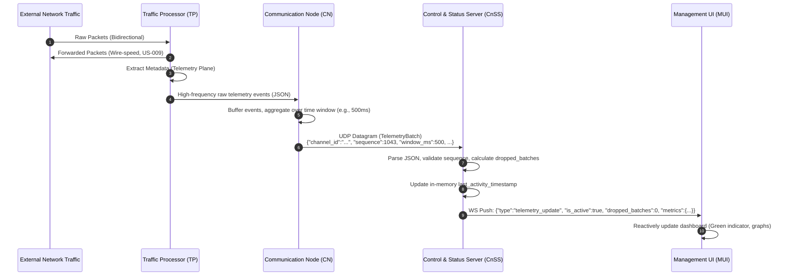

# System Architecture & Data Flow Specification (MVP v1)

## 1. Overview

The architecture is strictly decoupled into a **hardware-accelerated data plane** (for packet forwarding) and a **software-defined telemetry side-channel** (for monitoring). Failure in monitoring components **must not** impact the core packet forwarding (US-005, US-007, US-009).

## 2. Component Architecture & Conceptual Responsibilities

### 2.1. Traffic Processor (TP)
- **Role:** Core packet forwarding and telemetry extraction engine.
- **Responsibilities:**
  1. **Data Plane (Passthrough):** Operates as a transparent inline bridge, passing network packets in both directions at wire speed with negligible latency.
  2. **Telemetry Plane (Extraction):** Independently observes the passing traffic, extracts packet metadata, and generates a high-frequency stream of raw telemetry.
  3. **Local Dispatch:** Pushes the raw telemetry stream to the local Communication Node (CN) for further processing.

### 2.2. Communication Node (CN)
- **Role:** Local telemetry aggregation and forwarding node.
- **Responsibilities:** 
  1. **Ingestion:** Receives the high-frequency stream of raw telemetry from the local TP.
  2. **Buffering & Aggregation:** Buffers incoming events in memory and aggregates them into fixed time windows (e.g., `window_ms: 500`).
  3. **Remote Dispatch:** Transforms the aggregated window into a `TelemetryBatch` payload and forwards it to the remote Control and Status Server (CnSS).

### 2.3. Control and Status Server (CnSS)
- **Role:** Backend aggregation, state management, and API gateway.
- **Responsibilities:** 
  1. **Ingestion & State:** Listens for incoming UDP `TelemetryBatch` datagrams from one or multiple CNs. Maintains an in-memory state.
  2. **Normalization:** Calculates normalized metrics.
  3. **Real-time Push:** Broadcasts `telemetry_update` events to authorized MUI clients via WebSocket.
  4. **REST Fallback:** Exposes REST endpoints for health checks and fallback status polling.

### 2.4. Management User Interface (MUI)
- **Role:** Frontend dashboard for real-time visualization.
- **Responsibilities:** Authenticates with CnSS, establishes a persistent WebSocket connection, and reactively renders:
  - Binary channel activity indicator (Green/Red) (US-001).
  - Bidirectional packet volume counters/graphs (US-002).

---

## 3. Data Flow & Sequence Diagrams

### 3.1. End-to-End Telemetry Pipeline (Happy Path)
This diagram illustrates the normal flow of aggregated telemetry from the network bridge to the administrator's dashboard.



### 3.2. Channel Timeout & Fallback Mechanism
This diagram illustrates how the system handles a loss of telemetry (e.g., CN goes offline or network link drops), ensuring the administrator is accurately informed (US-001).

```mermaid
sequenceDiagram
    participant CN as Communication Node (CN)
    participant CnSS as Control & Status Server (CnSS)
    participant MUI as Management UI (MUI)

    Note over CnSS: Background Task: Check activity periodically
    
    rect rgb(44, 21, 21)
    Note over CnSS: Timeout Detected (No UDP for > 5000ms)
    CnSS->>CnSS: current_time - last_activity > 5.0s
    CnSS->>CnSS: Set channel state is_active = false
    CnSS->>MUI: WS Push: {"type":"telemetry_update", "is_active":false, "dropped_batches":0}
    MUI->>MUI: Update UI: Channel indicator turns Red (Offline)
    end

    Note over CN, CnSS: Recovery
    CN->>CnSS: UDP Datagram resumes (sequence: 1050)
    CnSS->>CnSS: Update last_activity, is_active = true
    CnSS->>MUI: WS Push: {"type":"telemetry_update", "is_active":true, ...}
    MUI->>MUI: Update UI: Channel indicator turns Green (Online)
```



---

## 4. Protocol Specifications

### 4.1. TP to CN (Local Telemetry Stream)
- **Transport:** Local network (UDP or IPC, implementation-dependent).
- **Direction:** TP to CN (unidirectional).
- **Payload:** Per-event metadata JSON (e.g., `{"size": 1500, "srcIP": "...", "L5proto": "TCP"}`).
- **Frequency:** High (per-packet or near per-packet).

### 4.2. CN to CnSS (Remote Aggregation)
- **Transport:** UDP 
- **Endpoint:** `{{cnss_host}}:{{cnss_udp_port}}` (Default: `5140`).
- **Payload Schema (`TelemetryBatch`):**
  ```json
  {
    "channel_id": "{{channel_id}}",
    "sequence": 1042,
    "window_ms": 500,
    "direction_out": { "packets": 150 },
    "direction_in": { "packets": 140 },
    "timestamp": "2026-06-17T12:00:00Z"
  }
  ```

### 4.3. CnSS to MUI (WebSocket Real-time Push)
- **Transport:** WebSocket (WSS recommended for US-014 Remote Access).
- **Endpoint:** `wss://{{cnss_host}}:{{cnss_ws_port}}/api/v1/ws/telemetry?token={{access_token}}`
- **Authentication:** Token extracted from the `token` query parameter. CnSS **MUST NOT** log the full request URL.
- **Payload Schema (`telemetry_update`):**
  ```json
  {
    "type": "telemetry_update",
    "channel_id": "{{channel_id}}",
    "is_active": true,
    "window_ms": 500,
    "dropped_batches": 0,
    "metrics": {
      "direction_out": { "packets_per_sec": 300, "packets": 150 },
      "direction_in": { "packets_per_sec": 280, "packets": 140 }
    },
    "timestamp": "2026-06-17T12:00:00Z",
    "received_at": "2026-06-17T12:00:00.050Z"
  }
  ```

---

## 5. Reliability & Edge Cases

### 5.1. Uninterrupted Traffic Flow (US-005, US-007, US-009)
The TP's Data Plane operates independently of the Telemetry Plane and the rest of the system. If the CN process crashes, the local link between TP and CN fails, or the CnSS is unreachable, the TP **continues to forward packets** at wire speed without interruption. Monitoring degradation does not equal service degradation.

### 5.2. UDP Sequence Tracking & Out-of-Order Delivery (CnSS)
UDP does not guarantee order. To prevent false `dropped_batches` spikes:
1. If `incoming_sequence > last_sequence + 1`:  
   `dropped = incoming_sequence - (last_sequence + 1)`
2. If `incoming_sequence <= last_sequence`:  
   **Ignore the sequence check** (`dropped = 0` for this packet). This gracefully handles out-of-order or duplicated packets without breaking the counter, while still updating `last_activity`.

### 5.3. Memory Leak Prevention (CnSS)
- On WebSocket `onclose` or `onerror`, the socket object must be immediately removed from the in-memory `listeners` set.
- A WebSocket `ping/pong` mechanism (e.g., every 30 seconds) must be implemented. If a client fails to `pong` within 10 seconds, the connection is forcefully closed.

### 5.4. MUI Client-Side Timeout Fallback
Since CnSS does not push "last known state" on initial connect (MVP v1 constraint), if the MUI WebSocket connects successfully but receives **no** `telemetry_update` within **6000ms**, the MUI must locally assume `is_active = false` and display the channel as Offline. This prevents the UI from hanging indefinitely.

---

## 6. Security & Access Control (US-012, US-014)
- **Authentication:** All REST and WebSocket endpoints require a valid `{{access_token}}`.
- **Transport Security:** WebSocket connections should use `wss://` (TLS) to protect telemetry data and tokens in transit, especially for remote MUI access (US-014).
- **Logging:** CnSS must sanitize logs. Query parameters containing tokens must be masked or omitted from access logs.
