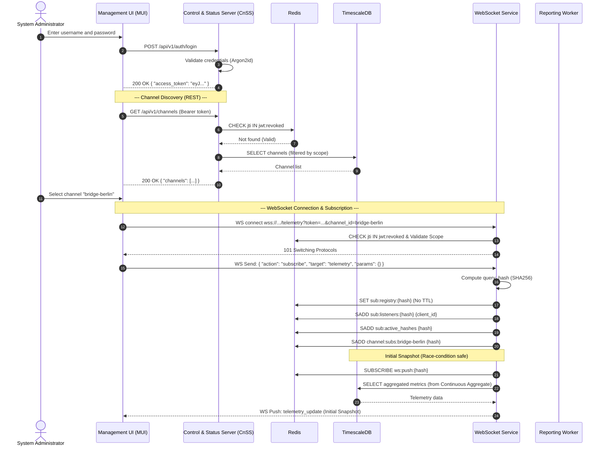
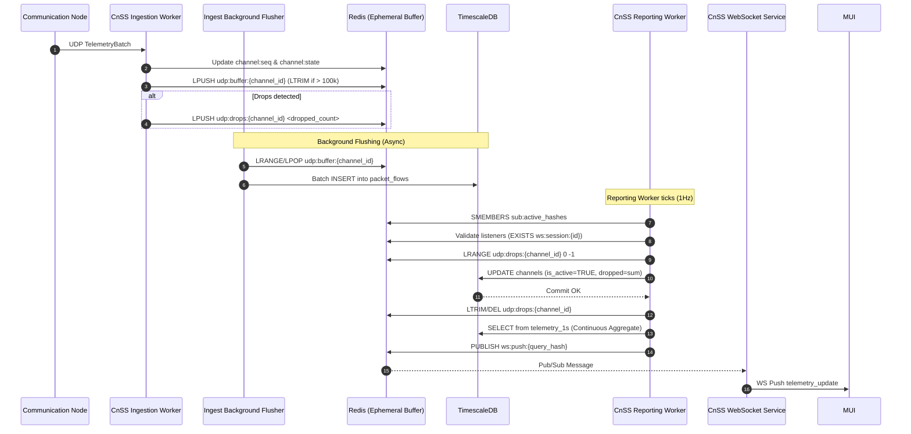
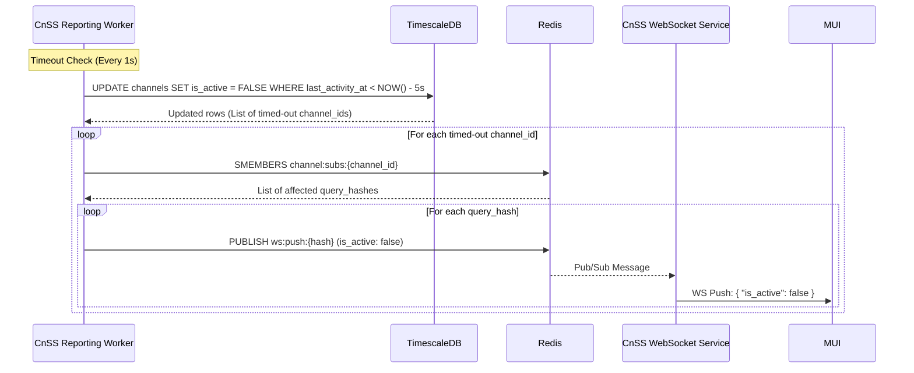
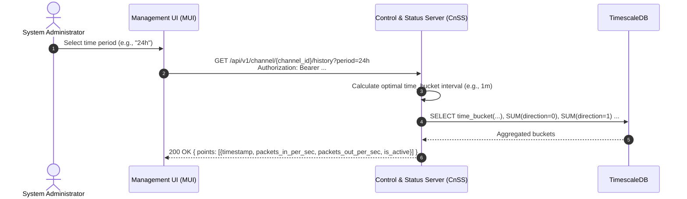
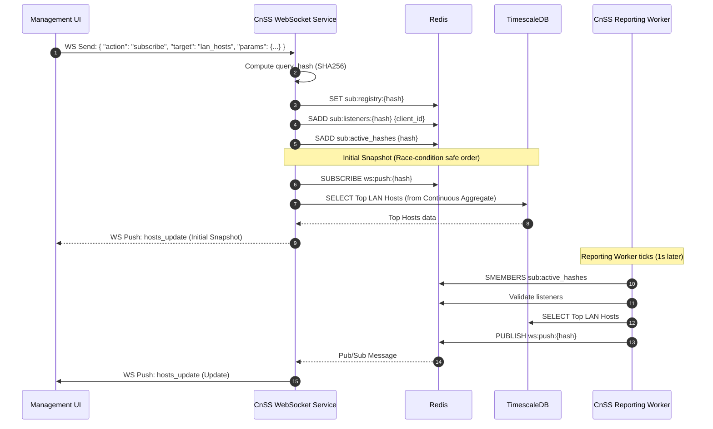

# System Architecture & Data Flow Specification (MVP v2)

## 1. Overview

The architecture is strictly decoupled into a hardware-accelerated data plane (for packet forwarding) and a software-defined telemetry side-channel (for monitoring). Failure in monitoring components must not impact the core packet forwarding (US-005, US-007, US-009).

The system supports multiple Communication Nodes (CNs) feeding a single Control and Status Server (CnSS), and multiple Management User Interfaces (MUIs) consuming data from the same CnSS.

The CnSS persists **raw packet metadata** (IPs, ports, directions) into a Time-Series Database (TimescaleDB). Real-time metrics for the MUI are aggregated via periodic SQL queries. This provides historical data, prevents memory leaks during traffic spikes, and allows for flexible future reporting.

To ensure horizontal scalability, fault isolation, and high-performance telemetry ingestion, the CnSS is strictly decoupled into isolated, containerized Docker microservices. **Redis** acts as the central nervous system for ephemeral buffering, state synchronization, and Pub/Sub messaging, operating without persistence (no RDB/AOF) to maximize IOPS. TimescaleDB remains the single source of truth for persistent data.

## 2. Component Architecture & Conceptual Responsibilities

### 2.1. Traffic Processor (TP)

**Role:** Core packet forwarding and telemetry extraction engine.

**Responsibilities:**

* **Data Plane (Passthrough):** Operates as a transparent inline bridge, passing network packets in both directions at wire speed with negligible latency.
* **Telemetry Plane (Extraction):** Independently observes the passing traffic, extracts packet metadata, and generates a high-frequency stream of raw telemetry.
* **Local Dispatch:** Pushes the raw telemetry stream to the local Communication Node (CN) for further processing.

### 2.2. Communication Node (CN)

**Role:** Local telemetry batching and forwarding node.

**Responsibilities:**

* **Ingestion:** Receives the high-frequency stream of raw telemetry from the local TP.
* **Buffering & Batching:** Buffers incoming raw packet metadata and groups them into fixed, small time windows (e.g., `window_ms: 50`).
* **Remote Dispatch:** Transforms the batch into a `TelemetryBatch` payload and forwards it to the remote CnSS via UDP.
* **UDP MTU Constraint:** CN is strictly responsible for ensuring the serialized JSON payload does not exceed the network MTU (recommended `< 1400 bytes`). CN must dynamically or statically adjust `window_ms` to prevent IP fragmentation and silent UDP drops.
* **Channel Identity:** Each CN is configured with a unique `channel_id`, which is included in every batch.

### 2.3. Control and Status Server (CnSS)

The CnSS is deployed as a set of Docker containers. If any container crashes, Docker's `restart: always` policy ensures immediate recovery without affecting the core network forwarding plane.

#### 2.3.1. Ingestion Worker (UDP Listener & Buffer Manager)

**Role**: High-performance telemetry ingestion, sequence tracking, and database buffering.

**Responsibilities**:

* **UDP Reception**: Listens for `TelemetryBatch` JSON payloads. Enforces MTU constraints (< 1400 bytes).
* **Sequence Tracking**: Maintains `last_sequence` per `channel_id` in **Redis** (`channel:seq:{channel_id}`). If `incoming_sequence <= last_sequence`, it ignores (handles out-of-order). If `last_sequence - incoming_sequence > 1,000,000`, it treats it as a CN reboot/reset and forcefully updates the baseline.
* **Redis State Buffering**: Updates `HSET channel:state:{channel_id}` (TTL 6s) **ONLY IF** `len(packets) > 0`. Accumulates drops via `HINCRBY ... dropped_delta`.
* **Capped List Buffering**: Pushes raw metadata into Redis List (`udp:buffer:{channel_id}`). Uses `LTRIM` to cap the list (e.g., 100,000 items) to prevent OOM crashes.
* **Background Flush**: Periodically flushes the Redis buffer into the `packet_flows` TimescaleDB hypertable using batch `INSERT` operations.

#### 2.3.2. Reporting Worker (Background Aggregator)

**Role**: Periodic metric aggregation and real-time event publishing.

**Responsibilities**:

* **Subscription Polling**: Every 1 second, reads active subscription hashes from Redis Set (`sub:active_hashes`).
* **Optimization**: Checks `sub:listeners:{query_hash}`. If no WebSocket clients are listening, the SQL query is skipped.
* **Dynamic SQL & Pub/Sub**: Generates safe, parameterized SQL (using strict whitelists for `sort_by`/`sort_order` to prevent injection), executes it, and publishes results to Redis Pub/Sub (`ws:push:{query_hash}`).
* **Atomic Flush & Timeout**: Uses a Lua script to atomically read/reset `dropped_delta` from Redis. Executes a single SQL query to mass-update inactive channels: `UPDATE channels SET is_active = FALSE WHERE last_activity_at < NOW() - INTERVAL '5 seconds'`.

#### 2.3.3. WebSocket Service (Client Gateway)

**Role**: Persistent client connection management and subscription routing.

**Responsibilities**:

* **Connection Lifecycle**: Validates JWT, checks `jti` against Redis revocation set (`jwt:revoked`), and verifies channel scope. Returns specific close codes (`4001`-`4004`) on failure.
* **Subscription Management**: Receives JSON control messages, generates a deterministic `query_hash` (SHA256), and registers it in Redis (`sub:registry:{hash}`).
* **Initial Snapshot**: Executes an immediate read-only query against TimescaleDB to provide data without waiting for the 1s Reporting Worker tick.
* **Session Heartbeat**: Refreshes TTL (10s) for `ws:session:{ws_client_id}` every 5 seconds to prevent orphaned subscriptions.
* **Scope Validation**: Rejects subscriptions if the `channel_id` in the control message differs from the URL `channel_id` (Close code 4003).

| Code | Reason | Meaning |
| --- | --- | --- |
| `4001` | `invalid_token` | Token is missing, malformed, expired, or has invalid signature. |
| `4002` | `missing_channel` | The `channel_id` query parameter is entirely absent from the WebSocket request URL. |
| `4003` | `channel_forbidden` | Token is valid, but the user does not have access to the requested channel. |
| `4004` | `channel_not_found` or `target_not_found` | The `channel_id` query parameter is present, but its value does not match any known or active channel in the CnSS registry. Or the value of target dois not match any known subscribtions in the CnSS |
| `1011` | `internal_error` | Unexpected server error. |


#### 2.3.4. REST API & Auth Service

**Role**: HTTP gateway, identity management, and historical data retrieval.

**Responsibilities**:

* **Authentication**: Validates credentials using **Argon2id** password hashes. Issues JWTs containing `role`, `scope`, and `jti`.
* **Zero-Latency Status**: Serves `/channels` and `/status` by reading directly from the persistent `channels` table, avoiding heavy `MAX(time)` queries.
* **History API**: Calculates optimal `time_bucket` intervals for historical line chart data.

### 2.4. Management User Interface (MUI)

**Role:** Frontend dashboard for real-time visualization.

**Responsibilities:**

* **Authentication & Discovery:** Prompts for credentials, fetches accessible channels.
* **WebSocket Connection:** Establishes a persistent WebSocket connection scoped to the selected `channel_id`.
* **Visualization:** Reactively renders binary channel activity indicators and bidirectional packet volume graphs.

## 3. Data Flow & Sequence Diagrams

### 3.1. Authentication & Channel Selection Flow

This diagram illustrates the authentication process and how MUI discovers and selects a channel to monitor.



### 3.2. Multi-Channel End-to-End Telemetry Pipeline (Happy Path)

This diagram illustrates the new flow: raw data ingestion to DB, and periodic aggregation to WS.



### 3.3. Channel Timeout & Fallback Mechanism (Per-Channel)



### 3.4. Line Chart History Retrieval (REST)

This diagram illustrates how MUI lazy-loads historical data for the Line Chart.



### 3.5. WebSocket Subscription for Host Tables (LAN/WAN)

This diagram illustrates the "Initial Snapshot on Subscribe" pattern for real-time host tables.



## 4. Protocol Specifications

### 4.1. TP to CN (Local Telemetry Stream)

* **Transport:** Local network (UDP or IPC).
* **Direction:** TP to CN (unidirectional).
* **Payload:** Per-event metadata JSON.

### 4.2. CN to CnSS (Remote Aggregation)

* **Transport:** UDP
* **Endpoint:** `{{cnss_host}}:{{cnss_udp_port}}` (Default: `5140`).
* **UDP Size Constraint:** CN must ensure the serialized JSON payload does not exceed the network MTU (recommended `< 1400 bytes`). CN must adjust `window_ms` to prevent IP fragmentation.
* **Payload Schema (`TelemetryBatch`):**

```json
{
  "channel_id": "main_tp_dev",
  "timestamp": 1718625600,
  "sequence": 1,
  "window_ms": 50,
  "packets": [
    {
      "direction": 0,
      "src_ip": "192.168.1.100",
      "dst_ip": "8.8.8.8",
      "src_port": 12345,
      "dst_port": 53
    },
    {
      "direction": 1,
      "src_ip": "8.8.8.8",
      "dst_ip": "192.168.1.100",
      "src_port": 53,
      "dst_port": 12345

    }
  ]
}
```

**Fields:**

| Field | Type | Description |
| --- | --- | --- |
| channel_id | string | Identifier of the monitored channel/bridge. |
| timestamp | integer | Unix timestamp (seconds) of the window start. |
| sequence | integer (64-bit) | Monotonically increasing 64-bit sequence number per channel. MUST be 64-bit to prevent wrap-around issues.
| window_ms | integer | Duration of the batching window in milliseconds. |
| packets | array | Array of raw packet metadata objects. |
| packets[].direction | integer | `0` for IN, `1` for OUT. |
| packets[].src_ip | string | Source IP address (IPv4/IPv6). |
| packets[].dst_ip | string | Destination IP address (IPv4/IPv6). |
| packets[].src_port | integer | Source port. |
| packets[].dst_port | integer | Destination port. |

### 4.3. CnSS to MUI (WebSocket Real-time Push)

* **Transport:** WebSocket (WSS recommended).
* **Endpoint:** `wss://{{cnss_host}}:{{cnss_ws_port}}/api/v1/ws/telemetry?token={{access_token}}&channel_id={{channel_id}}`
* **Payload Schema (`telemetry_update`):**

```json
{
   "type": "telemetry_update",
   "channel_id": "bridge-berlin-01",
   "is_active": true,
   "window_ms": int(reporting_window_sec*1000),
   "dropped_batches": 0,
   "metrics": {
     "direction_out": { "packets_per_sec": 300.0, "packets": 15 },
     "direction_in": { "packets_per_sec": 280.0, "packets": 14 }
  },
   "timestamp": "2026-06-17T12:00:00Z",
   "received_at": "2026-06-17T12:00:00.050Z"
}
```

### 4.4. MUI to CnSS (WebSocket Control Messages)

Transport: WebSocket (Text frames).

Direction: MUI to CnSS.

Purpose: Manage real-time subscriptions. **Note:** The core `telemetry_update` stream is now unified under this mechanic. The client MUST send a subscription for telemetry upon connecting.

Payload Schema (Subscribe):

```json
{
     "action": "subscribe",
     "channel_id": "bridge-berlin-01",
     "target": "lan_hosts", 
     "params": {
        "ip_subnet": "192.168.1.0/24",
        "sort_by": "received",
        "sort_order": "desc",
        "limit": 50,
        "window_sec": 5.0
     }
}
```

Payload Schema (Unsubscribe):

```json
{
    "action": "unsubscribe",
    "channel_id": "bridge-berlin-01",
    "target": "lan_hosts"
}
```

**Payload Schema (Telemetry Subscription):**

```json
{
     "action": "subscribe",
     "channel_id": "bridge-berlin-01",
     "target": "telemetry", 
     "params": {}
}
```

**Important:** After establishing a WebSocket connection, the client **MUST** send this subscription message to receive `telemetry` events. The telemetry stream is no longer pushed automatically upon connection.

### 4.5. CnSS to MUI (WebSocket Host Updates)

* **Transport**: WebSocket (Text frames).
* **Direction**: CnSS to MUI.
* **Purpose**: Push real-time updates for LAN/WAN host tables. Sent immediately upon subscription (Initial Snapshot) and then periodically (1 Hz) by the **Reporting** Worker.

Payload Schema (`hosts_update`):

```json
{
    "type": "hosts_update",
    "target": "lan_hosts",
    "channel_id": "bridge-berlin-01",
    "timestamp": "2026-06-17T12:00:05Z",
    "hosts": [
        {
            "ip": "192.168.1.100",
            "sent_per_sec": 15.5,
            "received_per_sec": 120.0,
            "last_seen": "2026-06-17T12:00:04Z"
        }
    ]
}
```

## 5. Database Schema (TimescaleDB)

CnSS utilizes TimescaleDB (an extension of PostgreSQL) for persistent, high-performance time-series storage.

### 5.1. `packet_flows` Hypertable

Stores every individual packet's metadata.

```sql
-- Creation of the table with auto-incrementing BIGSERIAL
CREATE TABLE packet_flows (
    id BIGSERIAL,
    time TIMESTAMPTZ NOT NULL,
    channel_id TEXT NOT NULL,
    direction SMALLINT NOT NULL, -- 0 = IN, 1 = OUT
    src_ip INET NOT NULL,
    dst_ip INET NOT NULL,
    src_port INTEGER NOT NULL,
    dst_port INTEGER NOT NULL,
    
    -- Composite Primary Key (TimescaleDB requirement for hypertables)
    PRIMARY KEY (id, time) 
);

-- Convert to hypertable partitioned by time
SELECT create_hypertable('packet_flows', 'time');

-- Index for fast aggregation by channel and time
CREATE INDEX idx_channel_time ON packet_flows (channel_id, time DESC);
```

### 5.2. Data Retention

To prevent infinite disk growth, CnSS (or a cronjob) should configure a retention policy:

```sql
-- Example: Automatically drop chunks older than 7 days
SELECT add_retention_policy('packet_flows', INTERVAL '7 days');
```

### 5.3. Data Aggregation Strategies (TimescaleDB)

To support the Line Chart and Host Tables without degrading performance, CnSS uses specific TimescaleDB features:

1. Line Chart (History): Uses `time_bucket()` to group raw packet flows into fixed time intervals based on the requested period (e.g., 1h -> 1s buckets, 24h -> 1m buckets).
2. Host Tables (LAN/WAN):
   * LAN Sent: `COUNT(*)` where `direction = 1` (OUT), grouped by `src_ip`.
   * LAN Received: `COUNT(*)` where `direction = 0` (IN), grouped by `dst_ip`.
   * WAN Sent: `COUNT(*)` where `direction = 0` (IN), grouped by `src_ip`.
   * WAN Received: `COUNT(*)` where `direction = 1` (OUT), grouped by `dst_ip`.
   * The results are combined using `UNION ALL` and grouped by IP to calculate `packets_per_sec` (count / window_sec).

### 5.4. Persistent Registry & Identity Tables

Alongside the time-series data, CnSS utilizes standard PostgreSQL tables for relational state and access control.

#### **`channels` (Persistent Registry)**

Acts as the persistent "cold" registry. Updated every 1s by the Reporting Worker to maintain historical records and state recovery.

```sql
CREATE TABLE channels (
    channel_id TEXT PRIMARY KEY,
    created_at TIMESTAMPTZ DEFAULT NOW(),
    last_activity_at TIMESTAMPTZ,
    dropped INTEGER DEFAULT 0,
    is_active BOOLEAN DEFAULT FALSE
);
```
  
#### **`users` & `user_channel_scopes` (Identity & Access)**

```sql
CREATE TABLE users (
    id UUID PRIMARY KEY DEFAULT gen_random_uuid(),
    username VARCHAR(50) UNIQUE NOT NULL,
    password_hash VARCHAR(255) NOT NULL, -- Argon2id via passlib
    role VARCHAR(20) NOT NULL CHECK (role IN ('admin', 'viewer')),
    created_at TIMESTAMPTZ DEFAULT NOW()
);

CREATE TABLE user_channel_scopes (
    user_id UUID REFERENCES users(id) ON DELETE CASCADE,
    channel_id TEXT NOT NULL,
    PRIMARY KEY (user_id, channel_id)
);
```

## 6. Reliability & Edge Cases

### 6.1. Uninterrupted Traffic Flow (US-005, US-007, US-009)

The TP's Data Plane operates independently. If CN crashes or CnSS/DB is unreachable, TP continues forwarding packets at wire speed.

### 6.2. UDP Sequence Tracking & Reset Detection

Sequence tracking is performed per channel using **Redis** (`channel:seq:{channel_id}`) to survive container restarts.

* If `incoming_sequence > last_sequence + 1`: Calculates drops.
* If `incoming_sequence <= last_sequence`: Ignores (handles out-of-order gracefully).
* **Sequence Reset Detection**: If `last_sequence - incoming_sequence > 1,000,000`, the worker treats it as a CN reboot, forcefully updates `last_sequence`, and resets the drop counter for this batch.
* **Constraint**: CN **must** use 64-bit integers for sequence numbers to prevent wrap-around issues.

### 6.3. Database, Memory & Redis Persistence

* **Redis Buffer Protection**: The Ingestion Worker uses `LTRIM` to cap the `udp:buffer:{channel_id}` list (e.g., at 100,000 items), preventing Out-Of-Memory (OOM) crashes if the DB flusher lags.
* **Session GC**: WebSocket sessions rely on Redis TTLs (`ws:session:{client_id}` set to 10s, refreshed every 5s). If the WS container crashes, keys automatically expire, preventing orphaned subscriptions.
* **Redis Persistence Trade-off**: Redis is explicitly configured to run **without persistence** (no RDB/AOF). It operates purely as an ephemeral buffer. If Redis restarts, unflushed UDP buffers and sequence states are lost. This is an accepted trade-off to maximize IOPS. Upon restart, the system gracefully resets sequence baselines and resumes ingestion.

### 6.4. MUI Client-Side Timeout Fallback

If MUI connects to WS but receives no `telemetry_update` within 6000ms, it locally assumes `is_active = false`.

## 7. Security & Access Control (US-012, US-014)

### 7.1. Authentication

All REST and WebSocket endpoints require a valid `{{access_token}}` (JWT). The JWT is issued via `POST /api/v1/auth/login` after successful credential validation. Unlike WebSocket connections which are persistent, REST API endpoints are stateless. However, to support immediate session termination (logout/compromise), the REST API middleware **MUST** extract the `jti` (JWT ID) from the Bearer token on *every single request* and verify it against the `jwt:revoked` Redis Set. If the `jti` exists, the API must return `401 Unauthorized` immediately, bypassing further route execution. The JWT payload contains:

```json
{
  "sub": "admin_01",
  "iat": 1750248000,
  "exp": 1750334400,
  "role": "admin",
  "scope": ["bridge-berlin-01", "bridge-prague-01"]
}
```

Password validation uses **Argon2id** via the `passlib` library

| Claim | Type | Description |
|-------|------|-------------|
| `sub` | string | User identifier. |
| `iat` | integer | Issued-at timestamp (Unix). |
| `exp` | integer | Expiration timestamp (Unix). Default: 24 hours from issuance. |
| `role` | string | `admin` or `viewer`. |
| `scope` | array[string] | List of `channel_id` the user may access. `role=admin` means unrestricted access, List of all channels. |

### 7.2. Authorization Matrix

| Role | `scope` | Access |
|------|---------|--------|
| `admin` | missing or any value | All channels (including dynamically added ones) |
| `viewer` | specified | Only channels listed in the scope array. |

### 7.3. Transport Security

WebSocket connections should use `wss://` (TLS) to protect telemetry data and tokens in transit, especially for remote MUI access (US-014). In MVP v1, HTTP is permitted as a conscious trade-off for simplicity, but this introduces risks (token interception via MITM).

### 7.4. Logging

CnSS must sanitize logs. Query parameters containing tokens must be masked or omitted from access logs (e.g., replace `?token=eyJhbG...` with `?token=[REDACTED]`).

### 7.5. CN Trust Model (MVP v1)

CNs are **not authenticated** — the `channel_id` is a trusted assertion. CnSS accepts UDP datagrams from any source. Mitigations:

* Network-level ACLs: CnSS should only accept UDP from known CN IP addresses.
* Future versions: mTLS / DTLS with client certificates, with `channel_id` embedded in the certificate's Subject Alternative Name.

### 7.6. Token Storage (MUI)

The MUI must store the JWT token **exclusively in memory** (JavaScript variable). Do not use `localStorage` or `sessionStorage` — these are vulnerable to XSS attacks. On page reload, the user must re-authenticate.

### 7.7. Token Revocation

To support immediate session termination (e.g., on logout or compromise), the Auth Service adds the token's `jti` (JWT ID) to a Redis Set (`jwt:revoked`). The WebSocket Service checks this set upon connection and periodically during the session. If a revoked `jti` is detected, the connection is immediately closed with code `4001`.

## 8. REST API Endpoints

### 8.1. `POST /api/v1/auth/login`

**Purpose:** Authenticate user and issue JWT token.  
**Auth:** None (public endpoint).  
**Request Body:**

```json
{
  "username": "admin",
  "password": "secretpassword"
}
```

**Response 200:**

```json
{
  "access_token": "eyJhbGciOiJIUzI1NiIsInR5cCI6IkpXVCJ9...",
  "token_type": "Bearer",
  "expires_in": 86400,
  "issued_at": "2026-06-18T12:00:00Z",
  "role": "admin",
  "scope": ["bridge-berlin-01", "bridge-prague-01"]
}
```

**Response 401:**

```json
{
  "error": "invalid_credentials",
  "message": "Invalid username or password."
}
```

### 8.2. `GET /api/v1/channels`

**Purpose:** List all channels accessible to the authenticated user. For `viewer`, the list is filtered by JWT scope. For `admin`, all known channels are returned.
**Auth:** `Authorization: Bearer {{access_token}}`  
**Response 200:**

```json
{
  "channels": [
    {
      "channel_id": "bridge-berlin-01",
      "is_active": true,
      "last_activity_timestamp": "2026-06-17T12:00:00Z"
    },
    {
      "channel_id": "bridge-prague-01",
      "is_active": false,
      "last_activity_timestamp": "2026-06-17T11:55:00Z"
    }
  ],
  "total": 2
}
```

### 8.3. `GET /api/v1/channel/{channel_id}/status`

**Purpose:** REST fallback for a specific channel's activity indicator.  
**Auth:** `Authorization: Bearer {{access_token}}`  
**Response 200:**

```json
{
  "channel_id": "{{channel_id}}",
  "is_active": true,
  "last_activity_timestamp": "2026-06-17T12:00:00Z"
}
```

**Response 403:**

```json
{
  "error": "forbidden",
  "message": "You do not have access to this channel."
}
```

**Response 404:**

```json
{
  "error": "not_found",
  "message": "Channel not found."
}
```

### 8.4. `GET /api/v1/health`

**Purpose:** Verify operational status of the CnSS itself.  
**Auth:** `Authorization: Bearer {{access_token}}`  
**Response 200:**

```json
{
  "status": "healthy",
  "components": {
    "cnss": "active"
  },
  "channels_active": 3,
  "channels_total": 4,
  "timestamp": "2026-06-17T12:00:00Z"
}
```

### 8.5. `GET /api/v1/channel/{channel_id}/history`

**Purpose**: Lazy-load historical telemetry data for the Line Chart. CnSS dynamically calculates the optimal `time_bucket` interval based on the requested period to return a reasonable number of points.
**Auth**: `Authorization: Bearer {{access_token}}`

Path Parameters:

| Parameter | Type | Description |
| --- | --- | --- |
| channel_id | string | Identifier of the channel to query. |

Query Parameters:

| Parameter | Type | Description |
| --- | --- | --- |
| period | string | Time period to query. Enum: `1h`, `24h`, `7d`, `30d`. |

Response 200:

```json
{
    "channel_id": "bridge-berlin-01",
    "period": "24h",
    "interval_sec": 60,
    "points": [
        {
            "timestamp": "2026-06-17T12:00:00Z",
            "packets_in_per_sec": 280.5,
            "packets_out_per_sec": 300.0,
            "is_active": true
        }
    ]
}
```

Response 403:

```json
{
  "error": "forbidden",
  "message": "You do not have access to this channel."
}
```

Response 404:

```json
{
  "error": "not_found",
  "message": "Channel not found."
}
```

## 9. Redis Architecture & State Management

Redis serves as the central nervous system, handling buffering, state synchronization, and pub/sub messaging. It is strictly configured as an **ephemeral, in-memory store** (no RDB/AOF persistence).

### 9.1. Key Structure

**Subscription Registry:**

* `sub:registry:{query_hash}` (String, TTL 1 hour): Stores the JSON definition of the subscription.
* `sub:listeners:{query_hash}` (Set): Stores the IDs of connected WebSocket clients requesting this data.
* `sub:active_hashes` (Set): Fast-lookup index of all active `query_hash` values, replacing blocking `KEYS` commands.

**Session & Buffer Management:**

* `ws:session:{ws_client_id}` (Hash): Tracks active subscriptions for rapid cleanup on disconnect. TTL 10s.
* `udp:buffer:{channel_id}` (List): High-speed buffer for raw packet metadata. Capped via `LTRIM`.
* `channel:seq:{channel_id}` (String): Stores the `last_sequence` integer per channel.
* `channel:state:{channel_id}` (Hash): Stores `last_activity_at` and `dropped_delta`. TTL 6s.

**Security:**

* `jwt:revoked` (Set): Stores the `jti` of revoked tokens for immediate session termination.

### 9.2. Pub/Sub Channels

* `ws:push:{query_hash}`: The Reporting Worker publishes aggregated JSON payloads here. The WebSocket Service subscribes to these channels based on active client requests.
