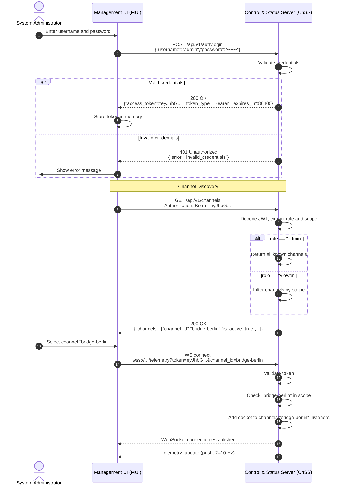
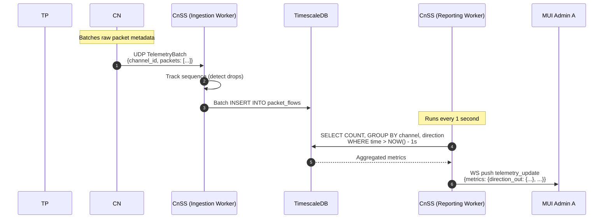
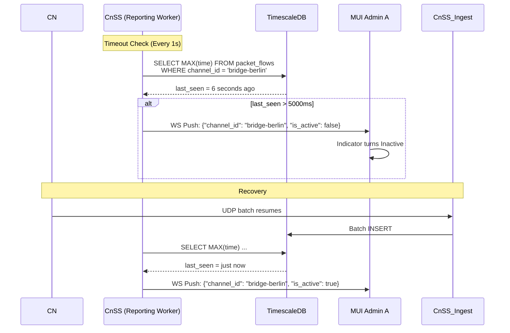
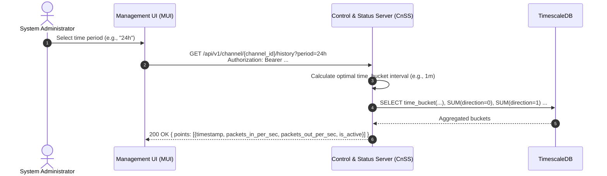
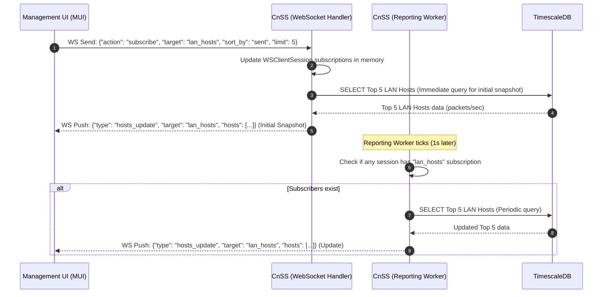

# System Architecture & Data Flow Specification (MVP v2)

## 1. Overview
The architecture is strictly decoupled into a hardware-accelerated data plane (for packet forwarding) and a software-defined telemetry side-channel (for monitoring). Failure in monitoring components must not impact the core packet forwarding (US-005, US-007, US-009).

The system supports multiple Communication Nodes (CNs) feeding a single Control and Status Server (CnSS), and multiple Management User Interfaces (MUIs) consuming data from the same CnSS. 

The CnSS persists **raw packet metadata** (IPs, ports, directions) into a Time-Series Database (TimescaleDB). Real-time metrics for the MUI are aggregated via periodic SQL queries. This provides historical data, prevents memory leaks during traffic spikes, and allows for flexible future reporting.

## 2. Component Architecture & Conceptual Responsibilities

### 2.1. Traffic Processor (TP)

**Role:** Core packet forwarding and telemetry extraction engine.

**Responsibilities:**
*   **Data Plane (Passthrough):** Operates as a transparent inline bridge, passing network packets in both directions at wire speed with negligible latency.
*   **Telemetry Plane (Extraction):** Independently observes the passing traffic, extracts packet metadata, and generates a high-frequency stream of raw telemetry.
*   **Local Dispatch:** Pushes the raw telemetry stream to the local Communication Node (CN) for further processing.

### 2.2. Communication Node (CN)

**Role:** Local telemetry batching and forwarding node.

**Responsibilities:**
*   **Ingestion:** Receives the high-frequency stream of raw telemetry from the local TP.
*   **Buffering & Batching:** Buffers incoming raw packet metadata and groups them into fixed, small time windows (e.g., `window_ms: 50`).
*   **Remote Dispatch:** Transforms the batch into a `TelemetryBatch` payload and forwards it to the remote CnSS via UDP.
*   **UDP MTU Constraint:** CN is strictly responsible for ensuring the serialized JSON payload does not exceed the network MTU (recommended `< 1400 bytes`). CN must dynamically or statically adjust `window_ms` to prevent IP fragmentation and silent UDP drops.
*   **Channel Identity:** Each CN is configured with a unique `channel_id`, which is included in every batch.

### 2.3. Control and Status Server (CnSS)

**Role:** Backend ingestion, persistent storage, aggregation, API gateway, and authentication server.

**Responsibilities:**
*   **Authentication:** Validates user credentials and issues JWT tokens containing `role` and `scope`.
*   **Persistent Storage (TimescaleDB):** Stores all raw packet metadata received from CNs into a time-series database.
*   **Ingestion Worker:** Listens for incoming UDP `TelemetryBatch` datagrams. Parses JSON, tracks `sequence` numbers to detect dropped datagrams, and performs batch `INSERT` operations into the `packet_flows` TimescaleDB table.
*   **Reporting Worker:** A background task that runs every 1 second. It queries TimescaleDB to aggregate metrics (packet counts per direction) for the last second, determines channel `is_active` status, and pushes `telemetry_update` events to subscribed MUI clients via WebSocket.
*   **Access Control:** Validates JWT tokens on all REST and WebSocket endpoints. Enforces per-channel access via the `scope` claim.
*   **REST API & WebSocket:** Exposes endpoints for MUI authentication, channel discovery, and real-time telemetry streaming.
*   **Session Management**: Maintains in-memory `WSClientSession` objects to track user context and active WebSocket subscriptions (e.g., LAN/WAN host tables). This enables targeted broadcasting and resource optimization.
*   **History API**: Provides REST endpoints for lazy-loading historical telemetry data (Line Chart) with dynamic time-bucketing.
*   **Targeted Reporting**: The Reporting Worker checks active subscriptions and pushes targeted `hosts_update` events only to subscribed MUI clients, skipping heavy DB queries if no one is listening.

### 2.4. Management User Interface (MUI)

**Role:** Frontend dashboard for real-time visualization.

**Responsibilities:**
*   **Authentication & Discovery:** Prompts for credentials, fetches accessible channels.
*   **WebSocket Connection:** Establishes a persistent WebSocket connection scoped to the selected `channel_id`.
*   **Visualization:** Reactively renders binary channel activity indicators and bidirectional packet volume graphs.

## 3. Data Flow & Sequence Diagrams

### 3.1. Authentication & Channel Selection Flow
This diagram illustrates the authentication process and how MUI discovers and selects a channel to monitor.



### 3.2. Multi-Channel End-to-End Telemetry Pipeline (Happy Path)
This diagram illustrates the new flow: raw data ingestion to DB, and periodic aggregation to WS.



### 3.3. Channel Timeout & Fallback Mechanism (Per-Channel)
Timeouts are now determined by querying the database for recent activity, rather than checking an in-memory dictionary.


### 3.4. Line Chart History Retrieval (REST)
This diagram illustrates how MUI lazy-loads historical data for the Line Chart.



### 3.5. WebSocket Subscription for Host Tables (LAN/WAN)
This diagram illustrates the "Initial Snapshot on Subscribe" pattern for real-time host tables.



## 4. Protocol Specifications

### 4.1. TP to CN (Local Telemetry Stream)
*   **Transport:** Local network (UDP or IPC).
*   **Direction:** TP to CN (unidirectional).
*   **Payload:** Per-event metadata JSON.

### 4.2. CN to CnSS (Remote Aggregation)
*   **Transport:** UDP
*   **Endpoint:** `{{cnss_host}}:{{cnss_udp_port}}` (Default: `5140`).
*   **UDP Size Constraint:** CN must ensure the serialized JSON payload does not exceed the network MTU (recommended `< 1400 bytes`). CN must adjust `window_ms` to prevent IP fragmentation.
*   **Payload Schema (`TelemetryBatch`):**
```json
{
  "channel_id": "main_tp_dev",
  "timestamp": 1718625600,
  "sequence": 1,
  "window_ms": 50,
  "packets": [
    {
      "direction": 0,
      "src_ip": "192.168.1.100",
      "dst_ip": "8.8.8.8",
      "src_port": 12345,
      "dst_port": 53
    },
    {
      "direction": 1,
      "src_ip": "8.8.8.8",
      "dst_ip": "192.168.1.100",
      "src_port": 53,
      "dst_port": 12345
    }
  ]
}
```
**Fields:**
| Field | Type | Description |
| --- | --- | --- |
| channel_id | string | Identifier of the monitored channel/bridge. |
| timestamp | integer | Unix timestamp (seconds) of the window start. |
| sequence | integer | Monotonically increasing sequence number per channel. |
| window_ms | integer | Duration of the batching window in milliseconds. |
| packets | array | Array of raw packet metadata objects. |
| packets[].direction | integer | `0` for IN, `1` for OUT. |
| packets[].src_ip | string | Source IP address (IPv4/IPv6). |
| packets[].dst_ip | string | Destination IP address (IPv4/IPv6). |
| packets[].src_port | integer | Source port. |
| packets[].dst_port | integer | Destination port. |

### 4.3. CnSS to MUI (WebSocket Real-time Push)
*   **Transport:** WebSocket (WSS recommended).
*   **Endpoint:** `wss://{{cnss_host}}:{{cnss_ws_port}}/api/v1/ws/telemetry?token={{access_token}}&channel_id={{channel_id}}`
*   **Payload Schema (`telemetry_update`):** *(Unchanged from MVP v1 to preserve frontend compatibility. Data is sourced from DB aggregation).*
```json
{
   "type": "telemetry_update",
   "channel_id": "bridge-berlin-01",
   "is_active": true,
   "window_ms": 50,
   "dropped_batches": 0,
   "metrics": {
     "direction_out": { "packets_per_sec": 300.0, "packets": 15 },
     "direction_in": { "packets_per_sec": 280.0, "packets": 14 }
  },
   "timestamp": "2026-06-17T12:00:00Z",
   "received_at": "2026-06-17T12:00:00.050Z"
}
```

### 4.4. MUI to CnSS (WebSocket Control Messages)
*   **Transport**: WebSocket (Text frames).
*   **Direction**: MUI to CnSS.
*   **Purpose**: Manage real-time subscriptions for host tables.

Payload Schema (Subscribe):

```json
{
    "action": "subscribe",
    "target": "lan_hosts",  // Enum: "lan_hosts", "wan_hosts"
    "sort_by": "sent",      // Enum: "sent", "received", "last_seen"
    "limit": 5              // Integer, default: 5
}
```

Payload Schema (Unsubscribe):

```json
{
    "action": "unsubscribe",
    "target": "lan_hosts"   // Enum: "lan_hosts", "wan_hosts"
}
```

### 4.5. CnSS to MUI (WebSocket Host Updates)
*   **Transport**: WebSocket (JSON frames).
*   **Direction**: CnSS to MUI.
*   **Purpose**: Push real-time updates for LAN/WAN host tables. Sent immediately upon subscription (Initial Snapshot) and then periodically (1 Hz) by the *   **Reporting** Worker.

Payload Schema (`hosts_update`):

```json
{
    "type": "hosts_update",
    "target": "lan_hosts",
    "channel_id": "bridge-berlin-01",
    "timestamp": "2026-06-17T12:00:05Z",
    "hosts": [
        {
            "ip": "192.168.1.100",
            "sent_per_sec": 15.5,
            "received_per_sec": 120.0,
            "last_seen": "2026-06-17T12:00:04Z"
        }
    ]
}
```

## 5. Database Schema (TimescaleDB)

CnSS utilizes TimescaleDB (an extension of PostgreSQL) for persistent, high-performance time-series storage.

### 5.1. `packet_flows` Hypertable
Stores every individual packet's metadata.

```sql
-- Creation of the table with auto-incrementing BIGSERIAL
CREATE TABLE packet_flows (
    id BIGSERIAL,
    time TIMESTAMPTZ NOT NULL,
    channel_id TEXT NOT NULL,
    direction SMALLINT NOT NULL, -- 0 = IN, 1 = OUT
    src_ip INET NOT NULL,
    dst_ip INET NOT NULL,
    src_port INTEGER NOT NULL,
    dst_port INTEGER NOT NULL,
    
    -- Composite Primary Key (TimescaleDB requirement for hypertables)
    PRIMARY KEY (id, time) 
);

-- Convert to hypertable partitioned by time
SELECT create_hypertable('packet_flows', 'time');

-- Index for fast aggregation by channel and time
CREATE INDEX idx_channel_time ON packet_flows (channel_id, time DESC);
```

### 5.2. Data Retention
To prevent infinite disk growth, CnSS (or a cronjob) should configure a retention policy:
```sql
-- Example: Automatically drop chunks older than 7 days
SELECT add_retention_policy('packet_flows', INTERVAL '7 days');
```

### 5.3. Data Aggregation Strategies (TimescaleDB)
To support the Line Chart and Host Tables without degrading performance, CnSS uses specific TimescaleDB features:

1. Line Chart (History): Uses `time_bucket()` to group raw packet flows into fixed time intervals based on the requested period (e.g., 1h -> 1s buckets, 24h -> 1m buckets).
2. Host Tables (LAN/WAN): 
   - LAN Sent: `COUNT(*)` where `direction = 1` (OUT), grouped by `src_ip`.
   - LAN Received: `COUNT(*)` where `direction = 0` (IN), grouped by `dst_ip`.
   - WAN Sent: `COUNT(*)` where `direction = 0` (IN), grouped by `src_ip`.
   - WAN Received: `COUNT(*)` where `direction = 1` (OUT), grouped by `dst_ip`.
   - The results are combined using `UNION ALL` and grouped by IP to calculate `packets_per_sec` (count / window_sec).
  
## 6. Reliability & Edge Cases

### 6.1. Uninterrupted Traffic Flow (US-005, US-007, US-009)
The TP's Data Plane operates independently. If CN crashes or CnSS/DB is unreachable, TP continues forwarding packets at wire speed.

### 6.2. UDP Sequence Tracking & Out-of-Order Delivery (CnSS Ingestion Worker)
Sequence tracking is performed per channel in memory by the Ingestion Worker before DB insertion.
*   If `incoming_sequence > last_sequence + 1`: `dropped = incoming_sequence - (last_sequence + 1)`.
*   If `incoming_sequence <= last_sequence`: Ignore (`dropped = 0`), handling out-of-order gracefully.
The calculated `dropped_batches` metric is passed to the Reporting Worker to be included in the WebSocket payload.

### 6.3. Database & Memory Leak Prevention
*   **WebSocket GC**: On WebSocket `onclose`, the `WSClientSession` object (containing the socket and subscription context) is removed from the channel's listener registry. If a channel loses all subscribers for a specific target (e.g., `lan_hosts`), the Reporting Worker skips the heavy DB query for that target.
*   **Database GC:** Handled natively by TimescaleDB retention policies (e.g., dropping chunks older than X days).
*   **Ingestion Memory:** The Ingestion Worker only keeps the `last_sequence` integer per channel in memory. No raw packet data is held in memory.

### 6.4. MUI Client-Side Timeout Fallback
If MUI connects to WS but receives no `telemetry_update` within 6000ms, it locally assumes `is_active = false`.

## 7. Security & Access Control (US-012, US-014)

### 7.1. Authentication
All REST and WebSocket endpoints require a valid `{{access_token}}` (JWT). The JWT is issued via `POST /api/v1/auth/login` after successful credential validation. The JWT payload contains:

```json
{
  "sub": "admin_01",
  "iat": 1750248000,
  "exp": 1750334400,
  "role": "admin",
  "scope": ["bridge-berlin-01", "bridge-prague-01"]
}
```

| Claim | Type | Description |
|-------|------|-------------|
| `sub` | string | User identifier. |
| `iat` | integer | Issued-at timestamp (Unix). |
| `exp` | integer | Expiration timestamp (Unix). Default: 24 hours from issuance. |
| `role` | string | `admin` or `viewer`. |
| `scope` | array[string] | List of `channel_id` the user may access. `role=admin` means unrestricted access, List of all channels. |

### 7.2. Authorization Matrix


| Role | `scope` | Access |
|------|---------|--------|
| `admin` | missing or any value | All channels (including dynamically added ones) |
| `viewer` | specified | Only channels listed in the scope array. |

### 7.3. Transport Security
WebSocket connections should use `wss://` (TLS) to protect telemetry data and tokens in transit, especially for remote MUI access (US-014). In MVP v1, HTTP is permitted as a conscious trade-off for simplicity, but this introduces risks (token interception via MITM).

### 7.4. Logging
CnSS must sanitize logs. Query parameters containing tokens must be masked or omitted from access logs (e.g., replace `?token=eyJhbG...` with `?token=[REDACTED]`).

### 7.5. CN Trust Model (MVP v1)
CNs are **not authenticated** — the `channel_id` is a trusted assertion. CnSS accepts UDP datagrams from any source. Mitigations:
- Network-level ACLs: CnSS should only accept UDP from known CN IP addresses.
- Future versions: mTLS / DTLS with client certificates, with `channel_id` embedded in the certificate's Subject Alternative Name.

### 7.6. Token Storage (MUI)
The MUI must store the JWT token **exclusively in memory** (JavaScript variable). Do not use `localStorage` or `sessionStorage` — these are vulnerable to XSS attacks. On page reload, the user must re-authenticate.

## 8. REST API Endpoints

### 8.1. `POST /api/v1/auth/login`
**Purpose:** Authenticate user and issue JWT token.  
**Auth:** None (public endpoint).  
**Request Body:**
```json
{
  "username": "admin",
  "password": "secretpassword"
}
```
**Response 200:**
```json
{
  "access_token": "eyJhbGciOiJIUzI1NiIsInR5cCI6IkpXVCJ9...",
  "token_type": "Bearer",
  "expires_in": 86400,
  "issued_at": "2026-06-18T12:00:00Z",
  "role": "admin",
  "scope": ["bridge-berlin-01", "bridge-prague-01"]
}
```
**Response 401:**
```json
{
  "error": "invalid_credentials",
  "message": "Invalid username or password."
}
```

### 8.2. `GET /api/v1/channels`
**Purpose:** List all channels accessible to the authenticated user. For `viewer`, the list is filtered by JWT scope. For `admin`, all known channels are returned.
**Auth:** `Authorization: Bearer {{access_token}}`  
**Response 200:**
```json
{
  "channels": [
    {
      "channel_id": "bridge-berlin-01",
      "is_active": true,
      "last_activity_timestamp": "2026-06-17T12:00:00Z"
    },
    {
      "channel_id": "bridge-prague-01",
      "is_active": false,
      "last_activity_timestamp": "2026-06-17T11:55:00Z"
    }
  ],
  "total": 2
}
```

### 8.3. `GET /api/v1/channel/{channel_id}/status`
**Purpose:** REST fallback for a specific channel's activity indicator.  
**Auth:** `Authorization: Bearer {{access_token}}`  
**Response 200:**
```json
{
  "channel_id": "{{channel_id}}",
  "is_active": true,
  "last_activity_timestamp": "2026-06-17T12:00:00Z"
}
```
**Response 403:**
```json
{
  "error": "forbidden",
  "message": "You do not have access to this channel."
}
```
**Response 404:**
```json
{
  "error": "not_found",
  "message": "Channel not found."
}
```

### 8.4. `GET /api/v1/health`
**Purpose:** Verify operational status of the CnSS itself.  
**Auth:** `Authorization: Bearer {{access_token}}`  
**Response 200:**
```json
{
  "status": "healthy",
  "components": {
    "cnss": "active"
  },
  "channels_active": 3,
  "channels_total": 4,
  "timestamp": "2026-06-17T12:00:00Z"
}
```

### 8.5. `GET /api/v1/channel/{channel_id}/history`
**Purpose**: Lazy-load historical telemetry data for the Line Chart. CnSS dynamically calculates the optimal `time_bucket` interval based on the requested period to return a reasonable number of points.
**Auth**: `Authorization: Bearer {{access_token}}`

Path Parameters:
| Parameter | Type | Description |
| --- | --- | --- |
| channel_id | string | Identifier of the channel to query. |

Query Parameters:
| Parameter | Type | Description |
| --- | --- | --- |
| period | string | Time period to query. Enum: `1h`, `24h`, `7d`, `30d`. |


Response 200:
```json
{
    "channel_id": "bridge-berlin-01",
    "period": "24h",
    "interval_sec": 60,
    "points": [
        {
            "timestamp": "2026-06-17T12:00:00Z",
            "packets_in_per_sec": 280.5,
            "packets_out_per_sec": 300.0,
            "is_active": true
        }
    ]
}
```
Response 403:
```json
{
  "error": "forbidden",
  "message": "You do not have access to this channel."
}
```
Response 404:
```json
{
  "error": "not_found",
  "message": "Channel not found."
}
```