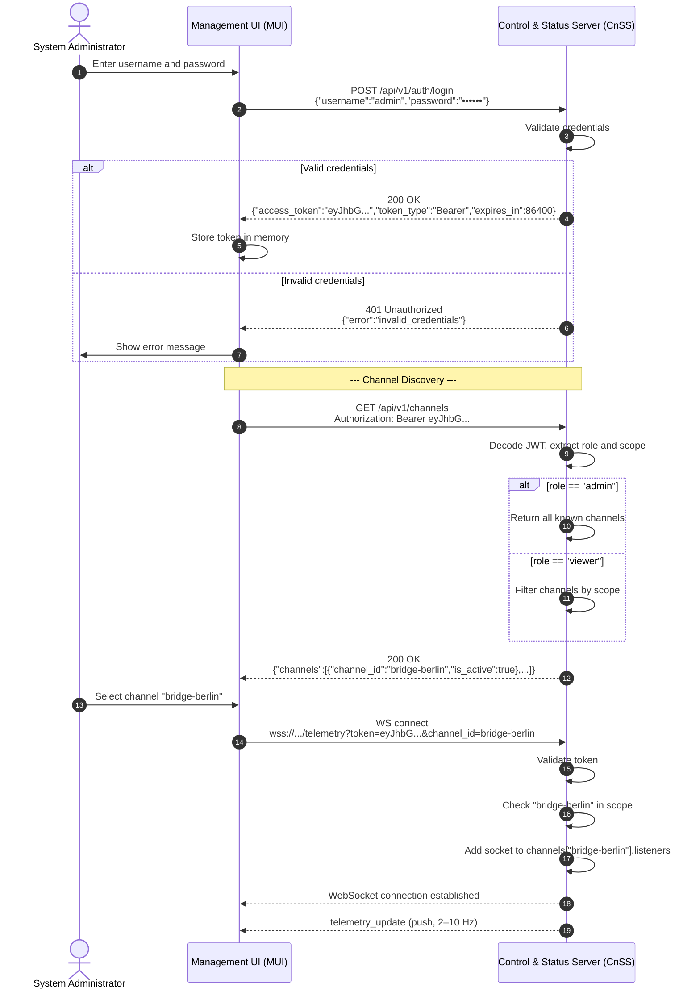
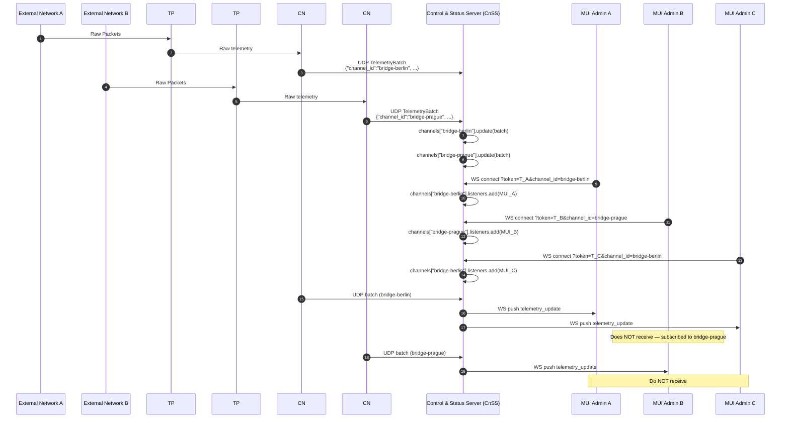
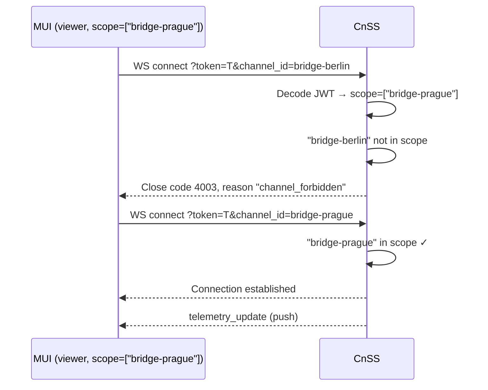

# System Architecture & Data Flow Specification (MVP v1)

## 1. Overview

The architecture is strictly decoupled into a **hardware-accelerated data plane** (for packet forwarding) and a **software-defined telemetry side-channel** (for monitoring). Failure in monitoring components **must not** impact the core packet forwarding (US-005, US-007, US-009).

The system supports **multiple Communication Nodes (CNs)** feeding a single Control and Status Server (CnSS), and **multiple Management User Interfaces (MUIs)** consuming data from the same CnSS. Each MUI authenticates with credentials, receives a JWT token with a scoped list of accessible channels, and subscribes to a specific channel for real-time telemetry.

## 2. Component Architecture & Conceptual Responsibilities

### 2.1. Traffic Processor (TP)
- **Role:** Core packet forwarding and telemetry extraction engine.
- **Responsibilities:**
  1. **Data Plane (Passthrough):** Operates as a transparent inline bridge, passing network packets in both directions at wire speed with negligible latency.
  2. **Telemetry Plane (Extraction):** Independently observes the passing traffic, extracts packet metadata, and generates a high-frequency stream of raw telemetry.
  3. **Local Dispatch:** Pushes the raw telemetry stream to the local Communication Node (CN) for further processing.

### 2.2. Communication Node (CN)
- **Role:** Local telemetry aggregation and forwarding node.
- **Responsibilities:** 
  1. **Ingestion:** Receives the high-frequency stream of raw telemetry from the local TP.
  2. **Buffering & Aggregation:** Buffers incoming events in memory and aggregates them into fixed time windows (e.g., `window_ms: 500`).
  3. **Remote Dispatch:** Transforms the aggregated window into a `TelemetryBatch` payload and forwards it to the remote Control and Status Server (CnSS).
  4. **Channel Identity:** Each CN is configured with a unique `channel_id` (e.g., `bridge-berlin-01`), which is included in every `TelemetryBatch`. The `channel_id` serves as the primary key for per-channel state in CnSS.

> **Note:** In MVP v1, CNs are **not authenticated** — they are trusted components operating in a controlled network. The `channel_id` is a trusted assertion. Future versions will introduce mTLS/DTLS for CN-to-CnSS authentication.

### 2.3. Control and Status Server (CnSS)
- **Role:** Backend aggregation, state management, API gateway, and authentication server.
- **Responsibilities:** 
  1. **Authentication:** Validates user credentials (username/password) via `POST /api/v1/auth/login` and issues JWT tokens containing `role` and `scope` (list of accessible `channel_id`).
  2. **Multi-Channel State:** Maintains an in-memory registry of channels: `Dict[channel_id → ChannelState]`. Each channel has its own `last_activity_timestamp`, `is_active` flag, `last_sequence`, and set of subscribed WebSocket listeners.
  3. **Ingestion:** Listens for incoming UDP `TelemetryBatch` datagrams from **one or multiple CNs**. Routes each batch to the appropriate channel by `channel_id`. If a channel does not exist, CnSS creates it on first receipt.
  4. **Normalization:** Calculates normalized metrics per channel.
  5. **Per-Channel Push:** Broadcasts `telemetry_update` events **only to MUI clients subscribed to that specific channel**.
  6. **Access Control:** Validates JWT tokens on all REST and WebSocket endpoints. Enforces per-channel access via the `scope` claim. (ignored for users with `role=admin`)
  7. **REST API:** Exposes endpoints for authentication (`/auth/login`), channel listing (`/channels`), per-channel status (`/channel/{channel_id}/status`), and health checks (`/health`).
  8. **Lifecycle Management:** Automatically removes channels that have been inactive (no UDP, no listeners) for a configurable retention period (default: 24 hours) to prevent memory leaks.

### 2.4. Management User Interface (MUI)
- **Role:** Frontend dashboard for real-time visualization.
- **Responsibilities:** 
  1. **Authentication:** Prompts the user for username and password, sends them to `POST /api/v1/auth/login`, and receives a JWT token.
  2. **Channel Discovery:** Fetches the list of accessible channels via `GET /api/v1/channels` (automatically filtered by JWT `scope`).
  3. **Channel Selection:** Presents the list of available channels to the user. The user selects a channel to monitor.
  4. **WebSocket Connection:** Establishes a persistent WebSocket connection **scoped to the selected `channel_id`** using `?token={{access_token}}&channel_id={{channel_id}}`.
  5. **Visualization:** Reactively renders:
     - Binary channel activity indicator (Green/Red) (US-001).
     - Bidirectional packet volume counters/graphs (US-002).
  6. **Channel Switching:** Allows the user to switch between channels by closing the current WebSocket and opening a new one with a different `channel_id`.

Multiple MUI clients may subscribe to the same channel concurrently — CnSS broadcasts to all listeners of that channel.

---

## 3. Data Flow & Sequence Diagrams

### 3.1. Authentication & Channel Selection Flow
This diagram illustrates the authentication process and how MUI discovers and selects a channel to monitor.



### 3.2. Multi-Channel End-to-End Telemetry Pipeline (Happy Path)
This diagram illustrates the normal flow of aggregated telemetry from multiple network bridges to multiple administrators' dashboards.



### 3.3. Channel Timeout & Fallback Mechanism (Per-Channel)
This diagram illustrates how the system handles a loss of telemetry for a specific channel without affecting other channels.

```mermaid
sequenceDiagram
    participant CN1 as CN #1 (bridge-berlin)
    participant CN2 as CN #2 (bridge-prague)
    participant CnSS as CnSS
    participant MUI_A as MUI Admin A
    participant MUI_B as MUI Admin B

    Note over CnSS: channels["bridge-berlin"].last_activity = t₀
    Note over CnSS: channels["bridge-prague"].last_activity = t₀

    rect rgb(44, 21, 21)
    Note over CnSS: Timeout Detected for bridge-berlin only (No UDP for > 5000ms)
    CnSS->>CnSS: channels["bridge-berlin"].is_active = false
    CnSS->>MUI_A: WS Push: {"channel_id":"bridge-berlin", "is_active":false}
    MUI_A->>MUI_A: Indicator turns Red
    Note over MUI_B: Unaffected — bridge-prague is still active
    end

    Note over CN1, CnSS: Recovery
    CN1->>CnSS: UDP batch resumes (bridge-berlin)
    CnSS->>CnSS: channels["bridge-berlin"].is_active = true
    CnSS->>MUI_A: WS Push: {"channel_id":"bridge-berlin", "is_active":true}
    MUI_A->>MUI_A: Indicator turns Green
```



### 3.4. Access Control Flow
This diagram illustrates how JWT `scope` enforces per-channel access.



---

## 4. Protocol Specifications

### 4.1. TP to CN (Local Telemetry Stream)
- **Transport:** Local network (UDP or IPC, implementation-dependent).
- **Direction:** TP to CN (unidirectional).
- **Payload:** Per-event metadata JSON (e.g., `{"size": 1500, "srcIP": "...", "L5proto": "TCP"}`).
- **Frequency:** High (per-packet or near per-packet).

### 4.2. CN to CnSS (Remote Aggregation)
- **Transport:** UDP 
- **Endpoint:** `{{cnss_host}}:{{cnss_udp_port}}` (Default: `5140`).
- **Routing:** CnSS uses `channel_id` from the payload to route the batch to the correct `ChannelState`. If the channel does not exist, CnSS creates it on first receipt.
- **Payload Schema (`TelemetryBatch`):**
  ```json
  {
    "channel_id": "{{channel_id}}",
    "sequence": 1042,
    "window_ms": 500,
    "direction_out": { "packets": 150 },
    "direction_in": { "packets": 140 },
    "timestamp": "2026-06-17T12:00:00Z"
  }
  ```

### 4.3. CnSS to MUI (WebSocket Real-time Push)
- **Transport:** WebSocket (WSS recommended for US-014 Remote Access).
- **Endpoint:** `wss://{{cnss_host}}:{{cnss_ws_port}}/api/v1/ws/telemetry?token={{access_token}}&channel_id={{channel_id}}`
- **Authentication & Authorization:**
  - Token extracted from the `token` query parameter.
  - `channel_id` extracted from the `channel_id` query parameter.
  - CnSS validates the token signature and expiration, then checks that `channel_id` is within the JWT's `scope` (or the user is an unrestricted `admin`).
  - CnSS **MUST NOT** log the full request URL to prevent token leakage.
- **WebSocket Close Codes:**

| Code | Reason | Meaning |
|:----:|--------|---------|
| `4001` | `invalid_token` | Token is missing, malformed, expired, or has invalid signature. |
| `4002` | `missing_channel` | The `channel_id` query parameter is missing. |
| `4003` | `channel_forbidden` | Token is valid, but the user does not have access to the requested channel. |
| `4004` | `channel_not_found` | The requested `channel_id` does not exist in CnSS's registry (no CN has ever reported with this ID). |
| `1011` | `internal_error` | Unexpected server error. |

- **Payload Schema (`telemetry_update`):**
  ```json
  {
    "type": "telemetry_update",
    "channel_id": "{{channel_id}}",
    "is_active": true,
    "window_ms": 500,
    "dropped_batches": 0,
    "metrics": {
      "direction_out": { "packets_per_sec": 300, "packets": 150 },
      "direction_in": { "packets_per_sec": 280, "packets": 140 }
    },
    "timestamp": "2026-06-17T12:00:00Z",
    "received_at": "2026-06-17T12:00:00.050Z"
  }
  ```

---

## 5. Reliability & Edge Cases

### 5.1. Uninterrupted Traffic Flow (US-005, US-007, US-009)
The TP's Data Plane operates independently of the Telemetry Plane and the rest of the system. If the CN process crashes, the local link between TP and CN fails, or the CnSS is unreachable, the TP **continues to forward packets** at wire speed without interruption. Monitoring degradation does not equal service degradation.

### 5.2. UDP Sequence Tracking & Out-of-Order Delivery (CnSS)
Sequence tracking is performed **per channel**. UDP does not guarantee order. To prevent false `dropped_batches` spikes:
1. If `incoming_sequence > last_sequence + 1`:  
   `dropped = incoming_sequence - (last_sequence + 1)`
2. If `incoming_sequence <= last_sequence`:  
   **Ignore the sequence check** (`dropped = 0` for this packet). This gracefully handles out-of-order or duplicated packets without breaking the counter, while still updating `last_activity`.

### 5.3. Memory Leak Prevention (CnSS)
- On WebSocket `onclose` or `onerror`, the socket object must be immediately removed from the in-memory `listeners` set of the corresponding channel.
- A WebSocket `ping/pong` mechanism (e.g., every 30 seconds) must be implemented. If a client fails to `pong` within 10 seconds, the connection is forcefully closed.
- **Channel GC:** Channels that have been inactive (`is_active = false`) for longer than `channel_retention_ms` (default: 24 hours) AND have zero listeners are removed from the in-memory registry.

### 5.4. MUI Client-Side Timeout Fallback
Since CnSS does not push "last known state" on initial connect (MVP v1 constraint), if the MUI WebSocket connects successfully but receives **no** `telemetry_update` within **6000ms**, the MUI must locally assume `is_active = false` and display the channel as Offline. This prevents the UI from hanging indefinitely.

### 5.5. Channel ID Collisions
If two distinct CNs accidentally use the same `channel_id`, their telemetry will be merged into a single channel state, causing incorrect metrics. Mitigation:
- `channel_id` should be globally unique (e.g., UUID, or `<site>-<device>-<index>`).
- CnSS should log a warning if a batch arrives with a large sequence jump inconsistent with the current channel state (possible indicator of a collision).

---

## 6. Security & Access Control (US-012, US-014)

### 6.1. Authentication
All REST and WebSocket endpoints require a valid `{{access_token}}` (JWT). The JWT is issued via `POST /api/v1/auth/login` after successful credential validation. The JWT payload contains:

```json
{
  "sub": "admin_01",
  "iat": 1750248000,
  "exp": 1750334400,
  "role": "admin",
  "scope": ["bridge-berlin-01", "bridge-prague-01"]
}
```

| Claim | Type | Description |
|-------|------|-------------|
| `sub` | string | User identifier. |
| `iat` | integer | Issued-at timestamp (Unix). |
| `exp` | integer | Expiration timestamp (Unix). Default: 24 hours from issuance. |
| `role` | string | `admin` or `viewer`. |
| `scope` | array[string] | List of `channel_id` the user may access. `role=admin` means unrestricted access, List of all channels. |

### 6.2. Authorization Matrix


| Role | `scope` | Access |
|------|---------|--------|
| `admin` | missing or any value | All channels (including dynamically added ones) |
| `viewer` | specified | Only channels listed in the scope array. |

### 6.3. Transport Security
WebSocket connections should use `wss://` (TLS) to protect telemetry data and tokens in transit, especially for remote MUI access (US-014). In MVP v1, HTTP is permitted as a conscious trade-off for simplicity, but this introduces risks (token interception via MITM).

### 6.4. Logging
CnSS must sanitize logs. Query parameters containing tokens must be masked or omitted from access logs (e.g., replace `?token=eyJhbG...` with `?token=[REDACTED]`).

### 6.5. CN Trust Model (MVP v1)
In MVP v1, CNs are **not authenticated** — the `channel_id` is a trusted assertion. CnSS accepts UDP datagrams from any source. Mitigations:
- Network-level ACLs: CnSS should only accept UDP from known CN IP addresses.
- Future versions: mTLS / DTLS with client certificates, with `channel_id` embedded in the certificate's Subject Alternative Name.

### 6.6. Token Storage (MUI)
The MUI must store the JWT token **exclusively in memory** (JavaScript variable). Do not use `localStorage` or `sessionStorage` — these are vulnerable to XSS attacks. On page reload, the user must re-authenticate.

---

## 7. REST API Endpoints

### 7.1. `POST /api/v1/auth/login`
**Purpose:** Authenticate user and issue JWT token.  
**Auth:** None (public endpoint).  
**Request Body:**
```json
{
  "username": "admin",
  "password": "secretpassword"
}
```
**Response 200:**
```json
{
  "access_token": "eyJhbGciOiJIUzI1NiIsInR5cCI6IkpXVCJ9...",
  "token_type": "Bearer",
  "expires_in": 86400,
  "issued_at": "2026-06-18T12:00:00Z"
}
```
**Response 401:**
```json
{
  "error": "invalid_credentials",
  "message": "Invalid username or password."
}
```

### 7.2. `GET /api/v1/channels`
**Purpose:** List all channels accessible to the authenticated user. For `viewer`, the list is filtered by JWT scope. For `admin`, all known channels are returned.
**Auth:** `Authorization: Bearer {{access_token}}`  
**Response 200:**
```json
{
  "channels": [
    {
      "channel_id": "bridge-berlin-01",
      "is_active": true,
      "last_activity_timestamp": "2026-06-17T12:00:00Z"
    },
    {
      "channel_id": "bridge-prague-01",
      "is_active": false,
      "last_activity_timestamp": "2026-06-17T11:55:00Z"
    }
  ],
  "total": 2
}
```

### 7.3. `GET /api/v1/channel/{channel_id}/status`
**Purpose:** REST fallback for a specific channel's activity indicator.  
**Auth:** `Authorization: Bearer {{access_token}}`  
**Response 200:**
```json
{
  "channel_id": "{{channel_id}}",
  "is_active": true,
  "last_activity_timestamp": "2026-06-17T12:00:00Z"
}
```
**Response 403:**
```json
{
  "error": "forbidden",
  "message": "You do not have access to this channel."
}
```
**Response 404:**
```json
{
  "error": "not_found",
  "message": "Channel not found."
}
```

### 7.4. `GET /api/v1/health`
**Purpose:** Verify operational status of the CnSS itself.  
**Auth:** `Authorization: Bearer {{access_token}}`  
**Response 200:**
```json
{
  "status": "healthy",
  "components": {
    "cnss": "active"
  },
  "channels_active": 3,
  "channels_total": 4,
  "timestamp": "2026-06-17T12:00:00Z"
}