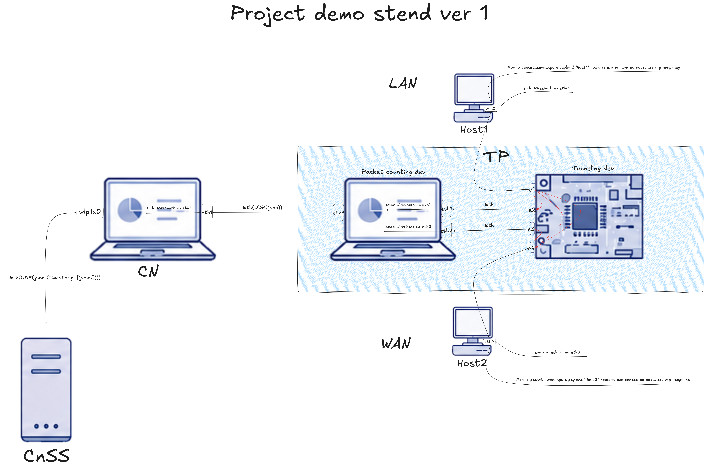
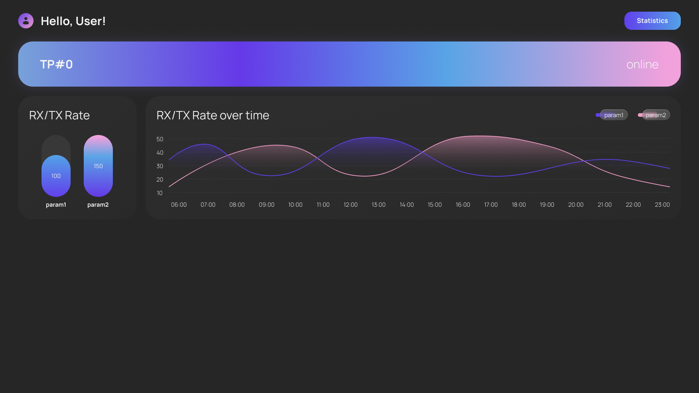
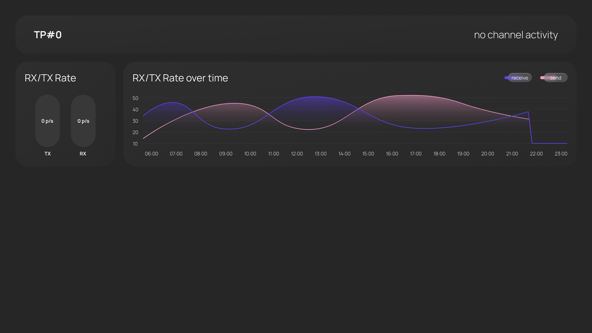
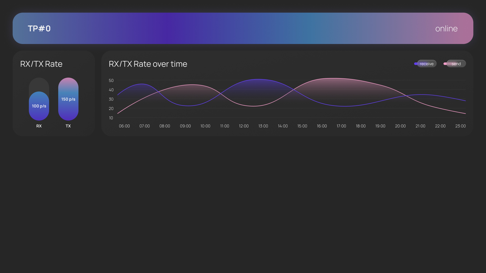
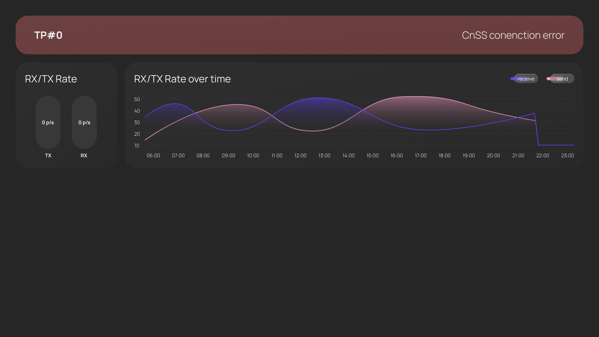
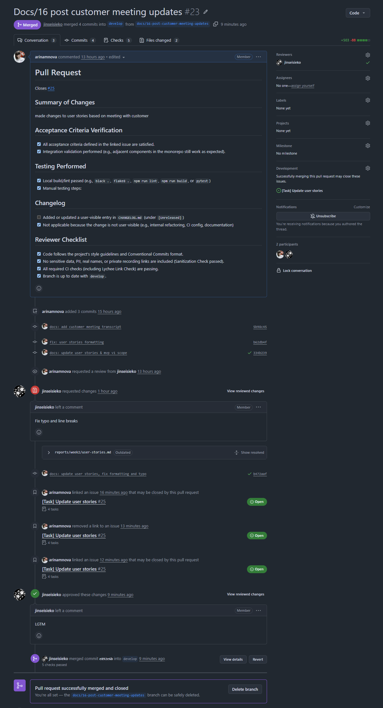

# Assignment 2 Report

## Project Overview

**Project Name:** Traffic Processing Platform

This is a monorepo containing minimally intrusive network traffic monitoring system. It consists of four distinct components designed to capture, process, forward, and visualize network telemetry in real-time without degrading network performance:

- **`traffic-processor/`**: Core packet counting and telemetry engine (transparent inline bridge).
- **`communication-node/`**: Local data forwarding node.
- **`cnss/`**: Control and Status Server (Backend) aggregating data via API/WebSocket.
- **`mui/`**: Management User Interface (Frontend) for real-time visualization.

**License:** [MIT License](../../LICENSE)

---

## 1. User Stories and Prioritization

The complete list of documented, prioritized, and customer-validated user stories can be found here:  
🔗 [User Stories](./user-stories.md)

---

## 2. Prototype and Interface Artifacts

We have designed the foundational interface and architecture for the MVP v1 scope.

- **System Architecture Diagram:**   
    *Describes the data flow from the Traffic Processor (FPGA + Laptop) through the Communication Node to the CnSS, as validated with the customer.*
- **Initial MUI MVP Dashboard Prototype:**   
    *Visualizes the primary dashboard, including channel activity status, Rx/Tx rates, and protocol statistics.*
- **Updated prototype screens based on customer feedback:**

    *Screen 1: Inactive state (when channel is inactive)*

    *Screen 2: Active state (when channel is active)*

    *Screen 3: Error state (error when connecting to the server)*
- 🔗 [Figma Prototype Link](https://www.figma.com/design/pbN9YeX8NosxN7wQgAeXbe/Traffic-Processor-App?node-id=119-268&t=CWDKMx5dmF0WB8DI-1)

---

## 3. MVP v0 Foundation

- [MVP v0 Report and Smoke-Check Scenario](./mvp-v0-report.md)  
- [Deployed backend link](http://10.93.26.186:8000/health)
- [Deployed frontend link](http://10.93.26.186/)
- [Public Video Demonstration Link](https://disk.yandex.ru/i/E_LcHKsMMonegg)
- [Local Setup Instructions](../../README.md)*

---

## 4. Development Workflow and CI/CD

Our team strictly follows the Gitflow branching model with mandatory merge commits to preserve history, as per course requirements.

- 🔗 **Minimal PR/MR Template:** [`.github/pull_request_template.md`](../../.github/pull_request_template.md)
- 🔗 [Example Reviewed PR/MR](https://github.com/SWP-47/traffic-processing-platform/pull/23)

 *The screenshot below demonstrates an approved review, required CI checks passing, and a merge commit.*  
  

- 🔗 **Lychee Configuration:** [`.github/workflows/lychee.yml`](../../.github/workflows/lychee.yml)
- 🔗 [Latest Successful Lychee Run](https://github.com/SWP-47/traffic-processing-platform/actions/runs/27464347659)
- **Excluded Lychee Links & Manual Verification:**  
    - exclude-all-private
    - exclude '10\.93\.26\.186'

All private is excluded because Lychee cannot access it. '10\.93\.26\.186' is excluded because '10\.93\.26\.186' in local university network.

---

## 5. Coverage and Traceability

### Prototype Coverage

The provided interface artifacts directly address the following stable User Story IDs:

- [US-001:](user-stories.md#us-001-channel-activity-indicator) Addressed by the "Channel Activity" indicator
- [US-002:](user-stories.md#us-002-basic-network-usage-statistics) Addressed by the Rx/Tx Rate counters
- [US-014:](user-stories.md#us-014-remote-mui-access) Addressed by the web-based nature of the MUI, designed for remote access.

### MVP v0 Coverage

The MVP v0 foundation targets the core plumbing required to support:

* US-001: Channel Activity Indicator
* US-002: Basic Network Usage Statistics
* US-004: Modular Platform Integration
* US-014: Remote MUI Access
* US-015: Real-time MUI Dashboard Updates

---

## 6. Customer Validation and Meeting Artifacts

- 🔗 **Customer Meeting Summary:** [customer-meeting-summary.md](./customer-meeting-summary.md)
- 🔗 **Customer Meeting Transcript:** [customer-meeting-transcript.md](./customer-meeting-transcript.md)  

---

## 7. Weekly Analysis

🔗 [Week 2 Analysis Report](./analysis.md)  

---

## 8. LLM Usage Report

🔗 [LLM Usage Report](./llm-report.md)  
