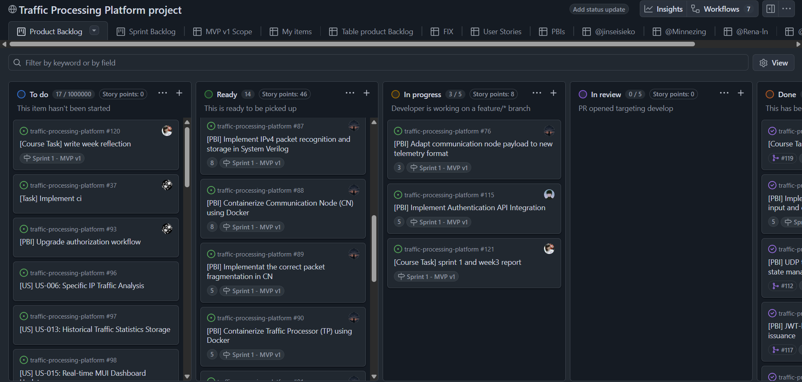
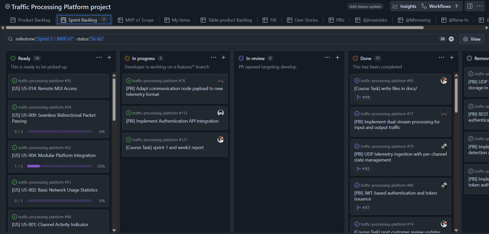
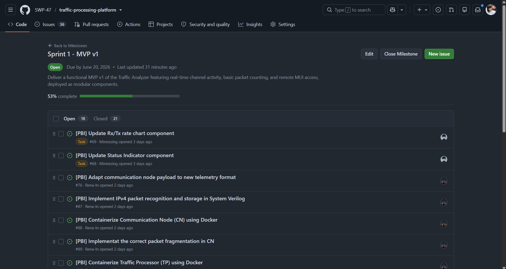
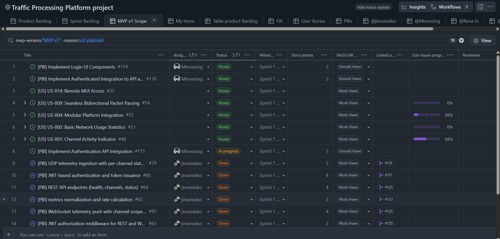
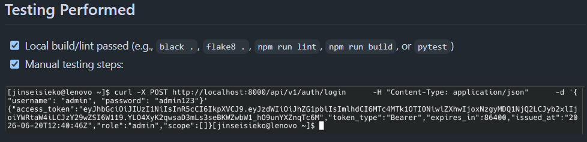
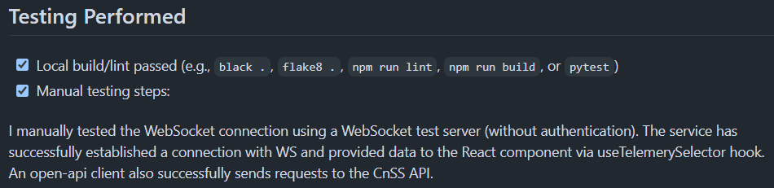
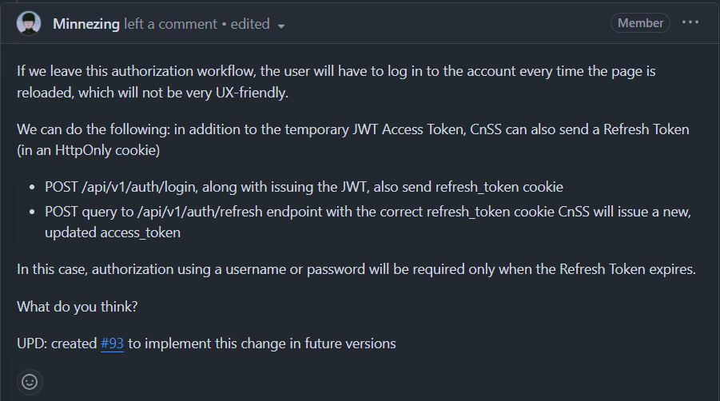
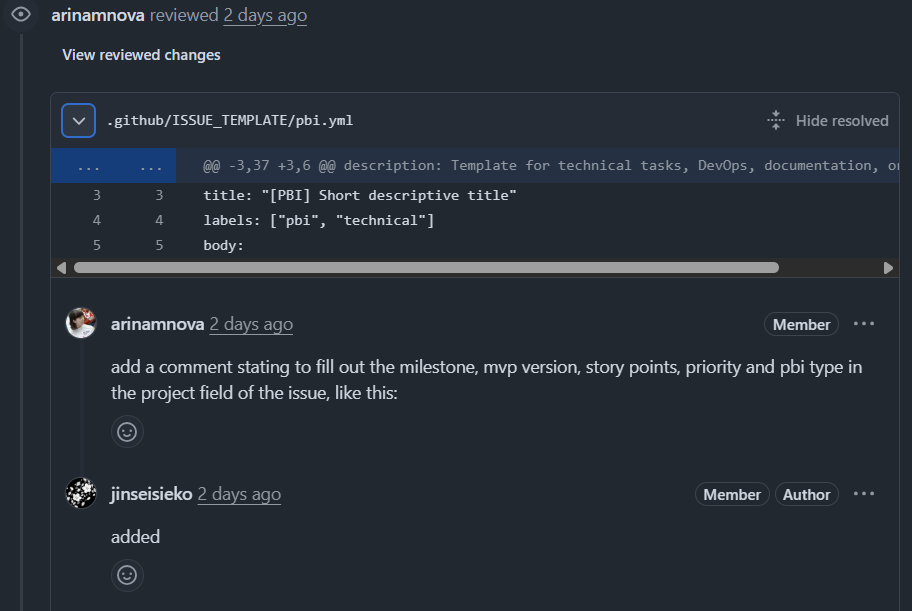
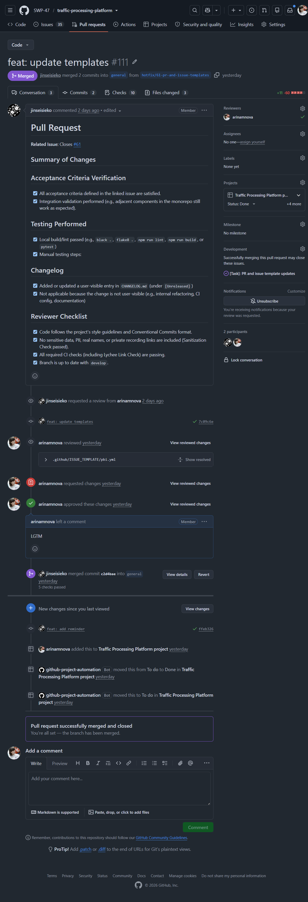

# Assignment 3 Report

## Project Overview

**Project Name:** Traffic Processing Platform

This is a monorepo containing minimally intrusive network traffic monitoring system. It consists of four distinct components designed to capture, process, forward, and visualize network telemetry in real-time without degrading network performance:

- **`traffic-processor/`**: Core packet counting and telemetry engine (transparent inline bridge).
- **`communication-node/`**: Local data forwarding node.
- **`cnss/`**: Control and Status Server (Backend) aggregating data via API/WebSocket.
- **`mui/`**: Management User Interface (Frontend) for real-time visualization.

**License:** [MIT License](../../LICENSE)

---

## User story and PBI scope

Since Assignment 2, the initial proposed MVP v1 scope documented in [`reports/week2/user-stories.md`](../week2/user-stories.md) has been refined, migrated to the issue tracker, and decomposed into actionable Product Backlog Items (PBIs).

The core scope remains focused on the foundational telemetry pipeline and visualization (US-001, US-002, US-004, US-005, US-009, US-014). However, following the Week 3 customer review, we expanded the current Sprint scope to include **US-012: Basic Password Protection for MUI** to ensure secure access to the dashboard from the initial release. Additionally, **US-015: Real-time MUI Dashboard Updates** was implemented together with the initial MVP v1 scope in preparation for future versions.

All active user stories, their current states, and historical tracking are maintained in the [User Story Index](/docs/user-stories.md).

## Customer feedback points addressed

We incorporated feedback from both the Assignment 2 prototype review and the Week 3 customer review into the MVP v1 implementation:

1. **Dashboard UI Layout & Contrast (from Assignment 2 Review):** The customer requested that the Tx/Rx packet counters be stretched to fill the bottom of the screen to avoid empty space.
2. **Frontend-Backend Integration Tooling (from Week 3 Review):** The customer recommended using `openapi-ts` and `openapi-fetch` to generate TypeScript clients directly from the backend's OpenAPI specification to reduce manual errors.
   - *Addressed:* We integrated `openapi-ts` into the MUI build pipeline to auto-generate type-safe API wrappers from the CnSS OpenAPI spec, replacing manual fetch calls.
3. **Security and Access Control (from Week 3 Review):** During the review, it was decided that basic authentication should not be deferred and must be included in the first functional release to protect the dashboard.
   - *Addressed:* We added **US-012 (Basic Password Protection for MUI)** to the current Sprint. The CnSS now issues JWT tokens via `/api/v1/auth/login`, and the MUI requires authentication before accessing the dashboard or WebSocket streams.
4. **CN-to-CnSS Communication Protocol (from Week 3 Review):** The customer suggested exploring Protobuf/gRPC for the future but agreed to keep the MVP simple and avoid overengineering.
   - *Addressed:* We finalized the UDP/JSON `TelemetryBatch` schema for the CN-to-CnSS pipeline for MVP v1, and documented the gRPC/Protobuf migration in the roadmap for future sprints.

## Links and Github views

- [Historical user stories](/reports/week2/user-stories.md)
- [Current user stories](/docs/user-stories.md)
- [Product Backlog board view](https://github.com/orgs/SWP-47/projects/1/views/1)

- [Sprint Backlog board view](https://github.com/orgs/SWP-47/projects/1/views/8)

- [Sprint milestone](https://github.com/SWP-47/traffic-processing-platform/milestone/1)

- [MVP v1 filtered view](https://github.com/orgs/SWP-47/projects/1/views/6)

### Total Story Points

- **Product Backlog size:** 74
- **Total Sprint Size:** 74

> Since our MVP v1 scope included all Must Have user stories, the team created PBIs only for the current sprint. The remaining PBIs in the Product Backlog consist of user stories, which we haven't estimated yet. Thus, the Product and Sprint Backlog sizes are the same.

## Selected MVP v1 scope

The chosen MVP v1 scope delivers a fully functional, four-component telemetry pipeline (Traffic Processor, Communication Node, Control and Status Server, and Management User Interface) that transparently forwards network traffic while capturing and visualizing real-time bidirectional packet counts and channel activity. To ensure secure remote monitoring, the scope also includes basic password authentication for the web-based dashboard, allowing system administrators to safely access live network statistics from anywhere via the internet.

## PBI Management Explanation

- **PBI types used:** Infrastructure / DevOps, Documentation, Refactoring, Testing, Architecture / Design, User Story, Course Task
  - Explanation: the team used PBI types to identify what part of the project it addressed. The types "User Story" and "Course Task" were added for convenient filtering in Github project views, even though course tasks aren't considered PBIs according to [process-requirements.md](/docs/process-requirements.md#product-backlog-items-and-scope). Course task issues themsleves were not labeled as PBIs.
- **Statuses used:** To Do, Ready, In Progress, In Review, Done (see [Process Requirements](/docs/process-requirements.md#work-status)) and Removed
  - The removed status is for PBIs closed as "Not planned". These PBIs were changed after a customer review and split into new PBIs.
- **Priorities:** Must Have, Should Have, Could Have
  - "Won't Have" priority was not added to our Github tasks. Any PBIs that changed over the course of the milestone are marked "Closed as not planned"
- **Sprint milestone usage:** all PBIs were marked with the "Sprint 1" milestone field. We used a "Sprint Backlog" board view on Github to see tasks only planned for this sprint.
- **MVP version tracking:** all PBIs that implemented user stories selected for our [MVP v1 scope](/reports/week2/user-stories.md#initial-proposed-mvp-v1-scope) were marked as "MVP v1." We used a filtered table view on Github to keep track of these PBIs and ensure that we fully implemented and delivered everything within the scope.
- **Task-decomposition approach:** Our project consists of four main elements that interact with each other, each developed by one team member. Once a user story was added to the current sprint, each team member created their own PBIs that would either fully or partially implement part of a user story which was relevant to their specific role.
  - For example, US-004: Modular Platform Integration (See: [US-014 Github issue](https://github.com/SWP-47/traffic-processing-platform/issues/52)) involves the traffic processor (TP), control node (CN), and CnSS server. @jinseisieko is in charge of CnSS, so he created a [PBI](https://github.com/SWP-47/traffic-processing-platform/issues/79) that partially implements US-004. @Rena-ln is in charge of the TP and CN, so she created several [PBIs](https://github.com/SWP-47/traffic-processing-platform/issues/87) that partially implement US-004. Once both team members complete their respective PBIs, US-004 will be fully implemented and marked as done.

## Roadmap Overview

- **Current Sprint (Sprint 1 - MVP v1):** Deliver a functional, transparent inline network bridge that counts packets and displays real-time channel activity remotely without disrupting end-user internet access. This establishes the core four-component data pipeline (TP → CN → CnSS → MUI) with JWT authentication.
- **Next Sprint (Sprint 2 - MVP v2):** Enhance monitoring capabilities by introducing byte-level volume counting, historical data retention, and protocol-based display filtering for deeper network and security-focused analysis.

For more details see: [Complete roadmap](/docs/roadmap.md).

## Verification evidence

- all PBIs completed for MVP v1 contain a description of the testing done to verify acceptance criteria in the respective PR as part of the [PR template](../../.github/pull_request_template.md) and [Definition of Done](/docs/definition-of-done.md) requirements. These include API logs or a written description of the testing done.
  - [example 1](https://github.com/SWP-47/traffic-processing-platform/pull/117)

  - [example 2](https://github.com/SWP-47/traffic-processing-platform/pull/124)

## Current product status

The team has successfully delivered MVP v1, establishing a fully functional, four-component telemetry pipeline that transparently forwards network traffic while capturing and visualizing real-time bidirectional packet counts and channel activity. Additionally, we integrated basic JWT password authentication for the Management User Interface to ensure secure remote access, fulfilling the core "Must Have" requirements and addressing recent customer feedback.

## Next steps

Moving forward, the team will focus on expanding the platform's analytical capabilities by implementing advanced telemetry features, such as per-IP/port tracking, byte volume counting, and SYN flood attack detection. We also plan to optimize the local deployment architecture by consolidating the Traffic Processor and Communication Node into a single Dockerized environment and refining the frontend dashboard with detailed host statistics and packet metadata views.

## Contribution table

- Github table with completed PBIs during Sprint 1 for each team member:
  - @jinseisieko [Table view](https://github.com/orgs/SWP-47/projects/1/views/12)
  - @Minnezing [Table view](https://github.com/orgs/SWP-47/projects/1/views/13)
  - @Rena-ln [Table view](https://github.com/orgs/SWP-47/projects/1/views/14)
  - @arinamnova [Table view](https://github.com/orgs/SWP-47/projects/1/views/15)

> Click items in the "Title" column to see issue details. Click on items in "Linked pull requests" to view the PR for each issue.

### Review activity

- Each team member reviewed and left a meaningful comment on the following PRs:
  - @Minnezing [PR link](https://github.com/SWP-47/traffic-processing-platform/pull/78)

  - @arinamnova [PR link](https://github.com/SWP-47/traffic-processing-platform/pull/111)

## Links

- [SemVer release PLACEHOLDER]
[IMAGE PLACEHOLDER]
- [CHANGELOG.md](../../CHANGELOG.md)
- [Process Requirements](/docs/process-requirements.md)
- [Roadmap](/docs/roadmap.md)
- [Definition of Done](/docs/definition-of-done.md)
- Github Templates
  - [User Story](../../.github/ISSUE_TEMPLATE/user_story.yml)
  - [Bug Report](../../.github/ISSUE_TEMPLATE/bug_report.yml)
  - [PBI](../../.github/ISSUE_TEMPLATE/pbi.yml)
  - [Course Task](../../.github/ISSUE_TEMPLATE/course_task.yml)
  - [Pull Request](../../.github/pull_request_template.md)
- [Reviewed PRs Github View](https://github.com/orgs/SWP-47/projects/1/views/16) (see column "Linked pull request")
  - [Example reviewed PR](https://github.com/SWP-47/traffic-processing-platform/pull/111)

- [RUNNABLE MVP PLACEHOLDER]
[IMAGE PLACEHOLDER]
- [ACCESS INSTRUCTIONS PLACEHOLDER]
- [Customer review transcript](customer-review-transcript.md)
- [Customer review summary](customer-review-summary.md)
- [Week 3 reflection](reflection.md)
- [Sprint 1 retrospective](retrospective.md)
- [LLM report](llm-report.md)
