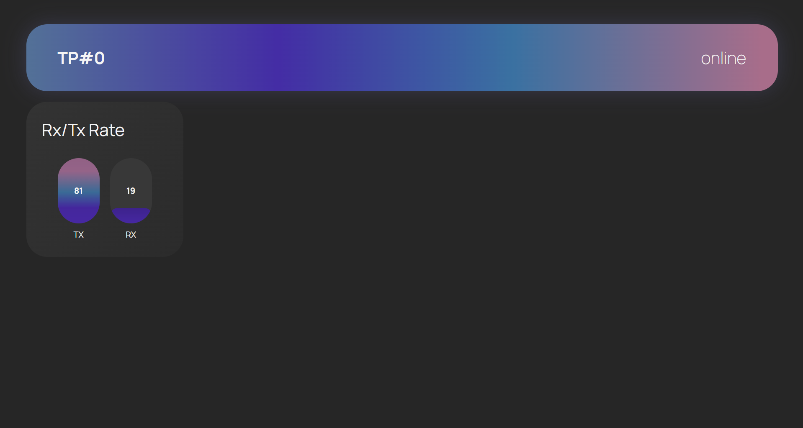
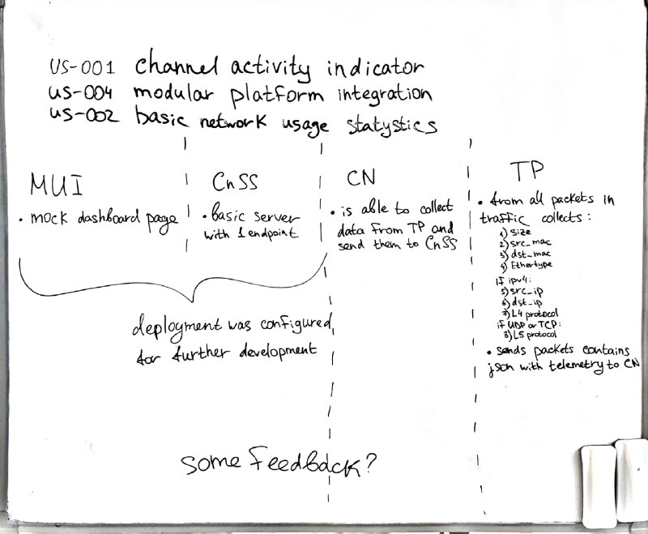

# Customer Review Summary

**Date:** June 17, 2026

## Participants

- **Project Manager**: @jinseisieko
- **Frontend Lead**: @Minnezing
- **Core Systems Engineer**: @Rena-ln

## Artifacts Demonstrated

1. **Deployed MUI**
   - Channel activity indicator component
   - Bar chart for traffic visualization (showing random numbers)

2. **System Architecture Diagram** - Whiteboard table of use stories completed in MVP v0 and details about component implementation to show progress on MVP

## Scope Reviewed

### Planned MVP v1 Scope (User Stories)

The team presented progress on the following **Must Have** user stories:

- **US-001**: Channel Activity Indicator
- **US-002**: Basic Network Usage Statistics  
- **US-004**: Modular Platform Integration
- **US-005**: Invisible Traffic Analyzer Deployment
- **US-009**: Seamless Bidirectional Packet Passing
- **US-014**: Remote MUI Access

### Current Implementation Status

| Component | Status | Owner |
| ----------- | -------- | ------- |
| Traffic Processor (TP) | ✅ Code ready (FPGA + laptop implementation) | @Rena-ln |
| Communication Node (CN) | ⚠️ Near complete - needs JSON format finalization | @Rena-ln |
| Control & Status Server (CnSS) | ⚠️ Basic server deployed, WebSocket/auth in progress | @jinseisieko |
| Management UI (MUI) | ⚠️ Mock deployed, real data integration pending | @Minnezing |

## Implemented Increment Discussed

### Completed/In Progress

1. **TP Packet Counting** - Functional packet detection and metadata extraction
2. **Basic Server Deployment** - Docker-compose setup for dev/prod environments
3. **CI/CD Pipeline** - Automated testing and deployment configured
4. **Frontend Foundation** - React/TypeScript app with placeholder components
5. **API Documentation** - OpenAPI spec for REST endpoints

### Technical Decisions Confirmed

- **TP-CN Communication**: Local UDP/IPC on same physical device
- **CN-CnSS Communication**: UDP with time-windowed aggregation (500ms windows)
- **CnSS-MUI Communication**: WebSocket with Bearer token authentication
- **Deployment**: Docker containers for CN and CnSS; FPGA for TP hardware part

## Customer Feedback & Requested Changes

### UI/UX Improvements

**Requested by customer:**

- **Related to US-001, US-002**: "Make the two counters bigger/stretch them to fill the entire screen to avoid empty space"
  - Priority: High (for MVP v1)
  - Action: @Minnezing to adjust dashboard layout

### Security & Architecture Recommendations

**Noted but NOT required for MVP v1:**

1. **Frontend Token Security** (Related to US-014)
   - Customer noted that tokens in frontend environment variables become public
   - Current approach acceptable for practice/educational purposes
   - Future improvement: Replace constant key with proper variable management

2. **API Client Generation** (Related to US-004)
   - **Suggestion**: Use OpenAPI specification to auto-generate TypeScript bindings
   - Tools mentioned: `openapi-fetch`, `openapi-ts`
   - Benefit: Reduces manual client code maintenance
   - **Decision**: Research for future sprints, not MVP v1

3. **WebSocket Message Schema** (Related to US-002)
   - **Suggestion**: Use JSON Schema to formally define WebSocket message structures
   - Benefit: Type safety and auto-generation of clients/servers
   - **Decision**: Research for future sprints

4. **CN-CnSS Protocol** (Related to US-004)
   - **Suggestion**: Consider gRPC/Protobuf instead of raw UDP
   - Benefit: Type-safe messages, better tooling
   - **Decision**: Explicitly NOT for MVP v1; evaluate for future

### Technical Clarifications

**Customer's Questions/Confirmations:**

- ✅ Confirmed: Docker can expose network interfaces to containers for TP software part
- ✅ Confirmed: Current architecture with TP+CN on same device is acceptable
- ✅ Confirmed: Timestamp precision at database level (±10 seconds) is acceptable for MVP

## Approvals

### Customer Approved

- ✅ **MVP v1 Scope**: All "Must Have" user stories (US-001, US-002, US-004, US-005, US-009, US-014)
- ✅ **Current Implementation Approach**: Architecture and technical decisions
- ✅ **Component Distribution**: Team member responsibilities and component ownership
- ✅ **Timeline**: Plans for completing MVP v1 in the near future

> Customer provided explicit confirmation for the current MVP v1 scope and Sprint 1 plan.

## Risks Identified

| Risk | Impact | Mitigation |
| ------ | -------- | ------------ |
| **UDP packet loss** between CN and CnSS | Medium | Sequence tracking already implemented; `dropped_batches` counter in place |
| **WebSocket connection drops** | Medium | Ping/pong mechanism planned; client-side timeout fallback (6s) |
| **Token security in frontend** | Low (for MVP) | Acceptable for educational project; document as known limitation |
| **Integration complexity** | Medium | Post-merge validation required between components (TP→CN→CnSS→MUI) |
| **Timeline pressure** | Medium | Focus on core functionality (counters + activity indicator); defer advanced features |

## Action Points

### Immediate (Before MVP v1 Submission)

| Action | Owner | Priority | Related US |
| -------- | ------- | ---------- | ------------ |
| Resize dashboard counters to fill screen | @Minnezing | High | US-001, US-002 |
| Finalize CN JSON message format | @Rena-ln, @jinseisieko | High | US-002, US-004 |
| Complete WebSocket authentication (Bearer token) | @jinseisieko | High | US-014 |
| Implement ping/pong heartbeat mechanism | @jinseisieko | High | US-001 |
| Integrate real data flow (TP→CN→CnSS→MUI) | All | Critical | US-001, US-002 |
| Test end-to-end telemetry pipeline | All | Critical | US-001, US-002, US-009 |

### Future Sprints (Post-MVP v1)

| Action | Owner | Priority | Related US |
| -------- | ------- | ---------- | ------------ |
| Research OpenAPI TypeScript client generation | @Minnezing, @jinseisieko | Low | US-004 |
| Evaluate JSON Schema for WebSocket messages | @jinseisieko | Low | US-002 |
| Research gRPC/Protobuf for CN-CnSS | @Rena-ln, @jinseisieko | Low | US-004 |
| Implement proper secret management for tokens | @jinseisieko | Medium | US-014 |

## Resulting Product Backlog Changes

### No Changes to MVP v1 Scope

- All "Must Have" user stories remain in scope
- No stories added or removed from MVP v1
- No priority changes requested

### Items added to Product Backlog

The following were discussed and added to the current Product Backlog and/or implemented in the current sprint:

1. **Advanced API tooling** (OpenAPI client generation)
   - Type: Technical Improvement
   - Priority: Could Have
   - Rationale: Nice-to-have for development efficiency

2. **Formal message schemas** (JSON Schema/Protobuf)
   - Type: Technical Improvement  
   - Priority: Could Have
   - Rationale: Improves type safety but not critical for MVP

3. **Enhanced token security**
   - Type: Security Improvement
   - Priority: Should Have (for production, Could Have for course)
   - Rationale: Current approach acceptable for educational context

> Customer granted permission to publish sanitized transcript in public repository.
