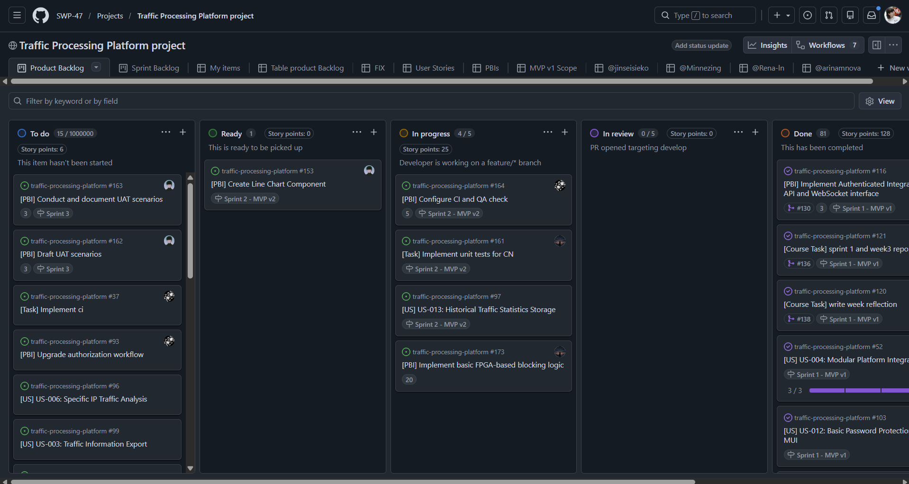
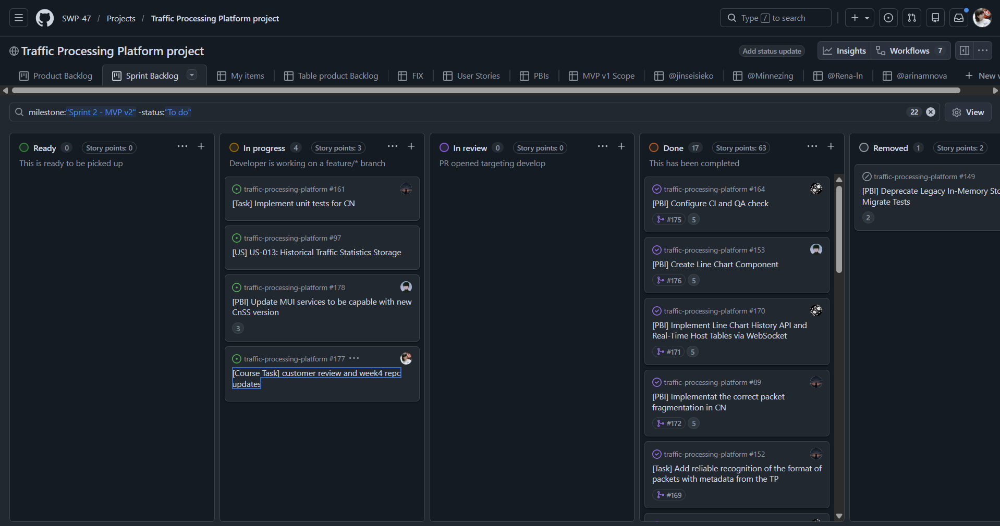
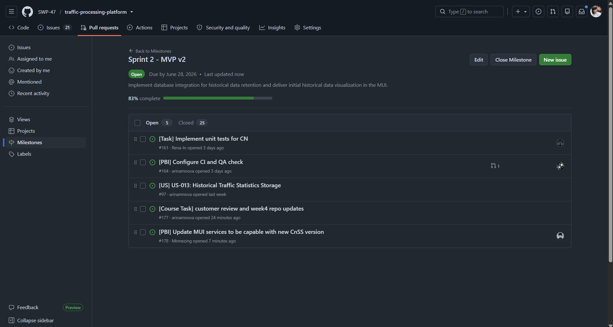
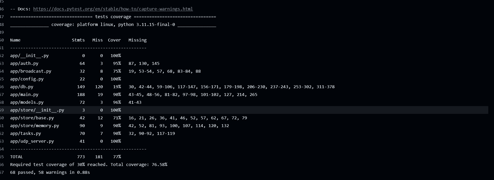
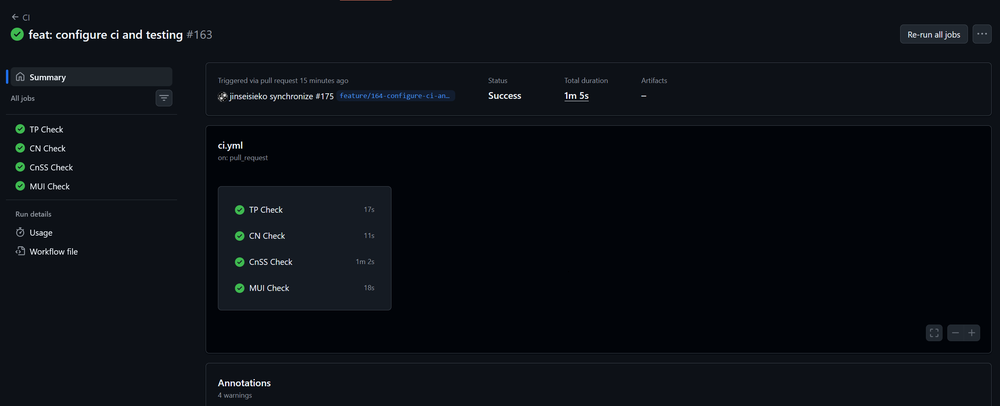
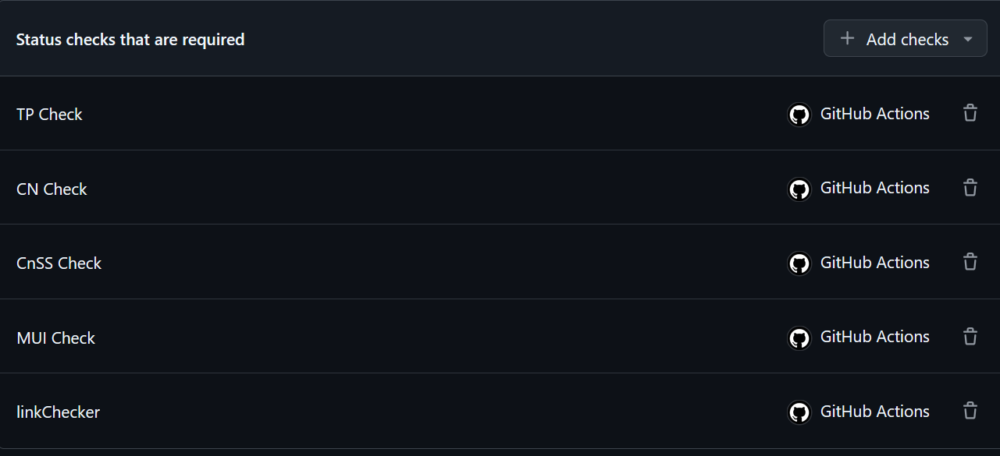
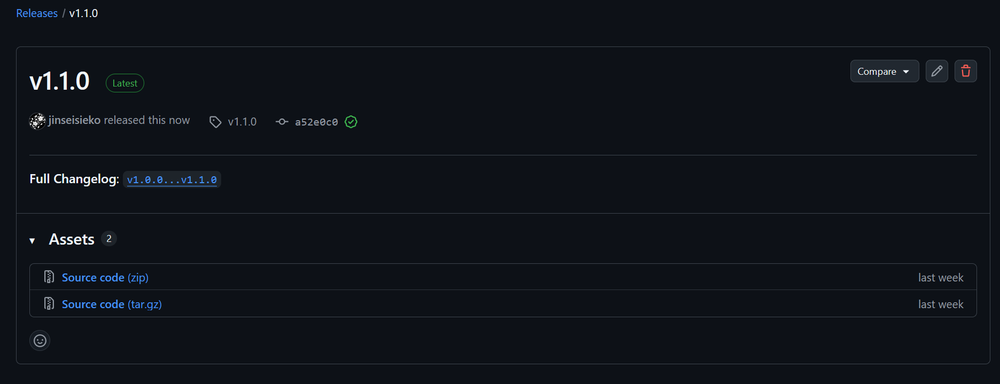
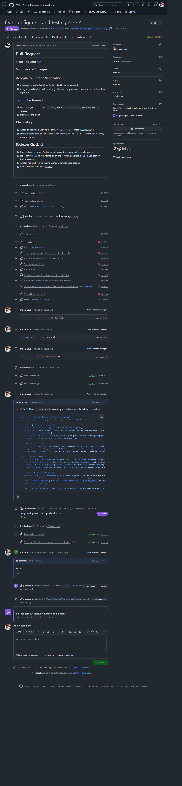

# Assignment 4 Report

## Project Overview

**Project Name:** Traffic Processing Platform

This is a monorepo containing minimally intrusive network traffic monitoring system. It consists of four distinct components designed to capture, process, forward, and visualize network telemetry in real-time without degrading network performance:

* **`traffic-processor/`**: Core packet counting and telemetry engine (transparent inline bridge).
* **`communication-node/`**: Local data forwarding node.
* **`cnss/`**: Control and Status Server (Backend) aggregating data via API/WebSocket.
* **`mui/`**: Management User Interface (Frontend) for real-time visualization.

**License:** [MIT License](../../LICENSE)

---

## Sprint Overview

* **Sprint Goal**: transition from in-memory storage to a persistent database, implement database integration for historical data retention, and deliver initial historical data visualization in the MUI
* **Sprint Dates**: June 22, 2026 – June 28, 2026
* **Total Sprint Size**: --
* **Scope Summary**:
  * **Backend**: Migrated from in-memory storage to TimescaleDB. Refactored UDP ingestion to accept raw packet metadata arrays. Implemented a 1Hz Reporting Worker for real-time aggregation and migrated REST APIs to read from the DB.
  * **Frontend**: Implemented Line Chart History API and created the Line Chart Component.
  * **Infrastructure/Core**: Containerized TP and CN using Docker. Implemented correct packet fragmentation logic in CN. Refactored software TP to extract per-packet metadata.

### Board & Milestone Links

* [Product Backlog](https://github.com/orgs/SWP-47/projects/1/views/1)

* [Sprint Backlog](https://github.com/orgs/SWP-47/projects/1/views/8)

* [Sprint Milestone](https://github.com/SWP-47/traffic-processing-platform/milestone/2)

---

## Delivered Product Changes

This sprint transitioned the platform from basic packet counting to advanced telemetry with historical retention. Key changes include:

1. **TimescaleDB Integration**: Replaced the legacy `InMemoryStateStore` with TimescaleDB to support historical data queries and prevent memory leaks.
2. **Raw Metadata Pipeline**: The TP now extracts `src_ip`, `dst_ip`, `src_port`, `dst_port`, and the CN forwards these as a JSON array. The CnSS parses and batch-inserts these into the `packet_flows` hypertable.
3. **Real-Time Host Tables**: Introduced a WebSocket subscription model (`WSClientSession`) to push Top-N LAN/WAN host statistics to the MUI only when clients are actively listening, optimizing DB load.
4. **MUI Dashboard Redesign**: Implemented the new Line Chart for historical RX/TX trends.
5. **Containerization**: TP and CN are now fully containerized via Docker for streamlined deployment.

### Deployment & Access

* **Deployed Product**: [http://10.93.26.186](http://10.93.26.186) *(Only accessible via UniversityStudent Wi-Fi)*
* **Access / Run Instructions**: [Local Setup & Deployment Guide](../../README.md#local-setup-instructions)

---

## Customer Feedback Response

| Feedback Point | Resulting PBI / Issue | Status | Response |
| :--- | :--- | :--- | :--- |
| Add a toggle switch for RX/TX raw numbers vs column chart visualization. | x | Not planned for this Sprint | Deferred. Acknowledged as a valid UI/UX improvement, but prioritized backend DB stability and core metadata pipeline for this sprint. Added to Product Backlog. |
| Make line charts more "rigid" (remove heavy smoothing, only round bucket corners). | [#176](https://github.com/SWP-47/traffic-processing-platform/issues/176) | Done | Addressed in the MUI redesign. Chart interpolation was removed; only corner rounding is applied. |
| Articulate "Top 5" tables with a "View all" button/link. | x | Not planned for this Sprint | "Top 5" headers will be added to the MUI figma design, but the tables themsleves were not implemented in this sprint and will be created with this feedback in mind in a future sprint. |
| Define 3 automated Quality Requirements (e.g., performance at different channel speeds). | [#164](https://github.com/SWP-47/traffic-processing-platform/issues/164) | Done | Defined QR-001 (Time Behaviour), QR-002 (Fault Tolerance), and QR-003 (Testability) with automated QRTs in CI. |

---

## Documentation Links

* **Roadmap**: [docs/roadmap.md](../../docs/roadmap.md)
* **Definition of Done**: [docs/definition-of-done.md](../../docs/definition-of-done.md)
* **Quality Requirements**: [docs/quality-requirements.md](../../docs/process-requirements.md)
* **Quality Requirement Tests**: [docs/quality-requirement-tests.md](../../docs/quality-requirement-tests.md)
* **Testing Strategy & Status**: [docs/testing.md](../../docs/testing.md)
* **User Acceptance Tests**: [docs/user-acceptance-tests.md (PLACEHOLDER)](../../docs/user-acceptance-tests.md)

> Our team did not conduct User Acceptance Testing during this sprint as the MUI was still trivial. The team recieved explicit permission from our TA and the course team to conduct UAT during the next sprint, when the MUI has more functionality. Therefore, the placeholder link provided above contains only a template for the UAT file, which fill be completed next week.

---

## Quality Model & Testing Status

### Quality Model (ISO/IEC 25010)

We selected the following sub-characteristics to define our Quality Requirements (QRs):

1. **Performance Efficiency (Time Behaviour)**: *QR-001* - CnSS health API responsiveness. The CnSS shall respond to `/api/v1/health` with valid metrics within 1 second under normal load.
2. **Security (Confidentiality)**: *QR-002* - CnSS access control confidentiality. The CnSS shall validate JWT tokens, enforce channel scope, and return only authorized channel listings or fail with `401`/`403`.
3. **Maintainability (Testability)**: *QR-003* - Critical module testability and coverage. The CnSS codebase shall be covered by automated tests enforcing at least 30% line coverage for the critical module surface.

### Automated Quality Requirement Tests (QRTs)

| QRT ID | Linked QR | Verification Method | Automated Command | Expected Measurable Result |
| :--- | :--- | :--- | :--- | :--- |
| **QRT-001** | QR-001 | Integration test | `docker compose -f cnss/docker-compose.test.yml up --build --abort-on-container-exit` | Health endpoint returns `200 OK` within 1 second. |
| **QRT-002** | QR-002 | Integration test | `docker compose -f cnss/docker-compose.test.yml up --build --abort-on-container-exit` | Authorized requests succeed; invalid/unauthorized return `401`/`403`. |
| **QRT-003** | QR-003 | Coverage gate | `pytest --cov=app --cov-report=term-missing --cov-fail-under=30 tests/` | Test suite passes with ≥30% line coverage. |

### Testing Status & Coverage

Critical modules were identified based on core user workflows, persistence, and external integration.

> CI checks were linked on the `develop` branch, not protected default branch (`general`). As per our [team-documentation.md](../../docs/team-documentation.md), our team only merges commits into general for the final SemVer release for each assignment. Therefore, it would be impossible for us to link the "latest" CI check in this assignment report without violating our git workflow. Explicit permission was obtained from the course team for us to provide evidence to a CI check on the `develop` branch.

**Table featuring automated QRT links:**

| Critical module | Why critical | Required line coverage | Current line coverage | Evidence |
| --- | --- | ---: | ---: | --- |
| `cnss/app/` | Core telemetry ingestion (UDP server), JWT authentication, WebSocket state management, TimescaleDB persistence, and Reporting Worker. Enforces all QRs. | 30% | ≥ 30% (enforced by `--cov-fail-under=30` gate) | [Latest CI run → CnSS Check → "Run coverage gate" step](https://github.com/SWP-47/traffic-processing-platform/actions/workflows/ci.yml) |
| `cnss/tests/integration/` | Validates end-to-end API contracts, WebSocket lifecycle, auth middleware, and UDP ingestion against a real TimescaleDB instance. | 30% | ≥ 30% (enforced by `--cov-fail-under=30` gate) | [Latest CI run → CnSS Check → "Run coverage gate" step](https://github.com/SWP-47/traffic-processing-platform/actions/workflows/ci.yml) |
| `mui/src/services/` | Frontend API client, WebSocket telemetry service, and authentication state management. Bridges the MUI to the CnSS. | 30% | N/A — frontend coverage gate not yet configured; type-safety enforced via `tsc --noEmit` | [Latest CI run → MUI Check → "Lint and type check" step](https://github.com/SWP-47/traffic-processing-platform/actions/workflows/ci.yml) |
| `traffic-processor/software-part/` | Core packet extraction logic (`tp_packet_counter.py`) that produces the telemetry consumed by every downstream component. | 30% | N/A — unit tests exist but no coverage gate is configured yet | [Latest CI run → TP Check → "Run unit tests" step](https://github.com/SWP-47/traffic-processing-platform/actions/workflows/ci.yml) |

*Coverage evidence:*

* **Unit Tests**:
  * [CnSS unit test directory](../../cnss/tests/unit/)
* **Integration Tests**: [Link to Integration Tests Directory]
  * [CnSS integration test directory](../../cnss/tests/integration/)

---

## CI/CD & QA Checks

* **CI Pipeline Configuration**: [`.github/workflows/ci.yml`](../../.github/workflows/ci.yml)
* **Latest Protected-Branch CI Run**: [CI Run](https://github.com/SWP-47/traffic-processing-platform/actions/runs/28296708790)

* **Branch Protection Rules**

### Additional QA Check: Dependency Vulnerability Scanning

### Additional QA Check Rationale

Link checking (Lychee) does not satisfy the Assignment 4 additional QA check requirement. The following check was selected to address specific project risks.

| QA objective or risk | Additional QA check | Scope | Latest result | Evidence | Limitations or follow-up |
|---|---|---|---|---|---|
| Dependencies with known vulnerabilities may expose deployments to avoidable security risk, especially since the CnSS is exposed to the network and ingests untrusted UDP payloads. | Automated Python dependency vulnerability scan via `pip-audit` | CnSS `requirements.txt` (and transitively all installed packages) | Passing | [Latest CI run → CnSS Check → "Run dependency audit" step](https://github.com/SWP-47/traffic-processing-platform/actions/workflows/ci.yml) | `pip-audit` only covers Python dependencies. Frontend (`npm audit`) and OS-level (`apt`) vulnerabilities are not yet scanned in CI and should be added in a future sprint. Some transitive vulnerabilities may require manual triage or delayed upstream fixes. |

### Future Governance

All Assignment 4 tests, CI checks, QRTs, and the Definition of Done are maintained as permanent repository assets. Later PBIs must satisfy these gates. If the product stack changes (e.g., migrating from FastAPI to Go), the Definition of Done and CI pipelines will be updated concurrently to enforce equivalent or stronger quality gates.

---

## Release & Changelog

* **SemVer Release (Sprint 2 Increment)**: [v1.1.0](https://github.com/SWP-47/traffic-processing-platform/releases/tag/v1.1.0)

* **Changelog**: [CHANGELOG.md](../../CHANGELOG.md)

---

## Demo

* **Public Sanitized Demo Video (< 2 mins)**: [Watch Demo PLACEHOLDER]

---

## Customer Review

> UAT will be conducted in the next customer review. This decision was explicitly approved by our TA and course team.

* [Customer Review Summary](customer-review-summary.md)
* [Customer Review Transcript](customer-review-transcript.md)

---

## Weekly Reflections & Reports

* [Reflection](reflection.md)
* [Retrospective](retrospective.md)
* [LLM Usage Report](llm-report.md)

---

## Product Status & Next Steps

**Current Status**: The telemetry side-channel now supports raw metadata extraction, high-throughput TimescaleDB persistence, and advanced MUI visualizations. The system comfortably handles 100 Mbps channels without optimization.

**Next Steps (Sprint 3)**:

1. Implement advanced filtering in the MUI (Protocol types, specific IP/Port tracking).
2. Develop the detailed Host Statistics page (second screen).
3. Explore byte-volume counting (US-016) to complement packet counts.
4. Refine UI/UX based on deferred feedback (RX/TX raw number toggle).

---

## Contribution Traceability

* Github table with completed PBIs during Sprint 2 for each team member:
  * @jinseisieko [Table view](https://github.com/orgs/SWP-47/projects/1/views/12)
  * @Minnezing [Table view](https://github.com/orgs/SWP-47/projects/1/views/13)
  * @Rena-ln [Table view](https://github.com/orgs/SWP-47/projects/1/views/14)
  * @arinamnova [Table view](https://github.com/orgs/SWP-47/projects/1/views/15)

> Click items in the "Title" column to see issue details. Click on items in "Linked pull requests" to view the PR for each issue.

---

## Evidence Screenshots

Example reviewed PR:

