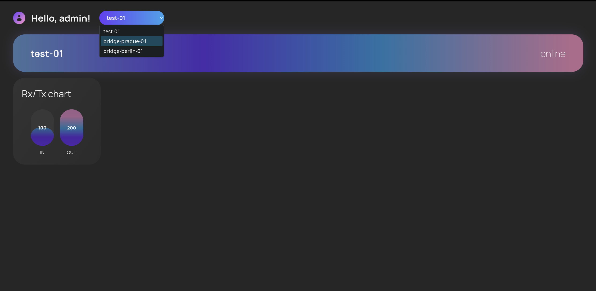
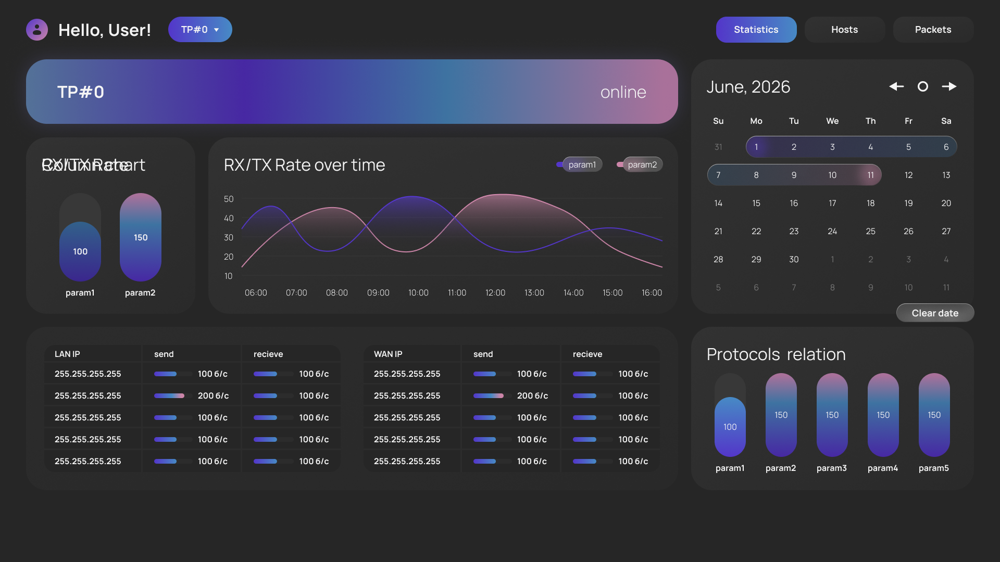
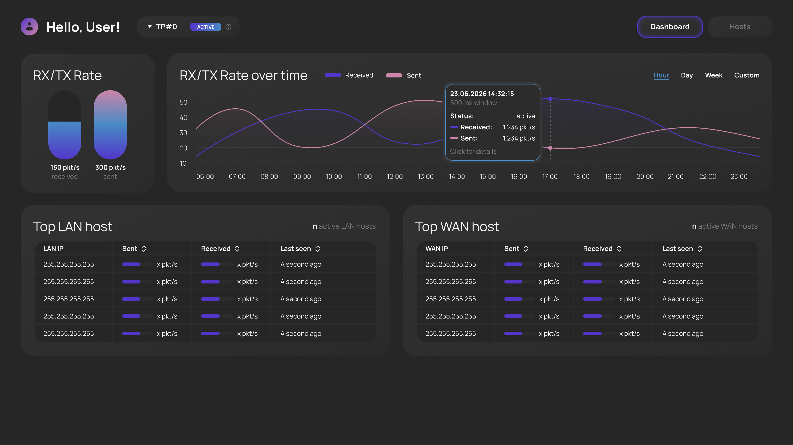
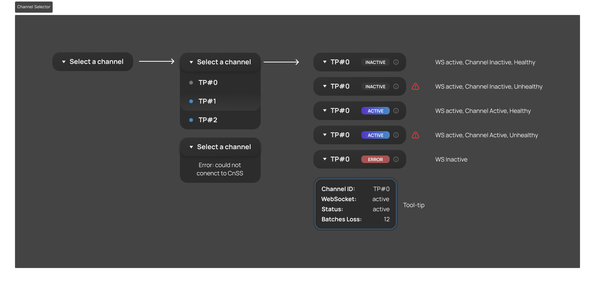
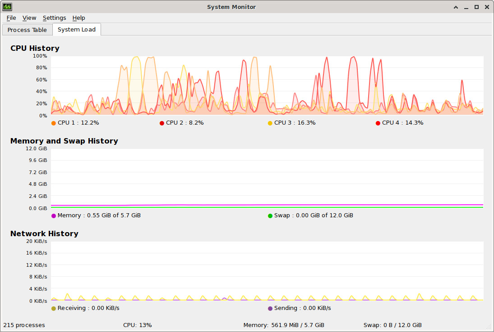
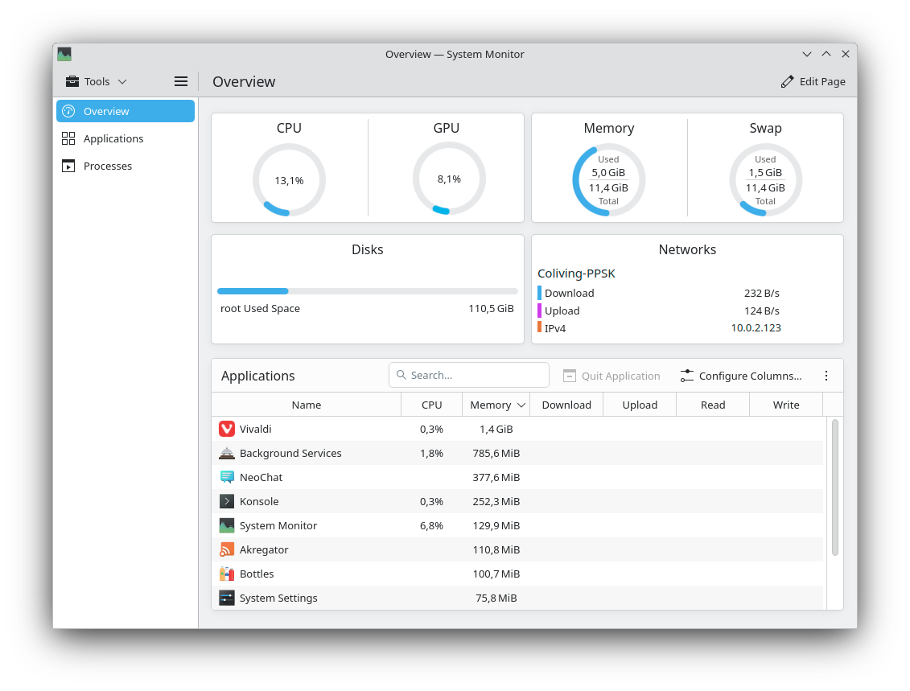

# Customer Review Summary

**Date**: June 26, 2026

**Participants**:

* **Project Manager:** @jinseisieko
* **Frontend Lead:** @Minnezing
* **Core Systems Engineer:** @Rena-ln
* **Technical Writer:** @arinamnova

## Sprint Goal Reviewed

The team reviewed the progress of **MVP v1** (delivered in the previous sprint) and the ongoing work for **Sprint 2**. The Sprint 2 goal focuses on transitioning from in-memory storage to a persistent database, implementing database integration for historical data retention, and delivering initial historical data visualization in the MUI.

## Delivered Increment Discussed

The team demonstrated the following increments:

1. **MVP v1 (Live Demo)**:
   * Role-based access control (Admin/Viewer) with scoped channel access.
   * Real-time WebSocket telemetry updates for channel activity and packet rates.
   * Dynamic channel registration and garbage collection (24h retention, 5s inactivity timeout).
   * Randomized load simulation script to demonstrate UI responsiveness and timeout indicators.

2. **Sprint 2 (In-Progress / Backend & Frontend Prototype)**:
   * **Backend**: Migrated from in-memory storage to **TimescaleDB**. The UDP ingestion pipeline was refactored to accept and store raw packet metadata. A 1Hz Reporting Worker was implemented for real-time aggregation.
   * **Frontend**: Implemented the Line Chart History API and Real-Time Host Tables via WebSocket, and created the Line Chart Component. A redesigned dashboard prototype was shown, incorporating `openapi-ts` for automated TypeScript client generation.
   * **Infrastructure**: Containerized TP and CN components using Docker. Implemented correct packet fragmentation logic in CN.

3. Demonstrated MUI prototype design:

*Old MUI design*

*New MUI design*

*Channel activity indicator redesign*

## UAT Results

> Our team did not conduct User Acceptance Testing during this meeting as the MUI was still trivial. The team recieved explicit permission from our TA and the course team to conduct UAT during the next sprint, when the MUI has more functionality.

## Quality Evidence Discussed

* **Performance / Stress Testing**: The backend successfully handled a simulated load of 6,000 packets/sec in one direction (approx. 72 Mbps, or 144 Mbps bidirectional assuming 1500-byte MTU). Data was written to TimescaleDB without bottlenecks.
* **Database Volume**: At peak testing, the database reached 186,000 rows with a minimal memory footprint impact on the VM.
* **Reliability**: Channel activity logic was successfully transitioned from an in-memory timer to a DB-driven query (marking inactive if the last record is > 50 seconds old).

## Feedback & Approvals

### Approvals

* The customer **approved** the overall MVP v1 scope, the role-based access logic, and the real-time WebSocket implementation.
* The customer **approved** the architectural shift to TimescaleDB and the raw metadata ingestion pipeline, confirming it solves the core streaming and processing problem.
* The customer **approved** the general direction of the new dashboard redesign (removing protocols from the main view, reducing visual noise).

### Requested Changes (UI/UX)

1. **RX/TX Column Chart vs. Raw Numbers**: The customer questioned the dynamic maximum calculation on the column chart (e.g., if the channel is idle, max is 0). He suggested adding a toggle switch: one position shows the visual chart, and the other shows just two raw numbers (RX/TX), as visual size is hard to read accurately and a logarithmic scale is too complex.
*Reference image demonstrated by the customer (KDE system monitor):*

2. **Line Chart Smoothing**: The customer requested "rigid" charts without heavy curve smoothing, as this is a tool for system administrators. He suggested applying smoothing *only* to the corners between buckets (semicircles) rather than interpolating the whole line.
3. **Top 5 Host Tables**: The customer requested explicitly articulating that the tables show the "Top 5" results. He suggested adding a "View all" button or note at the bottom to redirect users to a dedicated tab with the full list.
4. **Active Status Color**: The customer noted the "Active" status is blue instead of green. The team agreed to keep it as an accent color but acknowledged the standard convention.

### Quality Requirements (QR) Discussion

* The team asked for guidance on defining three measurable, automatable Quality Requirements.
* The customer suggested focusing on **Performance / Time Behaviour** across different channel speeds (1 Mbps, 10 Mbps, 100 Mbps, 1 Gbps).
* The customer advised the team to independently define measurable metrics (e.g., UDP parsing latency, WebSocket throughput, frontend rendering time) and automate them in the CI pipeline, emphasizing that the exact choice is up to the team as long as they are measurable and automated.

## Risks

* **Database Growth**: The customer advised the team to monitor Docker Compose volume statistics to build intuition about disk usage (e.g., how many megabytes 100k+ rows consume) to prevent future storage issues.
* **Legacy Code**: The PM noted that legacy in-memory storage code still exists in the Python backend and needs to be cleaned up to avoid confusion and maintenance overhead.
* **UDP Packet Loss**: Relying on UDP for telemetry means occasional packet loss is acceptable for monitoring but requires careful sequence tracking to avoid false "dropped batch" alerts.

## Action Points

1. **Frontend**: Implement the toggle switch for RX/TX raw numbers vs. column chart visualization.
2. **Frontend**: Adjust line chart rendering to remove heavy smoothing; apply rounding only to bucket corners.
3. **Frontend**: Add "Top 5" labels and "View all" navigation to the host tables.
4. **Backend/DevOps**: Define and implement 3 automated Quality Requirements (QRs) and their corresponding Quality Requirement Tests (QRTs) in the CI pipeline.
5. **DevOps**: Check and document Docker volume statistics for database growth.
6. **Backend**: Refactor and remove legacy in-memory state store code from the CnSS.

## Resulting Product Backlog / Scope Changes

* **New PBIs Created / Updated**:
  * UI/UX adjustments for the dashboard (RX/TX toggle, chart smoothing, "View all" tables).
  * Define and automate Quality Requirements (QR-001, QR-002, QR-003) and QRTs in CI.
  * Cleanup of legacy in-memory backend code.
* **Deferred**:
  * Detailed host statistics page (second screen) is deferred until the main dashboard UI is fully approved and stabilized.
  * Full packet capture (PCAP/Wireshark-like functionality) remains a low-priority "Could Have" for future sprints.
