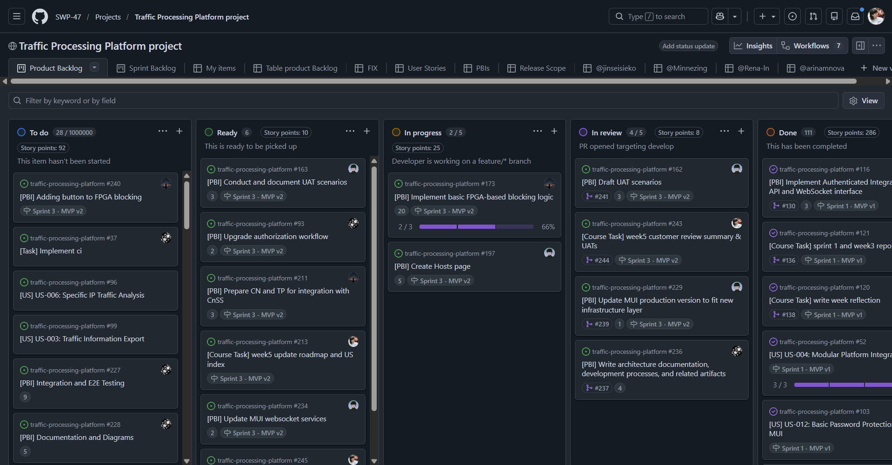
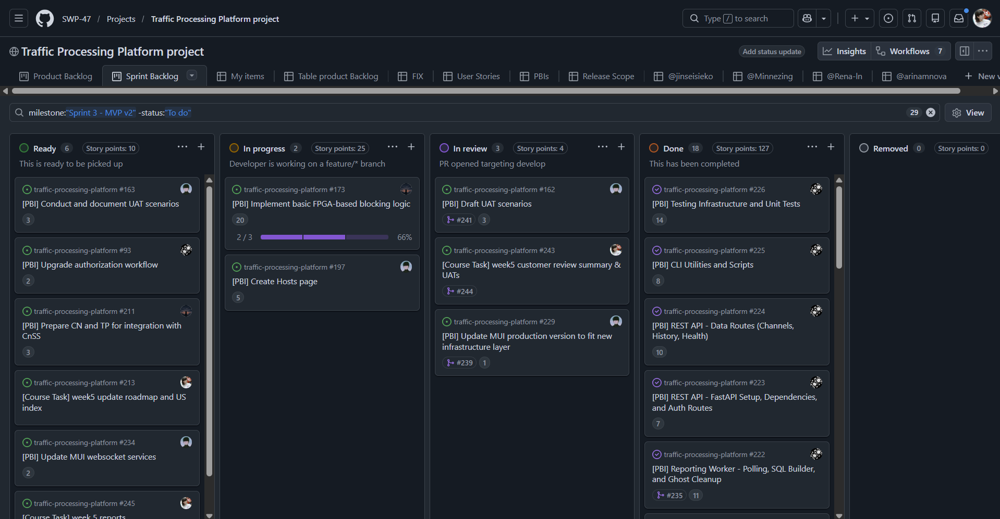
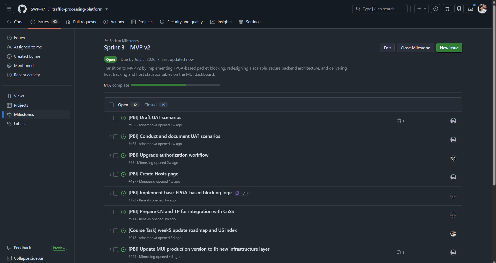
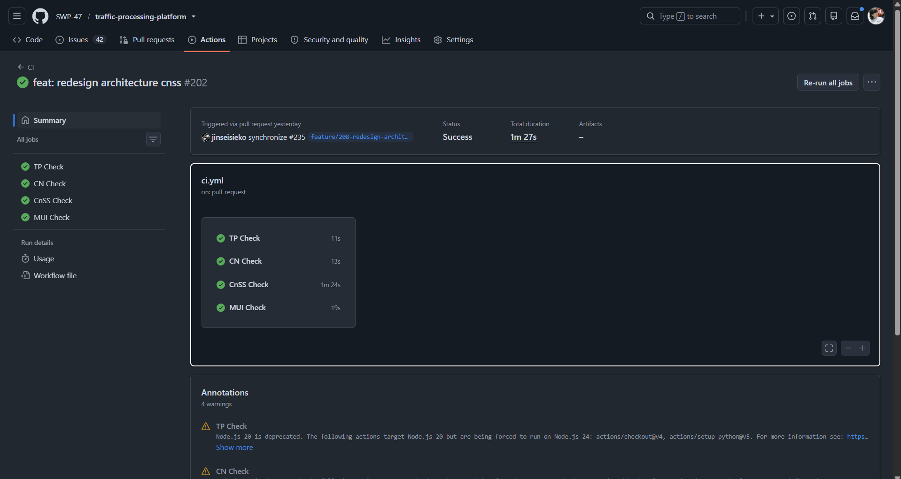
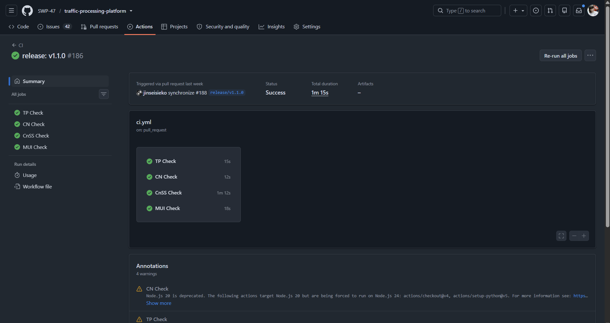
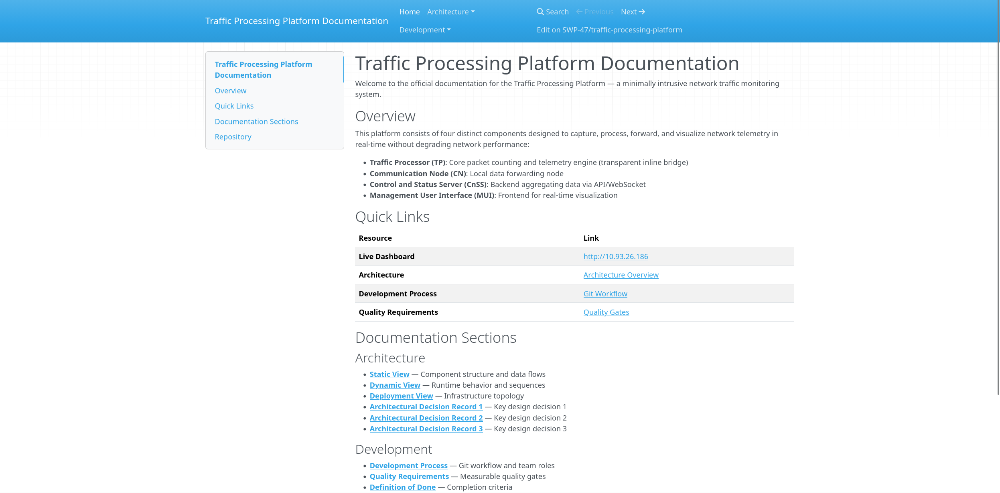
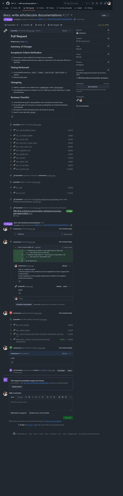

# Assignment 5 Report

## Project Overview

**Project Name:** Traffic Processing Platform

This is a monorepo containing minimally intrusive network traffic monitoring system. It consists of four distinct components designed to capture, process, forward, and visualize network telemetry in real-time without degrading network performance:

* **`traffic-processor/`**: Core packet counting and telemetry engine (transparent inline bridge).
* **`communication-node/`**: Local data forwarding node.
* **`cnss/`**: Control and Status Server (Backend) aggregating data via API/WebSocket.
* **`mui/`**: Management User Interface (Frontend) for real-time visualization.

**License:** [MIT License](../../LICENSE)

---

## 1. Sprint Overview & Scope

* **Sprint Dates:** June 29, 2026 – July 5, 2026
* **Sprint Goal:** Transition to MVP v2 by implementing FPGA-based packet blocking, redesigning a scalable, secure backend architecture, and delivering host tracking and host statistics tables on the MUI dashboard.
* **Total Sprint Size:** 166
* **Scope Summary:**
  * **Backend & Architecture:** Completely redesigned the CnSS architecture, decoupling it into four distinct components: Database, REST API, UDP Ingestion Listener, and WebSocket Service. Introduced a persistent `channels` table for efficient activity state checking and implemented a highly scalable WebSocket subscription model. Integrated a secure, persistent user database for authentication, replacing hardcoded credentials.
  * **Frontend (MUI):** Executed a comprehensive UI/UX redesign. Introduced the detailed "Host Statistics" table featuring advanced real-time filtering (Direction IN/OUT, IP subnet/regex, RX/TX min/max bounds, LastSeen ranges) and bi-directional sorting. Added summary "Top Hosts" tables to the main dashboard. Removed MAC address tracking from the design to streamline the data model.
  * **Infrastructure/Core:** Fully containerized the Traffic Processor (TP) and Communication Node (CN) using standardized Docker configurations for reproducible edge deployment.
  * **Backlog Refinement:** Removed US-016 (Byte Volume Counting) from the active scope based on customer feedback. Consolidated all planned web features (detailed host tables, dashboard widgets, redesign) into traceable PBIs.
  * **Documentation:** Updated all technical documentation to accurately reflect the new decoupled architecture, containerized deployment, and revised data models.

### Board & Milestone Links

* [Product Backlog View](https://github.com/orgs/SWP-47/projects/1/views/1)

* [Sprint 3 Backlog View](https://github.com/orgs/SWP-47/projects/1/views/8)

* [Milestone Link](https://github.com/SWP-47/traffic-processing-platform/milestone/3)

---

## 2. Delivered `MVP v2` Changes

The `MVP v2` increment transitions the platform from basic ephemeral packet counting to advanced telemetry with historical retention and hardware-level intervention.

* **Persistent Historical Data:** Replaced the legacy in-memory state store with TimescaleDB to support historical queries and prevent memory leaks.
* **Hardware Traffic Blocking:** Implemented a physical blocking mechanism on the FPGA Traffic Processor. Pressing the `Key1` button drops traffic for a targeted IP, visually confirmed via the board's LED indicator.
* **MUI Dashboard Redesign:** Introduced a toggle switch for raw numerical RX/TX rates versus visual column charts. Added a historical line chart for retrospective analysis and a "Top LAN Hosts" widget with a "View All" detailed table.
* **Containerized Edge Nodes:** TP and CN are now fully containerized via Docker for streamlined, reproducible deployment on the edge hardware.

---

## 3. Product Access & Setup

* **Deployed Product (MVP v2):** [http://10.93.26.186](http://10.93.26.186) *(Accessible via UniversityStudent Wi-Fi)*
* **Access / Run Instructions:** [Local Setup & Deployment Guide](../../README.md#local-setup-instructions)

---

## 4. Customer Feedback Response

We reviewed customer feedback from the `MVP v2` review and the Week 5 UAT session.

| Feedback Point | Resulting PBI / Issue | Status | Response |
| :--- | :--- | :--- | :--- |
| Articulate "Top 5" tables with a "View all" button/link. | [#197](https://github.com/SWP-47/traffic-processing-platform/issues/197) | **Done** | Added "View all entries" button at the bottom of the Top LAN hosts table. |
| Text-based filter fields are poor UX; use structured controls. | [#246](https://github.com/SWP-47/traffic-processing-platform/issues/246) | **Backlog** | Acknowledged. Deferred to Sprint 4 to implement sidebar/dropdown filters instead of raw text syntax. |
| Graph needs smaller time-scale division (1 min / 5 min) for real-time reactivity. | [#247](https://github.com/SWP-47/traffic-processing-platform/issues/247) | **Backlog** | Acknowledged. The current 5-minute aggregation smooths out rapid changes. Added to backlog for next sprint. |
| System crashed/stopped transmitting when Ethernet was disconnected. | [#251](https://github.com/SWP-47/traffic-processing-platform/issues/251) | **Backlog** | **Critical.** Investigating CN/CnSS state corruption or crash upon physical interface disconnect. |
| Fix hardware button debounce (contact bounce) on Key1. | [#250](https://github.com/SWP-47/traffic-processing-platform/issues/250) | **Backlog** | Currently, the test packets for blocked packets exist, but only contain headers, so the TP counter still registers them. As a result, the blocking effect isn't visible on the MUI. Acknowledged. Will be fixed in one of the next sprints |

---

## 5. Maintained Documentation

* **Roadmap:** [docs/roadmap.md](../../docs/roadmap.md)
* **Definition of Done:** [docs/definition-of-done.md](../../docs/definition-of-done.md)
* **Testing Strategy & Status:** [docs/testing.md](../../docs/testing.md)
* **Quality Requirements:** [docs/quality-requirements.md](../../docs/quality-requirements.md)
* **Quality Requirement Tests:** [docs/quality-requirement-tests.md](../../docs/quality-requirement-tests.md)
* **User Acceptance Tests:** [docs/user-acceptance-tests.md](../../docs/user-acceptance-tests.md)
* **Development Process:** [docs/development-process.md](../../docs/development-process.md)

---

## 6. Architecture & ADRs

### Architecture links

* [Static: Component Diagram](../../docs/architecture/static-view/component-diagram.puml)
* [Dymaic: End-to-end Telemetry](../../docs/architecture/dynamic-view/end-to-end-telemetry.puml)
* [Deployment diagram](../../docs/architecture/deployment-view/deployment-diagram.puml)
* [ADR directory](../../docs/architecture/adr/)
* **System Documentation**: [docs/system-documentation.md](../../docs/system-documentation.md)
* **API Documentation**: [api/README.md](../../api/README.md)
* **Architecture Documentation**: [docs/architecture/README.md](../../docs/architecture/README.md)

### Architecture Description

The Traffic Processing Platform follows a four-component architecture — a transparent inline **traffic-processor** for zero-impact packet counting, a **communication-node** for local data forwarding, a microservice-decomposed **CnSS backend** for telemetry aggregation via REST/WebSocket, and a **MUI frontend** for real-time visualization. This design, shaped by three key Architectural Decision Records (ADR-001 through ADR-003), supports the current product by ensuring wire-speed packet forwarding with no network degradation, high-throughput ephemeral Redis buffering for telemetry ingestion, and independent service scaling and deployment.

### Quality Requirements and Architectural Decisions

Each quality requirement directly drives specific architectural decisions: **QR-001 (Time Behaviour)** is satisfied by ADR-001's FPGA wire-speed forwarding and ADR-002's Redis ephemeral buffering to minimize latency; **QR-002 (Fault Tolerance)** is addressed through ADR-001's hardware-software separation, ADR-002's capped buffers, and ADR-003's microservice isolation to prevent cascading failures. **QR-003 (Testability)** is fulfilled by ADR-003's microservice decomposition, enabling independent unit testing and CI/CD verification of each backend component before deployment.

---

## 7. Testing & CI Status

All Assignment 4 automated Quality Requirement Tests (QRT-001 through QRT-003), CI quality gates, and the pip-audit dependency scan remain active and are passing for the MVP v2 increment. Although no new tests were introduced this sprint, the existing suite successfully validates the newly decoupled CnSS architecture while maintaining the required 42% coverage and security baselines.

* **CI Pipeline Configuration:** [`.github/workflows/ci.yml`](../../.github/workflows/ci.yml)
* **Latest Default-Branch CI Run:** [CI Run Link](https://github.com/SWP-47/traffic-processing-platform/actions/runs/28707290400)

> CI checks were linked on the `develop` branch, not protected default branch (`general`). As per our [development-process.md](../../docs/development-process.md), our team only merges commits into general for the final SemVer release for each assignment. Therefore, it would be impossible for us to link the "latest" CI check in this assignment report without violating our git workflow. Explicit permission was obtained from the course team for us to provide evidence to a CI check on the `develop` branch.

* **Latest Protected-Branch CI Run** (from Sprint 2): [CI Run Link](https://github.com/SWP-47/traffic-processing-platform/actions/runs/28329680698)

* **Automated QRTs:**
  * `QRT-001` (Health API < 1s): Passing
  * `QRT-002` (JWT Scope Enforcement): Passing
  * `QRT-003` (CnSS Coverage >= 30%): Passing (Currently at 42%)
* **Additional QA Check:** `pip-audit` dependency vulnerability scanning (Passing).

---

## 8. Release & Changelog

* **SemVer Release (MVP v2):** [v2.0.0](https://github.com/SWP-47/traffic-processing-platform/releases/tag/v2.0.0)
* **Hotfix SemVer Release (MVP v2):** [v2.0.1](https://github.com/SWP-47/traffic-processing-platform/releases/tag/v2.0.1) (*was added week5 reports that was accidentally not added to the main release*)
* **Changelog:** [CHANGELOG.md](../../CHANGELOG.md)
* **Public Sanitized Demo Video:** [Watch Demo (< 2 mins)](https://disk.yandex.ru/i/8geyKOzgUbzkOw)

---

## 9. User Acceptance Testing (UAT) Results Summary

We executed 5 UAT scenarios with the customer during the Week 5 review session.

| UAT ID | Scenario | Result | Summary & Customer Feedback |
| :--- | :--- | :--- | :--- |
| **UAT-001** | Assessment of current channel load | **Passed** | Dashboard rendered correctly. Toggle between chart and numerical display worked. *Feedback:* Values hovered around ~3 pkt/s; customer questioned if it was hardcoded. Team confirmed it's real but noted the university network segment lacks high-traffic scenarios during the test. |
| **UAT-002** | Retrospective analysis of channel activity | **Failed** | Historical chart rendered, but appeared as a flatline and did not visibly react to traffic blocking. *Feedback:* Customer requested a 1-minute/5-minute minimum time window toggle to see near real-time changes without heavy smoothing. |
| **UAT-003** | Fast identification of top consumer | **Failed** | Table rendered dynamically. *Failure:* When the Ethernet cable was disconnected to test inactive host marking, the entire system stopped transmitting/receiving and did not recover. *Feedback:* Customer noted a stability concern ("component got tired") requiring a restart. |
| **UAT-004** | Overview of active network hosts | **Passed** | "View all entries" and basic filtering worked. *Feedback:* Customer reiterated that strict text-based filter syntax is poor UX and requested structured sidebar/dropdown filters. |
| **UAT-005** | Hardware traffic blocking | **Passed** | Pressing Key1 successfully blocked traffic (LED1 turned off, laptop lost internet). *Feedback:* Customer noted the router sees broken packets. Team acknowledged the lack of contact bounce (debounce) fixing and the hardcoded IP limitation. |

### Hosted Documentation Site

* [Hosted Documentation Site](https://swp-47.github.io/traffic-processing-platform/)

---

## 10. Sprint Review & Reflections

* **Sprint Review Summary:** [reports/week5/customer-review-summary.md](sprint-review-summary.md)
* **Sprint Review Transcript:** [reports/week5/sprint-review-transcript.md](sprint-review-transcript.md)
* **Reflection:** [reports/week5/reflection.md](reflection.md)
* **Retrospective:** [reports/week5/retrospective.md](retrospective.md)
* **LLM Usage Report:** [reports/week5/llm-report.md](llm-report.md)

---

## 11. Product Status & Next Steps

**Current Status:**

The MUI now supports a table view of all hosts. The hardware data plane successfully supports physical traffic blocking via the FPGA. The system comfortably handles 100 Mbps channels without optimization.

**Next Steps (Sprint 4):**

1. **Stability Fix:** Investigate and resolve the CN/CnSS state corruption crash when a network interface is physically disconnected (UAT-003 failure).
2. **UI/UX Refinement:** Replace text-based filtering with structured sidebar controls (UAT-004 feedback).
3. **Real-Time Reactivity:** Implement 1-minute/5-minute time-scale zooming for the historical chart (UAT-002 feedback).
4. **Hardware Polish:** Fix the Key1 button contact bounce (debounce) and expand blocking rules beyond a single hardcoded IP.

---

## 12. Contribution Traceability

* Github table with completed PBIs during Sprint 3 for each team member:
  * @jinseisieko [Table view](https://github.com/orgs/SWP-47/projects/1/views/12)
  * @Minnezing [Table view](https://github.com/orgs/SWP-47/projects/1/views/13)
  * @Rena-ln [Table view](https://github.com/orgs/SWP-47/projects/1/views/14)
  * @arinamnova [Table view](https://github.com/orgs/SWP-47/projects/1/views/15)

> Click items in the "Title" column to see issue details. Click on items in "Linked pull requests" to view the PR for each issue.

## 13. Screenshot evidence

*Closed PR:*

