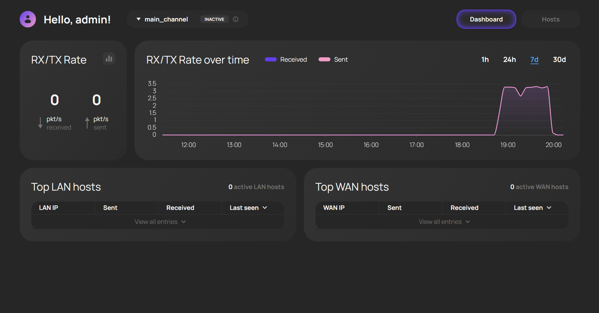
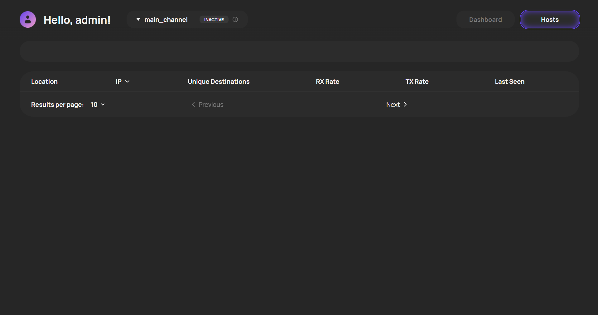

# Sprint Review Summary

**Date**: July 4, 2026

**Participants**:

- **Project Manager:** @jinseisieko
- **Frontend Lead:** @Minnezing
- **Core Systems Engineer:** @Rena-ln
- **Technical Writer:** @arinamnova

## Sprint Goal & Delivered Increment

**Sprint Goal:** Transition to MVP v2 by implementing FPGA-based packet blocking, redesigning a scalable, secure backend architecture, and delivering host tracking and host statistics tables on the MUI dashboard.

**Delivered Increment:**

- Complete backend redesign separating WebSocket, REST, and UDP ingestion into distinct Docker containers with Redis buffering and Postgres/TimescaleDB aggregation.
- Nginx reverse proxy integration for production deployment.
- Updated MUI dashboard featuring real-time and historical packet rate charts, LAN/WAN host tables, and basic text-based filtering.
- Physical hardware integration for traffic blocking via FPGA/TP button.

## Artifacts Demonstrated

1. **Physical Testbed:** FPGA-based Traffic Processor (TP) and Communication Node (CN) setup demonstrating physical traffic blocking via a hardware button (Key1).
2. **Management User Interface (MUI):**
   - Main dashboard with real-time top-5 WAN/LAN host statistics tables.
   - Host statistics page with text-based filtering.
3. **Backend Architecture:** Overview of the new containerized backend, Redis message brokering, and Postgres window aggregation.

## User Acceptance Testing (UAT) Results

The customer executed five UAT scenarios to validate the MVP v2 increment during the Week 5 Sprint Review.

| UAT Scenario | Result | Customer Comments & Observations |
| :--- | :--- | :--- |
| **UAT-001: Assessment of the current channel load** | **Passed (with minor feedback)** | The dashboard and the toggle between chart/numerical modes worked correctly. However, values hovered around ~3 packets/sec, leading the customer to suspect the data was a hardcoded constant. The team confirmed the data was real but acknowledged the low throughput was due to the test environment, prompting the customer to request high-traffic test tabs (Speedtest, streaming) for future validation. |
| **UAT-002: A retrospective analysis of channel activity** | **Failed** | The historical chart rendered and was scalable, but it appeared as a flatline (~3 packets/sec) and failed to visually drop when hardware blocking was activated. The customer noted that the heavy smoothing/aggregation makes real-time changes invisible and requested a smaller time-scale division (1-minute or 5-minute window) to zoom in for near real-time observation. |
| **UAT-003: Fast identification of the top consumer in the network** | **Failed** | The "Top LAN hosts" table rendered and dynamically showed the LAN host IP. However, when the team disconnected the Ethernet cable to simulate an inactive host, the system stopped transmitting data entirely and did not recover. The customer observed that a system component "got tired from working too long" (crashed) and required a manual restart, flagging a critical stability issue. |
| **UAT-004: Overview of the list of active network hosts** | **Passed (with minor feedback)** | The full hosts page rendered correctly, and basic text-based filtering (e.g., `location: LAN`) alongside column sorting functioned as expected. However, the customer heavily criticized the strict, text-based syntax filtering as a poor user experience, reiterating prior feedback and requesting structured UI controls like dropdowns or sidebars instead. |
| **UAT-005: Hardware traffic blocking** | **Passed (with minor feedback)** | Pressing the physical `Key1` button successfully blocked traffic (LED1 turned off, laptop lost internet immediately) and restored it on the second press. The customer tested with Wikipedia and streaming, noting that video buffers mask the immediate drop and that the router sees broken packets. The team acknowledged that the hardware button debounce (contact bounce) is not yet fixed and that blocking is currently hardcoded to a single IP. |

**Resulting PBIs/Issues:**

- Fix graph reactivity and add a smaller time window (1-5 mins) for real-time visualization.
- Improve filtering UI/UX (replace or augment raw text fields with better controls).
- Investigate and fix backend/CN crash or memory leak when network interfaces are disconnected/reconnected.

## Addressed Customer Feedback (from previous sprints)

- **Backend Architecture:** Implemented the customer's suggestion to separate logical elements (WebSocket, REST, UDP) into distinct containers to improve modularity and scalability.
- **MUI Design:** The dashboard now matches the approved Figma prototype, including the toggle for raw numbers vs. charts, and the layout for host statistics tables.

## Architecture & Workflow Changes Discussed

- **Backend Redesign:** The backend was completely rewritten. Ingestion, API, and WebSocket handling are now isolated in separate Docker containers. Redis is used for buffering before database writes. Postgres handles automatic 1-second window aggregation for historical data. Nginx was added to wrap the project for secure production deployment.
- **Database Optimization:** Moved from raw data querying to pre-aggregated tables in Postgres to handle historical packet rates efficiently.

## Customer Feedback & Requested Changes

1. **Real-time Graph Reactivity:** The current graph smoothing/aggregation makes it look like a hardcoded constant. The customer requested a smaller time window (e.g., 1 minute or 5 minutes) to see near real-time changes and immediate drops when traffic is blocked.
2. **Filtering UI/UX:** Text-based filtering (e.g., typing `location: LAN`) is difficult to use. The customer suggested improving this, noting that text fields for filtering are generally a poor UX choice compared to dropdowns or tags.
3. **Detailed Host Statistics:** The customer requested a dedicated screen for detailed statistics of individual hosts, and potentially a "host map" visualization in the future.
4. **UAT Scenario Preparation:** For future demos, the team should prepare specific high-traffic scenarios (e.g., Speedtest, Wikipedia text, online radio/TV streams) to properly test active traffic, asymmetry, and blocking behavior.

## Risks

- **System Stability:** The system failed to recover gracefully from a physical network disconnect (Ethernet unplug), indicating a potential unhandled exception, socket leak, or state corruption in the CN or CnSS.
- **Hardware Debounce:** The physical blocking button suffers from contact bounce, which could trigger multiple state changes or confuse the telemetry pipeline if not handled in firmware/software.

## Action Points & Product Backlog Updates

| Action Point | Resulting PBI / Backlog Item | Priority |
| :--- | :--- | :--- |
| Add a 1-minute / 5-minute time window toggle to the historical/real-time charts to improve reactivity. | New PBI: MUI Chart Time-window Toggle | Should |
| Redesign the Host filtering UI to be more user-friendly (less reliant on strict text syntax). | New PBI: Improve Host Filtering UX | Should |
| Implement the detailed Host Statistics page | PBI: Detailed Host Stats Page | Should |
| Investigate and fix the system crash/fatigue upon Ethernet disconnect. | Bug: CN/CnSS state corruption on interface loss | Must |
| Fix hardware button debounce issue on the FPGA/TP. | Bug: Key1 Contact Bounce | Could |

## Overall Assessment

The customer was generally positive about the visual progress and the backend architectural improvements ("At a quick glance, everything seems great"). The backend redesign successfully addresses scalability concerns. However, the frontend's real-time reactivity and system stability under physical network changes require immediate attention before the next increment.
