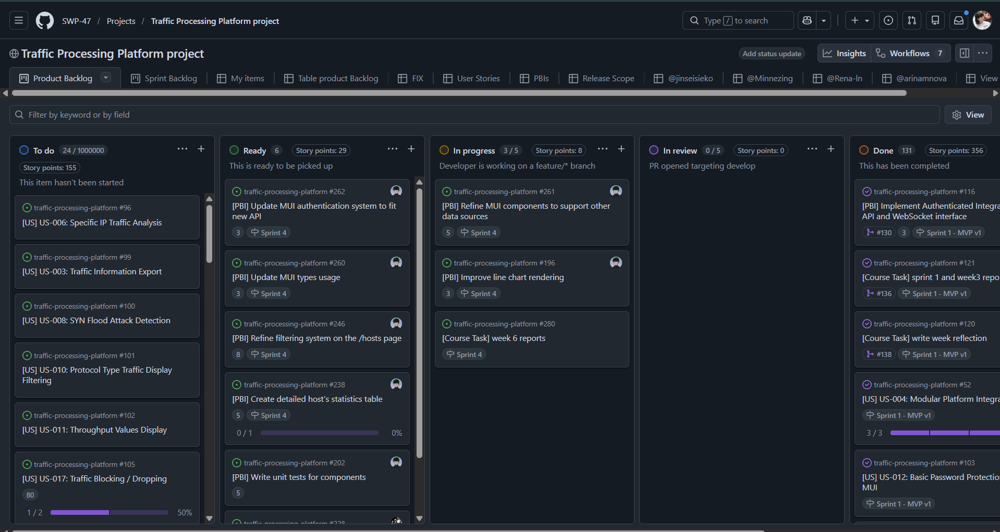
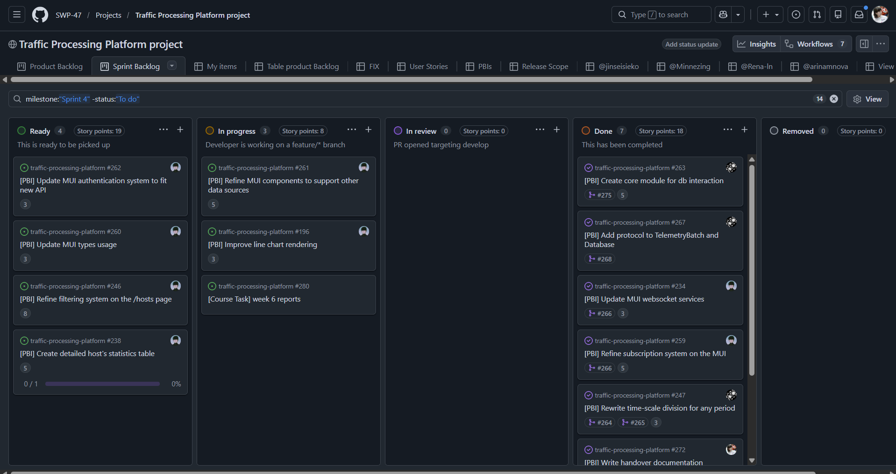
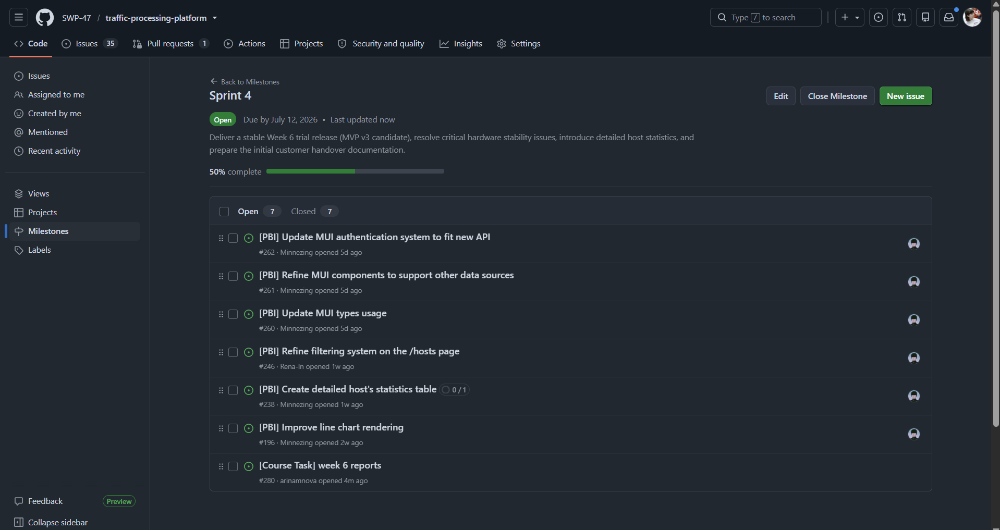
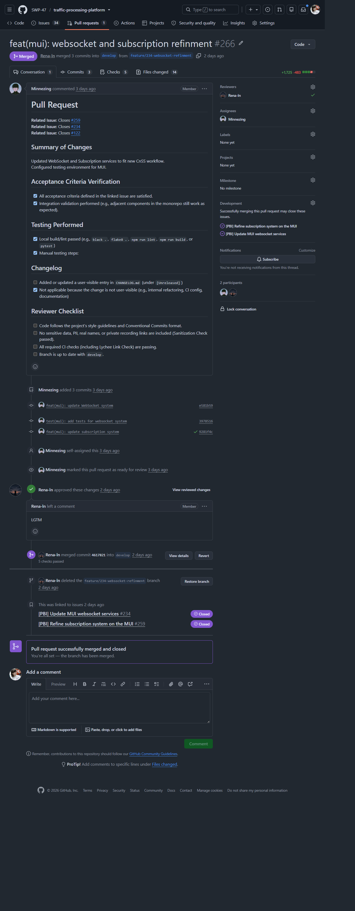

# Assignment 6 Report

## Project Overview

**Project Name:** Traffic Processing Platform

This is a monorepo containing minimally intrusive network traffic monitoring system. It consists of four distinct components designed to capture, process, forward, and visualize network telemetry in real-time without degrading network performance:

* **`traffic-processor/`**: Core packet counting and telemetry engine (transparent inline bridge).
* **`communication-node/`**: Local data forwarding node.
* **`cnss/`**: Control and Status Server (Backend) aggregating data via API/WebSocket.
* **`mui/`**: Management User Interface (Frontend) for real-time visualization.

**License:** [MIT License](../../LICENSE)

---

## Sprint 4 Planning & Scope

**Sprint 4 Goal:** Deliver a stable Week 6 trial release (MVP v3 candidate), resolve critical hardware stability issues, introduce detailed host statistics, and prepare the initial customer handover documentation.

**Sprint Dates:** July 6, 2026 – July 12, 2026  
**Total Sprint Size:** PLACEHOLDER

**Scope Summary:**
During Sprint 4, the team focused on transition readiness and system stability. Key achievements include:

* Resolved the critical CN/CnSS state corruption crash triggered by physical network cable disconnects.
* Achieved 70% automated backend test coverage and implemented protocol-aware telemetry aggregation in TimescaleDB.
* Delivered the first iteration of the detailed host statistics page in the MUI.
* Drafted the initial customer handover documentation (`docs/customer-handover.md`).
* Prepared the physical test stand for high-traffic UAT scenarios (Wikipedia, online radio).

**Links & Views:**

* 🔗 [Product Backlog Board View](https://github.com/orgs/SWP-47/projects/1/views/1)

* 🔗 [Sprint 4 Backlog Board View](https://github.com/orgs/SWP-47/projects/1/views/8)

* 🔗 [Sprint 4 Milestone](https://github.com/SWP-47/traffic-processing-platform/milestone/4)

---

## Product Access & Setup

**Deployed Product (Week 6 Trial Release):** [http://10.93.26.186](http://10.93.26.186) *(Accessible only via Innopolis University "UniversityStudent" Wi-Fi)*

**Documentation & Setup Links:**

* 📖 [Local Setup & Run Instructions](../../README.md#local-setup-instructions)
* [`README.md`](../../README.md)
* 🤝 [Contributor Guide (`CONTRIBUTING.md`)](../../CONTRIBUTING.md)
* 🤖 [Agent Guide (`AGENTS.md`)](../../AGENTS.md)
* 📦 [Customer Handover Documentation](../../docs/customer-handover.md)
* 🌐 [Hosted Documentation Site](https://swp-47.github.io/traffic-processing-platform/)

---

## Customer-Facing Documentation & Handover

### Documentation Review Summary

During the Week 6 meeting, the customer reviewed the draft `docs/customer-handover.md`.

* **Clear:** The high-level architecture overview, component responsibilities, and basic deployment steps were found to be clear and well-structured.
* **Unclear/Missing:** The customer noted that the server deployment process is currently too complex because database table migrations must be run manually.
* **Action Taken:** The team acknowledged this and committed to automating the DB migration process in the startup script for Sprint 5.

### Transition-Readiness Summary

The product is currently **almost ready for independent use**, but full transition is blocked by two main factors:

1. **Deployment Automation:** The manual DB migration step must be automated to ensure the customer can deploy the server independently without developer intervention.
2. **Hardware Blocking Verification:** The fix for fragmented packets during hardware blocking was written but not yet deployed to the physical FPGA stand. Live verification is required before the customer can rely on the blocking feature.
3. **Throughput Limits:** The system crashes at extreme loads (~250 Mbps). The exact maximum stable throughput must be investigated and explicitly documented in the handover guide.

---

## Customer Feedback & Response

During the Week 6 trial and UAT session, the customer provided critical feedback regarding metric usefulness and system limits.

| Feedback Point | Resulting PBI / Issue | Status | Response |
|---|---|---|---|
| **Metric Measurement Asymmetry:** Displaying statistics in packets/sec is confusing for asymmetric TCP streams (e.g., online radio). Bytes/sec is much more useful. | [US-016: Byte Volume Counting](https://github.com/SWP-47/traffic-processing-platform/issues/104) | Added to Sprint 5 | **Prioritized.** Backend will sum packet sizes in TimescaleDB buckets; MUI will add a toggle for packets vs. bytes. |
| **System Stability Under Extreme Load:** System crashed/hung during a stress test at ~30 MB/s (~240 Mbps) due to CN/CnSS queue overflow. | Investigate CN/CnSS queue limits & document max throughput | Added to Sprint 5 | **Addressed.** We will document the max stable throughput (e.g., 100 Mbps) in the handover docs. |
| **Deployment Complexity:** Server deployment requires manual DB migrations. | Automate DB migrations in startup script | Added to Sprint 5 | **Addressed.** Startup script will wait for DB readiness and auto-execute migrations. |
| **Hardware Blocking Bug:** Fix for fragmented packets is written but not deployed to the physical FPGA stand. | Deploy fragmented packet fix to physical stand | Added to Sprint 5 | **Deferred.** Will be deployed and verified live in Week 7. |

**Explanation of Deferred Feedback:**
The detailed host map visualization was deferred to the post-course backlog to make room for the highly prioritized byte-volume counting feature requested by the customer during the trial.

---

## User Acceptance Testing (UAT) Summary

The team conducted UAT scenarios with the customer using the physical test stand and prepared high-traffic tabs (Wikipedia, online radio).

* **UAT-001 (Assessment of current channel load):** **Passed with major feedback.** The dashboard rendered correctly, but the customer noted that packet counts are misleading for asymmetric TCP traffic. This directly resulted in the Sprint 5 scope change to implement byte-volume counting.
* **UAT-003 (Fast identification of top consumer):** **Passed with minor feedback.** The new detailed host statistics page rendered correctly, showing packet transfer stats, historical graphs, and destination addresses. The customer approved the layout but noted it needs to support the upcoming byte-volume metrics.
* **UAT-005 (Hardware traffic blocking):** **Deferred.** The physical stand successfully recovered from cable disconnects (fixing the Week 5 crash). However, because the fragmented packet fix was not yet flashed to the FPGA, live hardware blocking was intentionally not demonstrated to avoid showing broken behavior.

🔗 [Full UAT Execution Results](../../docs/user-acceptance-tests.md)

---

## Sprint Review Artifacts

The Sprint Review was recorded with the customer's permission. Publication of the transcript was permitted.

* 📝 [Sprint Review Summary](./sprint-review-summary.md)
* 🗣️ [Sprint Review Transcript (Sanitized)](./sprint-review-transcript.md)
* 🔄 [Sprint 4 Retrospective](./retrospective.md)
* 💭 [Week 6 Reflection](./reflection.md)
* 🤖 [LLM Usage Report](./llm-report.md)

---

## Maintained Documentation & Quality Assets

The following maintained artifacts were updated during Sprint 4 to reflect the new backend test coverage, protocol aggregation, and physical stand stability fixes:

* 🗺️ [Roadmap](../../docs/roadmap.md)
* 🧪 [Testing Strategy & Status](../../docs/testing.md)
* 📏 [Quality Requirements](../../docs/quality-requirements.md)
* 📐 [Quality Requirement Tests](../../docs/quality-requirement-tests.md)

---

## Release & Changelog

**Week 6 Trial Release (SemVer):** [v2.1.0-rc1] PLACEHOLDER  
*This release maps to the Sprint 4 Milestone and serves as the handover-candidate for the customer trial.*

🔗 [CHANGELOG.md](../../CHANGELOG.md)

---

## Current Product Status & Week 7 Follow-Up

**Current Status:** The telemetry pipeline is stable under normal loads, the physical stand recovers gracefully from network disconnects, and the MUI now provides deep-dive host statistics. The system is functionally complete for the core MVP v3 scope, pending the integration of byte-volume metrics and deployment automation.

**Expected Week 7 (Sprint 5) Follow-Up Work:**

1. Implement backend byte-volume counting (sum of packet sizes) and expose via API.
2. Add MUI toggle to switch between "Packets per second" and "Bytes per second".
3. Automate database migrations in the deployment/startup script.
4. Deploy the fragmented packet fix to the physical FPGA stand and verify live hardware blocking.
5. Investigate the 250 Mbps queue overflow and explicitly document the maximum stable throughput in `docs/customer-handover.md`.
6. Finalize the customer handover and confirm the transition outcome.

---

## Contribution Traceability

* Github table with completed PBIs during Sprint 4 for each team member:
  * @jinseisieko [Table view](https://github.com/orgs/SWP-47/projects/1/views/12)
  * @Minnezing [Table view](https://github.com/orgs/SWP-47/projects/1/views/13)
  * @Rena-ln [Table view](https://github.com/orgs/SWP-47/projects/1/views/14)
  * @arinamnova [Table view](https://github.com/orgs/SWP-47/projects/1/views/15)

> Click items in the "Title" column to see issue details. Click on items in "Linked pull requests" to view the PR for each issue.

---

## Evidence Screenshots

**Example reviewed PR ([PR Link](https://github.com/SWP-47/traffic-processing-platform/pull/266)):**

