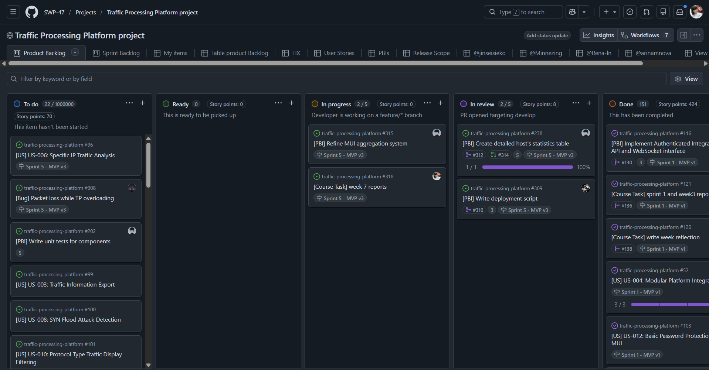
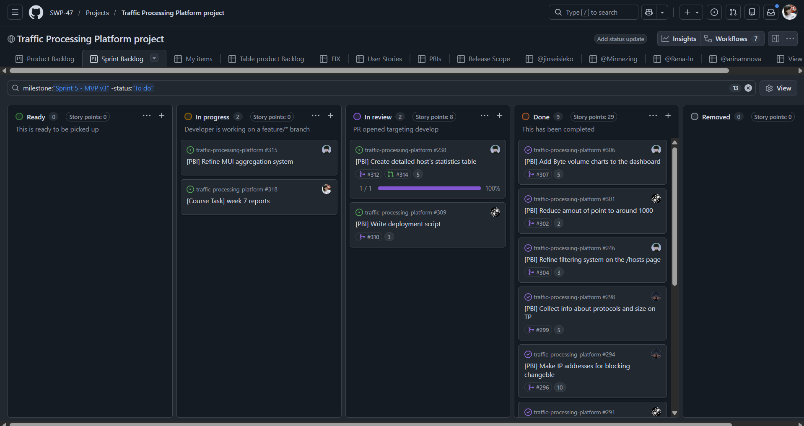
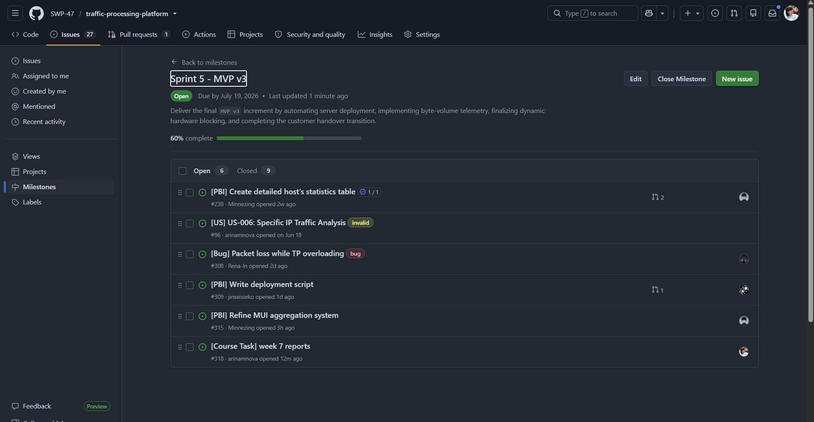
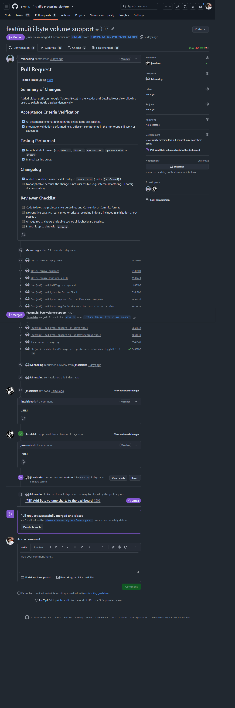

# Assignment 6 Report

## Project Overview

**Project Name:** Traffic Processing Platform

This is a monorepo containing minimally intrusive network traffic monitoring system. It consists of four distinct components designed to capture, process, forward, and visualize network telemetry in real-time without degrading network performance:

* **`traffic-processor/`**: Core packet counting and telemetry engine (transparent inline bridge).
* **`communication-node/`**: Local data forwarding node.
* **`cnss/`**: Control and Status Server (Backend) aggregating data via API/WebSocket.
* **`mui/`**: Management User Interface (Frontend) for real-time visualization.

**License:** [MIT License](../../LICENSE)

---

## 1. Previous Week Evidence

🔗 [Week 6 Report (Sprint 4)](../week6/README.md)

---

## 2. Sprint 5 Planning & Scope

**Sprint 5 Goal:** Deliver the final `MVP v3` increment by automating server deployment, implementing byte-volume telemetry, finalizing dynamic hardware blocking, and completing the customer handover transition.  
**Sprint Dates:** July 13, 2026 – July 19, 2026  
**Total Sprint Size:**  PLACEHOLDER

### Scope Summary

During Sprint 5, the team focused on finalizing the product for independent customer use, addressing critical UX feedback regarding metric readability, and automating the deployment pipeline. Key achievements include:

* **Deployment Automation:** Developed an interactive `make deploy` script that handles container startup, automatic database migrations, `.env` generation, and test data seeding.
* **Telemetry Enhancements:** Implemented a frontend toggle for switching between packets/sec and bytes/sec (KB, MB) to better represent asymmetric TCP traffic.
* **UX/UI Refinements:** Redesigned the host table state management to prevent IP "jumping" by implementing a 10-minute timeout for stale entries. Added clickable host rows for deep-dive statistics.
* **Hardware Polish:** Replaced hardcoded FPGA blocking with dynamic IP blocking via CLI script (defaulting to `0.0.0.0`).
* **Stress Testing:** Successfully validated system stability up to 588 Mbps without queue overflow or hangs.

### Links & Views

* 🔗 [Product Backlog Board View](https://github.com/orgs/SWP-47/projects/1/views/1)

* 🔗 [Sprint 5 Backlog Board View](https://github.com/orgs/SWP-47/projects/1/views/8)

* 🔗 [Sprint 5 Milestone](https://github.com/SWP-47/traffic-processing-platform/milestone/5)

---

## 3. Summary of Final MVP v3 Changes

The final `MVP v3` release transitions the platform from a trial-ready state to a fully deployable, customer-usable product.

* **Automated Deployment Pipeline:** The manual database migration bottleneck identified in Week 6 was resolved. The new `make deploy` script interactively prompts for environment type (dev/prod), generates a secure random JWT secret, runs DB migrations, and optionally seeds admin/viewer users. A corresponding cleanup script was added for production environment resets.
* **Byte-Volume Counting & UI Toggle:** Addressing customer feedback on asymmetric traffic (e.g., online radio streaming), the backend now aggregates packet sizes. The MUI features a new toggle to switch the main dashboard and historical charts between Packets/sec and Bytes/sec.
* **Dynamic Hardware Blocking:** The FPGA Traffic Processor no longer relies on a hardcoded IP for traffic dropping. A CLI script now dynamically updates the blocked IP on the board, defaulting to `0.0.0.0` (allow all) upon startup.
* **Frontend State Management:** To resolve the issue of rapidly changing IP addresses in the "Top Hosts" table, the frontend now maintains local state. IPs are updated in real-time (1s window) but are only removed from the UI if they remain inactive for 10 minutes, providing a stable view for the administrator.
* **Session Persistence:** Implemented automatic JWT token refresh, allowing users to reload the MUI page without being forced to re-authenticate.

---

## 4. Product Access & Setup

**Deployed Product (Final MVP v3):** [http://10.93.26.186](http://10.93.26.186)  
*(Accessible via Innopolis University "UniversityStudent" Wi-Fi)*

### Documentation & Setup Links

* 📖 [Local Setup & Run Instructions](../../README.md#local-setup-instructions)
* 🏠 [Root README.md](../../README.md)
* 🤝 [Contributor Guide (CONTRIBUTING.md)](../../CONTRIBUTING.md)
* 🤖 [Agent Guide (AGENTS.md)](../../AGENTS.md)
* 📦 [Customer Handover Documentation](../../docs/customer-handover.md)
* 🌐 [Hosted Documentation Site](https://swp-47.github.io/traffic-processing-platform/)

---

## 5. Final Transition Outcome & Handover Status

### Handover Level Reached

**`Ready for independent use`**  
The customer has confirmed that the product is fully functional, the deployment scripts are clear, and the physical stand is stable. The customer has accepted the handover documentation and is prepared to operate the system independently.

Evidence of the customer using the product himself can be viewed in the UAT videos submitted privately to Moodle.

### Customer-Confirmation Status

**`Accepted`**  
During the Week 7 review meeting, the customer explicitly confirmed the handover status: *"Yes, everything works. Excellent."*

### Summary of Transferred Assets

* **Deployment Scripts:** The interactive `make deploy` and cleanup scripts were transferred and documented in the Handover guide, allowing the customer to spin up or tear down the production environment with a single command.
* **Physical Stand Configuration:** The FPGA bitstream, TP/CN Docker configurations, and network topology were verified and handed over.

### Known Limitations & Follow-up Items

While the product is accepted, the following technical limitations remain documented in the handover guide as known constraints for future development:

1. **ICMP/Ping Filtering:** Due to strict typing in the telemetry pipeline, packets without ports (like ICMP) are currently ignored and do not appear in port statistics.
2. **Top Ports Direction:** The "Top Ports" widget currently only aggregates the OUT (transmit) direction.
3. **Maximum Throughput:** While the system successfully handled 588 Mbps in Week 7 stress tests, the exact theoretical ceiling for the CN/CnSS queue under sustained extreme loads is documented as ~600 Mbps.

---

## 6. Customer Feedback Response (Sprint 5)

| Feedback Point (from Week 6 Review) | Resulting PBI / Issue | Status | Response |
| :--- | :--- | :--- | :--- |
| **Metric Readability:** "Displaying statistics in packets/sec is confusing for asymmetric TCP streams. Bytes/sec is much more useful." | [US-016: Byte Volume Counting](https://github.com/SWP-47/traffic-processing-platform/issues/104) | **Done** | Backend now sums packet sizes. MUI includes a toggle for Packets/Bytes/KB/MB. |
| **Table Stability:** "IP addresses in the table jump too fast because of 1-second aggregation. It's hard to read." | [Frontend Table State Management](https://github.com/SWP-47/traffic-processing-platform/issues/285) | **Done** | Implemented frontend state: real-time updates for existing IPs, 10-minute timeout for removal. |
| **Hardcoded Blocking:** "The blocking IP is hardcoded. It should be dynamic." | [Dynamic FPGA IP Blocking](https://github.com/SWP-47/traffic-processing-platform/issues/278) | **Done** | CLI script now dynamically injects the target IP into the FPGA, defaulting to `0.0.0.0`. |
| **Deployment Complexity:** "Server deployment requires manual DB migrations." | [Automate DB Migrations](https://github.com/SWP-47/traffic-processing-platform/issues/260) | **Done** | `make deploy` script automatically waits for DB readiness and runs migrations. |
| **Session Persistence:** "I have to re-login every time I refresh the page." | [Auto Token Refresh](https://github.com/SWP-47/traffic-processing-platform/issues/290) | **Done** | Implemented automatic token refresh; session persists across page reloads. |

---

## 7. User Acceptance Testing (UAT) Summary

The team conducted final UAT scenarios with the customer during the Week 7 review session using the physical test stand.

* **UAT-001 (Assessment of current channel load):** **Passed.** The new byte-volume toggle successfully demonstrated asymmetric traffic (e.g., large TCP downloads vs. small ACKs). The customer confirmed this metric is much more useful for network analysis.
* **UAT-003 (Fast identification of top consumer):** **Passed.** The clickable host tables and the 10-minute timeout state management worked flawlessly. The customer noted the table is now stable and easy to read.
* **UAT-005 (Hardware traffic blocking):** **Passed.** The dynamic IP blocking was demonstrated. The customer observed that entering a specific IP into the script immediately dropped packets to zero on the MUI, and resetting to `0.0.0.0` restored traffic.

🔗 [Full UAT Execution Results](../../docs/user-acceptance-tests.md)

---

## 8. Release, Changelog & Demo

* **Final SemVer Release (MVP v3):** [v3.1.0](https://github.com/SWP-47/traffic-processing-platform/releases/tag/v3.1.0)
* **Changelog:** [CHANGELOG.md](../../CHANGELOG.md)
* **Public Sanitized Demo Video:** [Watch Final Demo (< 2 mins)] PLACEHOLDER

---

## 9. Demo Day Preparation

The team has completed all required preparations for the Week 8 Demo Day presentation.

* **Rehearsal:** The mandatory Week 7 lab rehearsal was completed successfully. All team members presented their assigned slides.
* **Slide Deck:** The final PDF slide deck has been prepared and submitted via the private Moodle channel.
* **Pre-recorded Demo:** A sanitized, pre-recorded demo video (under 2 minutes) has been embedded in the presentation to ensure a smooth in-class demonstration, highlighting the dynamic FPGA blocking and the new byte-volume metrics.

---

## 10. Sprint Review & Reflections

The Sprint Review was recorded with the customer's permission. Publication of the transcript was permitted.

* 📝 [Sprint Review Summary](./sprint-review-summary.md)
* 🗣️ [Sprint Review Transcript (Sanitized)](./sprint-review-transcript.md)
* 🔄 [Sprint 5 Retrospective](./retrospective.md)
* 💭 [Week 7 Reflection](./reflection.md)
* 🤖 [LLM Usage Report](./llm-report.md)

---

## 11. Final Product Status

**Current Status:** The Traffic Processing Platform has reached its final course state (`MVP v3`). The telemetry pipeline is highly stable (validated up to 588 Mbps), the physical FPGA stand supports dynamic hardware intervention, and the MUI provides deep, readable, and customizable traffic analytics. The deployment process is fully automated, and the customer has formally accepted the handover. The product is ready for independent operation.

---

## 12. Contribution Traceability

* Github table with completed PBIs during Sprint 4 for each team member:
  * @jinseisieko [Table view](https://github.com/orgs/SWP-47/projects/1/views/12)
  * @Minnezing [Table view](https://github.com/orgs/SWP-47/projects/1/views/13)
  * @Rena-ln [Table view](https://github.com/orgs/SWP-47/projects/1/views/14)
  * @arinamnova [Table view](https://github.com/orgs/SWP-47/projects/1/views/15)

> Click items in the "Title" column to see issue details. Click on items in "Linked pull requests" to view the PR for each issue.

---

## 13. Evidence Screenshots

**Example reviewed PR ([PR Link](https://github.com/SWP-47/traffic-processing-platform/pull/266)):**

